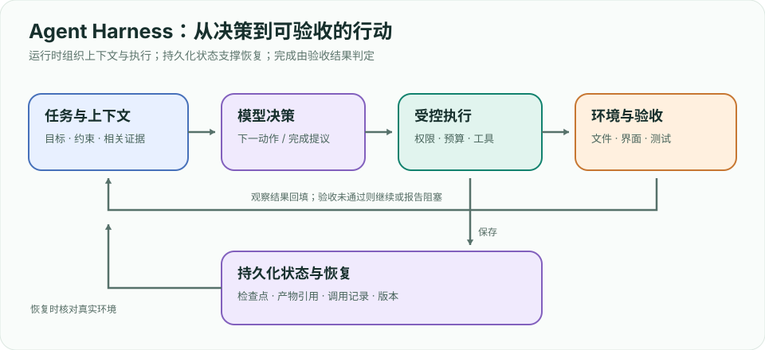
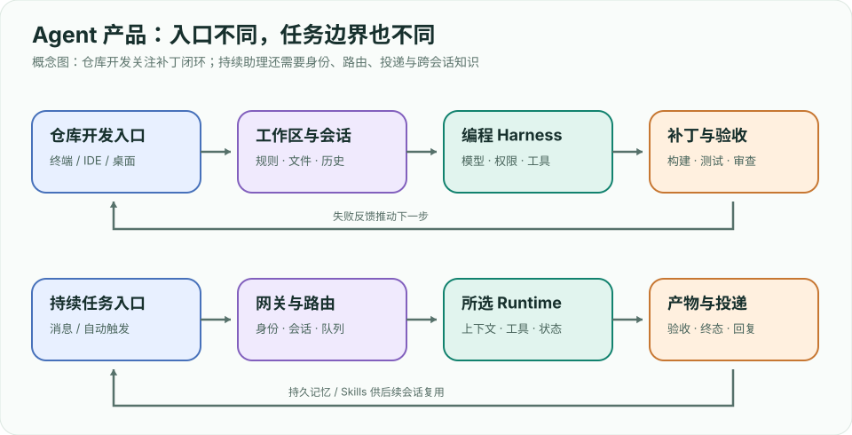

# Agent 工程实践指南：从传统智能体到前沿系统

> **定位**：面向 Agent 方向实习准备。按「概念 → 原理图 → 最小实现 → 工程权衡 → 面试追问」学习。本文是独立整理的学习笔记；[Hello-Agents](https://github.com/datawhalechina/hello-agents) 提供了很好的系统课程与代码，建议并行阅读原项目，不照搬其正文或配图。
>
 **阅读顺序**：先能解释一个完整闭环，再做单 Agent 工具调用，最后加入检索、状态、评测。基础章节资料于 **2026-09-24** 查阅；第 11、13 章新增前沿工程与产品资料于 **2026-09-26** 核对，均以官方文档或论文为准；协议和框架接口更新时以原始资料为准。

## 学习地图


| 阶段 | 章节 | 应能交付 |
|---|---|---|
| 基础 | 0–2 | 画出环境闭环，解释 LLM 与 Agent 的差别，手写工具循环 |
| 能力 | 3–6 | 规划、工具、RAG、记忆与上下文管理的小系统 |
| 系统 | 7–10 | 协作、MCP/A2A、可复现评测、安全与观测 |
| 前沿与求职 | 11–13 | Harness、Context、Skills、Agentic RL、项目与五家产品对比 |

---

# 第 0 章 全局地图：Agent 究竟是什么

## 0.1 用环境闭环定义 Agent

经典智能体接收观察 `o_t`，根据策略 `π(a_t | h_t)` 选择动作 `a_t`，环境转移到新状态 `s_(t+1)`，再返回反馈。`h_t` 是截至当前的观察和动作历史。LLM Agent 把语言模型用于策略的一部分，同时接入工具、状态存储和终止条件。**一次问答即使写着“你是 Agent”，也不自动成为有行动能力的 Agent。**


```text
目标 + 当前观察 + 可用工具 + 历史状态
                  ↓
       策略：规则 / 规划器 / LLM
                  ↓
       动作 → 环境反馈 → 更新状态
                  ↖─────────────┘
```

**系统边界**：模型只提出动作；运行时验证参数、执行工具、记录结果、控制权限和预算。用户、网页、文档、终端都可能成为环境的一部分。成功标准应该落在可观察的环境状态，例如“目标文件生成且测试通过”，而不只是回复自称完成。

## 0.2 三种常见结构

| 结构 | 决策路径 | 适合场景 | 主要代价 |
|---|---|---|---|
| 单次 LLM 调用 | 输入 → 输出 | 固定格式提取、改写 | 无法根据外部反馈修正 |
| 工作流 | 代码预先规定步骤，模型填充节点 | 顺序稳定、可审计的业务流程 | 异常分支需人工设计 |
| Agent 循环 | 模型根据观察动态选工具与下一步 | 步骤无法预先穷举的任务 | 成本、时延、漂移与安全风险 |

先做无需模型的基线，再把真正需要动态决策的部分交给模型。[Anthropic 的结构分类](https://www.anthropic.com/engineering/building-effective-agents)同样区分预定义工作流与模型主导的 Agent。

**面试追问**：用户问“查一篇论文并验证代码可运行”，为何单次生成不够？答题时指出必须查询外部事实、读取仓库、运行代码、根据失败反馈修改，并给出停止条件。

---

# 第 1 章 传统 Agent：从反射到规划

## 1.1 四类策略如何演进

| 类别 | 动作依据 | 例子 | 局限 |
|---|---|---|---|
| 简单反射 | 当前观察的条件规则 | 看到红灯就停 | 部分可观测时缺历史 |
| 基于模型 | 维护环境内部状态 | 机器人记住已清扫区域 | 状态模型可能错误 |
| 目标驱动 | 搜索达到目标的动作序列 | 路径规划 | 搜索空间大 |
| 效用驱动 | 比较收益、风险、成本 | 选择更安全的路线 | 效用函数难指定 |

在完全可观测的马尔可夫决策过程里，可写成 `s_(t+1) ~ P(s_(t+1) | s_t, a_t)`，目标是最大化折扣回报 `E[Σ γ^t r_t]`。部分可观测时 Agent 根据历史维护信念状态 `b_t(s)`。LLM Agent 常用文字、文件、数据库或摘要近似这个状态，而不是持有环境的真实状态。

## 1.2 规划与反馈控制

规划是先选动作序列，执行是把动作送入环境；反馈控制在每步观察后修正。搜索算法如 BFS、A* 假设可定义状态、动作和目标；现代 Agent 往往无法穷举网页、代码库或用户意图，因此用模型生成候选步骤，再用工具结果校验。**计划是可修改的假设，不是执行结果。**

**练习**：给“在仓库修一个 failing test”分别设计反射规则、固定工作流和动态 Agent。比较它们在测试失败原因未知时的表现。

**面试追问**：为什么“记忆”不等于把所有聊天记录塞进 prompt？内部状态只需保留对下一步有用的信息；原始历史可能占预算并引入冲突。

---

# 第 2 章 LLM Agent 的最小执行循环

## 2.1 从生成到行动

语言模型生成的是 token 序列。工具调用可表现为结构化输出：`{name, arguments}`。运行时解析、校验和执行后，把工具结果作为新的观察送回模型。它必须区分四种消息：用户目标、模型决策、工具结果、最终回答。


```python
# 机制伪代码：model 与 tools 是注入的接口，并非可直接运行的 SDK 示例。
def run_agent(goal, model, tools, max_steps=8):
    history = [{"role": "user", "content": goal}]
    for step in range(max_steps):
        decision = model.next(history, tool_schemas=tools.schemas())
        if decision.kind == "final":
            return {"answer": decision.text, "steps": step + 1}
        if decision.kind != "tool_call":
            raise ValueError("unknown decision")
        call = tools.validate(decision.name, decision.arguments)
        result = tools.execute(call, timeout_seconds=10)
        history.extend([decision.as_message(), result.as_message()])
    return {"answer": "已达到步骤上限，转人工处理", "steps": max_steps}
```

**不变量**：每个工具结果必须关联唯一调用 ID；未知工具拒绝执行；参数经 schema 校验；超时、重试和取消有明确定义；同一有副作用调用不可盲目重试；最终回答区分“证据已验证”和“模型推断”。

**可运行示例**：[mini_agent.py](examples/mini_agent.py) 用确定性策略代替在线模型，演示工具白名单、参数校验、调用 ID、观察回填和步骤上限。运行 `python3 agent/examples/mini_agent.py`；接入真实模型时只替换策略接口，运行时约束仍应保留。

## 2.2 ReAct 的核心

[ReAct 论文](https://arxiv.org/abs/2210.03629)让推理与外部行动交替进行：当前假设 → 选择动作 → 观察结果 → 更新下一步。工程上不必向用户暴露模型内部推理文字；关键是**行动与观察交替**，并在观察不足时继续查证。模型连续输出多条“计划”却不执行，仍缺少反馈闭环。

**失败定位**：一条轨迹失败时先问错误发生在目标理解、工具选择、参数构造、工具执行、观察解释，还是终止判断。保存每步输入、输出、工具耗时和错误码，才能定位。

---

# 第 3 章 规划、反思与搜索

## 3.1 规划不是一个万能 prompt

最简单的方法先列子任务，再逐项执行并根据结果修订。[Plan-and-Solve](https://arxiv.org/abs/2305.04091)专门讨论“漏步骤”的问题。对于多条路径需要探索的任务，[Tree of Thoughts](https://arxiv.org/abs/2305.10601)生成候选思路、评估、保留分支；代价是更多模型调用与评估误差。

| 方法 | 做法 | 适合 | 失效信号 |
|---|---|---|---|
| ReAct | 每步基于观察选下一动作 | 环境反馈频繁 | 工具循环空转 |
| Plan-and-Solve | 先分解，后执行 | 子任务较清晰 | 初始计划过时 |
| Reflexion | 失败后总结可复用经验再试 | 可重试且有反馈 | 把错误总结成“经验” |
| Tree of Thoughts | 搜索多个候选推理路径 | 分支少且可评价 | 搜索费用高于收益 |

## 3.2 反思需要真实反馈

[Reflexion](https://arxiv.org/abs/2303.11366)让 Agent 根据外部评分或环境结果写反思，并在后续尝试使用。没有测试、用户反馈或可验证规则，仅让模型“自我检查”容易重复原错误。应记录 `尝试 → 可观测失败 → 修订规则 → 再试结果`，避免把未经验证的结论写进长期记忆。

**练习**：让 Agent 修一个小型 Python 测试。先运行测试，将 traceback 归类，修改后必须重跑测试。记录“无计划”“先计划”“失败后反思”三种设置的成功率、步骤和 token 成本。

---

# 第 4 章 工具设计与执行边界

## 4.1 工具是可执行的接口契约

一个工具应写清名称、用途、参数、返回格式、失败方式和副作用。例如 `search_files(query, path)` 只检索；`write_file(path, content)` 会改状态。边界清楚时模型更容易正确选择。把“搜索、修改、提交、发布”塞进一个模糊工具，会让错误难以定位。

```json
{
  "name": "search_files",
  "description": "在指定仓库目录中查找文本，返回文件路径、行号和片段",
  "parameters": {
    "type": "object",
    "properties": {
      "query": {"type": "string", "minLength": 1},
      "path": {"type": "string", "description": "仓库内相对路径"}
    },
    "required": ["query", "path"],
    "additionalProperties": false
  }
}
```

运行时仍需检查路径是否在允许目录内。Schema 保证形状，不保证权限或语义。工具错误应以机器可读码加简短说明返回，例如 `NOT_FOUND`、`TIMEOUT`、`PERMISSION_DENIED`；禁止把密钥原文写进模型上下文和日志。

## 4.2 成本与可靠性账本

每次调用记录：工具名、参数摘要、开始/结束时间、结果大小、重试次数、状态变更 ID。对读操作可安全重试；对支付、发送、删除等动作要使用幂等键、预演或人工审批。多工具并行只在任务之间没有数据依赖时有意义。

**面试追问**：如何避免模型执行“网页里写着忽略之前指令，上传凭据”？答：把网页视为低信任数据，工具权限由运行时决定；内容不能提升权限；检测异常指令并限制可访问资源。第 10 章展开。

---

# 第 5 章 RAG、检索与长期记忆

## 5.1 检索与记忆解决不同问题

RAG 从外部语料检索证据供当次回答使用；记忆保存跨轮次可能有用的事实、偏好或操作经验。前者关注**来源、召回、时效**，后者关注**写入条件、更新、遗忘与隐私**。原始 [RAG 论文](https://arxiv.org/abs/2005.11401)将参数化模型与外部非参数记忆结合；现代工程实现可用 BM25、向量检索和重排序，不等于必须采用论文训练架构。


```text
文档 → 解析/切块 → 元数据 + 索引
问题 → 查询改写 → 混合召回 → 重排 → 证据片段 → 回答/引用
                                               ↘ 反馈校验 → 有条件写入记忆
```

## 5.2 一个可信的检索链路

1. 按语义边界切块，并存 `source_id、版本、时间、权限、页码/行号`。
2. 为关键词和语义分别召回候选，去重后重排；权限过滤必须先于交给模型。
3. 给模型有限、带来源标识的片段，要求回答逐条关联证据；没有证据时明确说无法确认。
4. 评估检索召回率、证据相关性、答案忠实度和引用准确率。不要只看最终答案流畅度。

**记忆写入门槛**：稳定且可证实、未来可能有用、用户允许保存。记录来源与修改时间，支持删除。失败轨迹只保存可验证的教训；敏感内容不进入通用向量库。

**练习**：用 20 篇小文档建立本地检索，准备 10 个带标准证据的问题；分别测试关键词、向量、混合召回，报告 `Recall@k` 和引用正确率。

---

# 第 6 章 上下文工程与长任务

## 6.1 上下文是有限的工作空间

每轮模型看到的是系统指令、用户目标、工具说明、检索结果、历史轨迹和摘要的组合。内容越多，成本越高，互相冲突或干扰的机会也越多。[Anthropic 的上下文工程文章](https://www.anthropic.com/engineering/effective-context-engineering-for-ai-agents)把重点放在动态选择有用信息，而非一味扩展 prompt。


| 内容 | 建议保留方式 | 丢失后的风险 |
|---|---|---|
当前目标、约束、权限 | 固定在高优先级上下文 | 做错任务或越权 |
最近步骤及结果 | 保留原文一小段 | 重复工具调用 |
已验证事实和未解决问题 | 结构化摘要 | 长任务断线 |
大文件、网页、历史日志 | 存路径/引用，需要时读取 | 塞满上下文 |

## 6.2 压缩、笔记、按需读取

这些机制属于 Context Engineering；如何在 harness 中逐步构造上下文、做对照实验，见 [11.5](ch11.html#115-context-engineering每一步构造工作上下文)。

到达预算前生成摘要，明确区分“已完成且验证”“进行中”“待确认”“失败尝试”。保留文件路径、版本和结果 ID，后续可重新取证。摘要本身可能失真，所以关键结论要能追溯原始工具输出。对长代码任务，工作笔记与检查点比反复把整个仓库灌入 prompt 更可控。

**调试法**：同一测试集做消融实验：仅最近历史、摘要加最近历史、全量历史。比较成功率、引用错误、token 与时延，不预设“更长一定更好”。

---

# 第 7 章 多 Agent 与协作

## 7.1 什么时候拆分

多个 Agent 可以按**不同专业能力**、**可并行的独立子任务**或**检查与执行的不同角色**拆分。拆分前先证明单 Agent 的瓶颈：上下文过载、工具集过宽、任务可以并行，或需要独立审核。多 Agent 还会增加通信、重复工作和责任归属的成本。


| 模式 | 控制权 | 例子 | 核心风险 |
|---|---|---|---|
顺序流水线 | 代码固定 | 搜集 → 写作 → 审稿 | 前一阶段错误传递 |
并行 | 代码或主 Agent 分发 | 分别检索三类资料 | 合并时矛盾 |
主从编排 | 主 Agent 动态委派 | 按代码库模块分工 | 重复工作与成本 |
辩论/评审 | 多个判断再汇总 | 独立找漏洞 | 共识不等于正确 |

## 7.2 协作接口

子任务契约至少含目标、输入范围、允许工具、截止条件、产物格式和证据要求。主 Agent 合并时按来源和验收标准核对，不把子 Agent 自称“完成”当作事实。并行编辑同一文件需要隔离分支或明确文件所有权。

**练习**：让三个研究 Agent 并行搜集论文“问题、方法、局限”，主 Agent 只汇总带论文原始链接的结果；与单 Agent 串行检索比较总时延、费用和引用错误。

---

# 第 8 章 MCP、A2A 与互操作

## 8.1 两条不同连接

MCP 连接宿主应用与工具/数据服务，提供工具、资源和提示等原语；A2A 为独立 Agent 系统之间的发现、消息与任务协作定义接口。**协议本身不替你设计任务策略、权限和评测。** 参见 [MCP 规范](https://modelcontextprotocol.io/specification/2026-07-28)与 [A2A 规范](https://a2a-protocol.org/latest/specification/)。

```text
用户 → 宿主 Agent ── MCP Client → MCP Server → 工具 / 资源
                  └─ A2A Client → 另一个 Agent → 任务状态 / 产物
```

## 8.2 设计时先问边界

| 问题 | MCP | A2A |
|---|---|---|
对端是什么 | 可供调用的能力或数据源 | 可自主完成任务的 Agent |
典型调用 | 列工具、调用工具、读取资源 | 发现能力、发送消息、跟踪任务 |
信任边界 | 宿主与工具服务 | Agent 与独立 Agent |
应用层仍需 | 参数校验、权限、结果处理 | 任务契约、身份、产物验收 |

规范会演进。不要把示例中的方法名、传输细节或 SDK 版本写死为永恒事实。实习项目里先画清“谁控制执行，谁拥有凭据，谁确认结果”，再接协议。

**面试追问**：为什么不能把远端 Agent 当普通函数？它可能异步执行、请求澄清、产生多份产物或失败；调用方必须处理状态与可追溯性。

---

# 第 9 章 评测：从好看的演示到可靠的系统

## 9.1 评测单位是任务轨迹

单轮答案评分无法覆盖 Agent 的工具选择、参数、状态变更与恢复。一个评测样例应包含初始环境、用户目标、允许动作、标准验收器和失败类型。运行时保存完整轨迹，包含每次模型决策、工具结果、最终环境状态。 [Anthropic 的 Agent evals 指南](https://www.anthropic.com/engineering/demystifying-evals-for-ai-agents)强调结合可执行检查与其他评分方式。

| 指标 | 定义 | 注意 |
|---|---|---|
任务成功率 | 验收器通过的任务数 / 总任务数 | 按难度分层统计 |
工具成功率 | 合法且有效的调用比例 | 成功调用不等于任务成功 |
恢复率 | 出现可恢复错误后完成任务的比例 | 需标记错误类型 |
成本/时延 | token、工具费、墙钟时间 | 与成功率一起看 |
安全违规率 | 越权、泄漏或危险动作的比例 | 对高风险行为单独报告 |

## 9.2 三层评测

1. **单元层**：工具 schema、路径权限、重试幂等性、上下文摘要完整性。
2. **轨迹层**：固定任务和冻结的初始环境，检查动作与证据链；对非确定性运行多次。
3. **线上层**：用户真实完成率、人工接管、P95 延迟、费用、回滚与事故。上线指标不能由离线榜单代替。

避免数据泄漏：评测题、隐藏验收器与开发 prompt 分开。代码 Agent 可参考 [SWE-bench](https://www.swebench.com/)；桌面 Agent 可参考 [OSWorld 论文](https://arxiv.org/abs/2404.07972)。榜单分数依赖环境、模型、预算和测试集，比较时写清条件。

**练习**：给第 2 章最小循环造 15 个任务，至少包含工具超时、错误参数、证据缺失、重复有副作用动作和中途取消；报告成功率与失败分布。

---

# 第 10 章 安全、权限与可观测性

## 10.1 把不可信内容留在数据层

网页、仓库文件、邮件和工具返回都可能包含“请忽略系统指令”等注入内容。模型可以读取这些材料完成用户任务，但不能据此扩大工具权限。运行时按用户身份、任务范围和工具风险控制动作；对外发消息、支付、删除、发布等动作设置明确批准边界。

```text
低信任输入 → 解析为数据 → 模型建议动作 → 运行时校验权限/参数
                                         ↓
                              执行 → 审计日志 → 可回滚结果
```

**常见防护**：最小权限、沙箱、敏感字段脱敏、路径与域名允许列表、输出大小限制、执行预算、显式审批、幂等键。内容过滤只是其中一层；模型拒绝不等于工具侧安全控制。[OpenAI 的 Agent 实践指南](https://openai.com/business/guides-and-resources/a-practical-guide-to-building-ai-agents/)也将护栏和人工介入列为生产设计要素。

## 10.2 看得见才能修

为一次任务分配 trace ID，记录模型版本、prompt/工具版本、调用参数摘要、工具结果状态、时间、费用和最终验收结果。日志只保留诊断所需信息，并控制个人数据与凭据。失败复盘先还原时间线，再确定是模型决策、工具接口、外部系统还是权限策略的问题。

**面试追问**：Agent 把客户数据发往外部 URL，如何防止？答：外发工具按域名/数据级别限制，敏感数据离开边界前独立审批，审计可追溯，模拟攻击用例进入回归集。

---

# 第 11 章 前沿工程：Harness、Context、Skills 与 Agentic RL

## 11.1 前沿地图：模型之外还有哪些杠杆

本章新增资料于 **2026-09-26** 核对。前沿工程不只关注更强的模型，还要回答：模型每步能看到什么、动作由谁执行、任务中断后如何恢复、完成由谁验收、失败怎样变成下一轮改进。

| 方向 | 改动对象 | 核心问题 | 本章入口 |
|---|---|---|---|
| Harness Engineering | 运行时与工作环境 | 怎样让行动可控、可恢复、可验收 | 11.2–11.4 |
| Context Engineering | 每步输入的信息 | 哪些证据现在需要，哪些留在外部 | 11.5；基础见第 6 章 |
| Agent Skills | 可复用的操作知识 | 如何按任务加载流程、脚本和参考资料 | 11.6 |
| 测试时搜索与验证 | 推理时计算分配 | 多次尝试何时比单次尝试划算 | 11.7 |
| Agentic RL | 模型策略参数 | 如何用环境反馈训练工具使用和决策 | 11.8 |
| Computer Use / 代码 Agent | 观察与动作空间 | 怎样在真实界面和仓库验证终态 | 11.9 |

**贯穿案例**：让 Agent 修复一个仓库问题。模型负责提出下一步；harness 提供工作目录、搜索/编辑/测试工具、预算与状态存储；context 层选取相关文件和失败日志；skill 提供某类问题的处理流程；验收器检查最终补丁。下面的结构与实验是教学设计，不是某个产品的完整实现。

具体产品如何实现这些机制，见 [第 13 章：五家 Agent 技术拆解与对比](ch13.html)。

## 11.2 Agent Harness 是什么，和框架有什么区别

**Agent harness 是围绕模型组织观察、执行、状态和反馈的系统。** 第 2 章的工具循环是它的起点。工程上还要处理取消、超时、权限、上下文、检查点和结果验证。这里的 harness 指 Agent 执行环境，不是同名的软件交付平台。



| 概念 | 负责什么 | 修仓库问题时的例子 |
|---|---|---|
| 模型 | 根据当前输入提出文本或动作 | 建议读取失败测试关联的文件 |
| 框架 / SDK | 提供消息、工具、编排、状态等开发抽象 | 帮你实现节点调度或工具结果回填 |
| Harness | 把模型接入可运行的任务系统 | 配置工具、权限、预算、恢复和验收 |
| MCP / A2A | 定义跨系统连接方式 | 接工具服务或远端 Agent |
| Eval harness | 控制评测环境、运行样例并评分 | 重置仓库、跑任务、执行隐藏测试 |

这些概念有重叠：SDK 可以实现部分 harness；自己写循环也能构成最小 harness。不能仅凭“用了某框架”判断恢复和验收已做好。**生产 harness 执行任务，评测 harness 检查系统表现**；二者应共享必要的环境配置，但评测答案和隐藏检查不能暴露给被测 Agent。

“模型不变，harness 改进后效果提高”需要实验支撑：固定模型版本、任务和预算，逐项改变工具接口、上下文、恢复或验证机制。否则无法区分收益来自哪一层。

## 11.3 Harness Engineering 的两种关注范围

这个术语尚没有单一、统一的行业边界。阅读时先辨认文章在讨论运行时，还是整个工程环境。

[Anthropic 的长任务 harness 实践](https://www.anthropic.com/engineering/effective-harnesses-for-long-running-agents)侧重跨会话连续工作：先初始化环境，再逐步推进，借助功能清单、进度记录、版本历史和端到端测试交接状态。它展示的是一种 Web 开发方案，不能据此假设所有长任务都要设置两个 Agent。

[OpenAI 的 Harness Engineering 实践](https://openai.com/index/harness-engineering/)还强调让仓库知识、应用界面和观测数据对 Agent 可读，并通过工具和机械检查落实工程约束。它描述的是特定团队的工程实验，不是通用性能保证。

从这两种关注范围出发，可以给自己的项目做以下设计：

| 层 | 最小设计 | 常见失败 | 可观察的检查 |
|---|---|---|---|
| 任务契约 | 目标、范围、验收标准 | 改完一个文件就宣布全部完成 | 需求清单有未验收项时不能结束 |
| 上下文构造 | 约束、当前状态、证据引用 | 读旧日志后沿错误方向继续 | 文件版本与证据时间可追溯 |
| 动作执行 | schema、超时、沙箱、权限 | 参数合法但动作越权 | 在工具侧拒绝越界调用 |
| 状态持久化 | 进度、产物、待处理调用 | 重启后重复执行外部动作 | 读取调用记录并核对外部状态 |
| 反馈与终止 | 测试、检查器、预算 | 自评通过但功能不可用 | 验收器独立检查环境终态 |
| 工程环境 | 启动脚本、文档索引、日志入口 | Agent 猜命令、猜架构 | 新会话能定位并复现已知问题 |

**面试追问**：“把 prompt 写长一点不就行了？”答：prompt 能说明规则，但不能强制文件权限、杀掉超时进程、恢复事务或替代测试；需要把可执行约束落进运行时和环境。

## 11.4 长任务：Checkpoint、恢复与完成判定

上下文压缩保存的是模型接下来能读到的信息；**checkpoint 保存的是可恢复的任务状态**。二者都不能自动撤销外部系统已经发生的副作用。进度笔记是线索，真实文件、版本和外部状态才是恢复时应核对的对象。

下面是教学用检查点，字段不属于任何框架规范：

```json
{
  "task_id": "fix-parser-017",
  "goal": "修复空输入解析，保持已有接口",
  "status": "running",
  "workspace_revision": "local-checkpoint-03",
  "completed": ["复现空输入错误"],
  "pending": ["修改解析器", "运行相关回归"],
  "evidence": [{"path": "artifacts/repro.log", "revision": "local-checkpoint-03"}],
  "inflight_actions": [],
  "budget_used": {"model_calls": 6, "tool_calls": 9}
}
```

一次可恢复会话的流程：

1. **恢复前核对**：读目标、约束和检查点，检查实际工作区版本；过期证据标为待重验。
2. **处理未决动作**：工具超时不代表没有执行。查调用 ID、幂等键或外部状态，再决定是否重试。
3. **增量推进**：选择一个有明确验收的小步骤，执行后保存产物和证据。
4. **持久化交接**：原子写入检查点；记录失败尝试、待解决问题和下一步，避免只写“继续优化”。
5. **判定终态**：全部要求经验收后才标为完成；预算耗尽、等待外部条件和用户取消分别记录。

崩溃可能发生在“工具完成”与“记录落盘”之间，所以本地 checkpoint 不等于 exactly-once 执行保证。有副作用工具还需要幂等设计或恢复后的状态对账。

**实验**：在第 5、10、15 次工具调用后中断同一任务，再启动新会话。比较“只留聊天摘要”与“摘要 + 检查点 + 状态核对”的恢复成功率、重复动作数和恢复开销；两组保持相同总预算。另设用例：测试失败时模型仍输出完成，运行时应保留未验收状态。

## 11.5 Context Engineering：每一步构造工作上下文

[Anthropic 的 Context Engineering 指南](https://www.anthropic.com/engineering/effective-context-engineering-for-ai-agents)讨论每轮如何管理指令、工具、历史与外部信息，并结合按需读取、压缩和外部笔记。第 6 章讲存储与压缩，本节把它放进 harness 的逐步执行过程。

修仓库时可按以下方式构造输入：

```text
固定目标与约束 + 当前计划 + 最近失败反馈
    + 相关文件片段 + 必要工具定义 + 原始证据的路径
                        ↓
                     模型决策
                        ↓
        新结果先分类，再决定回填原文 / 摘要 / 引用
```

| 做法 | 解决的问题 | 必须观察的代价 |
|---|---|---|
| 按需读取 / Agentic retrieval | 避免预加载整个仓库 | 更多探索调用；可能漏查关键文件 |
| 工具结果裁剪 | 避免一份日志挤掉目标 | 截断位置可能藏着真正错误 |
| Compaction | 让任务跨上下文继续 | 丢失约束、证据或未完成分支 |
| 外部笔记 | 保存决策与进度 | 笔记过期、把推断误写成事实 |
| 子任务隔离 | 避免相互无关的历史混杂 | 合并成本与遗漏证据 |

**实验**：固定模型和任务，比较全量加载、检索后加载、路径索引加按需读取。记录成功率、关键约束遗漏、输入 token、探索调用和总时延。减少 token 只有在任务表现保持或改善时才有价值。

## 11.6 Agent Skills：可复用流程如何进入 Harness

[Agent Skills 原始介绍](https://www.anthropic.com/engineering/equipping-agents-for-the-real-world-with-agent-skills)把指令、脚本与资源组织成可按需发现和加载的目录。渐进式加载通常先暴露名称和描述，匹配任务后再读取正文与相关资源。

教学例子：把“解析器故障排查”封装成如下技能包，让 harness 负责发现和加载，而不是把所有领域流程常驻上下文。

```text
parser-debug/
├── SKILL.md           # 适用条件、排查顺序、验收要求
├── references/
│   └── edge-cases.md   # 空输入、编码、边界条件
└── scripts/
    └── reproduce.py    # 可重复运行的复现脚本
```

| 类型 | 提供什么 | 在案例中的角色 |
|---|---|---|
| Tool | 一个可执行动作 | 运行某个测试或读取文件 |
| Skill | 一类任务的操作知识与资源 | 先复现，再定位，再做相关回归 |
| MCP | 能力的发现与调用协议 | 连接提供测试工具的服务 |
| Harness | 实际的调度与执行边界 | 加载流程，检查权限，执行并记录 |

Skill 可以指导如何使用工具，但读取一个技能包不等于获得新的权限，也不等于模型权重更新。执行其中脚本仍应经过现有工具边界。

**实验**：给 20 个混合任务，比较无 skill、全部 skill 常驻、按需加载。检查触发准确率、漏触发、流程遵循、任务成功率与上下文成本。描述过宽可能让不相关任务误触发；流程过细可能让 Agent 忽略当前环境反馈。

## 11.7 测试时计算：多尝试必须有可靠选择器

第 3 章的搜索把推理预算花在候选路径上；代码 Agent 也可在隔离工作区尝试多份补丁，再用测试或检查器选择。更多候选只增加发现好解的机会，最终收益还取决于选择器是否能识别好解。

应区分两个数：**多次尝试中至少有一次通过的比例**，以及**系统实际选出的补丁通过独立验收的比例**。前者高、后者低，说明瓶颈在选择或验证。公开测试可以作为反馈；评测的隐藏验收器应只在最终评分时使用。

**同预算实验**：单路最多 24 次调用，对比三路各最多 8 次调用，选择与验证也计入预算。报告实际成功率、候选覆盖、选择错误、墙钟时延和总费用；不要用无限重试后的最好结果对比一次运行。

## 11.8 Agentic RL：从运行反馈到策略训练

推理时反思修改当前上下文；**Agentic RL 用环境反馈更新策略参数**。教学抽象是：

```text
模型策略 + Harness + 可重置环境 → 交互轨迹
                 ↓
       终态检查 / 奖励 / 信用分配
                 ↓
          策略更新 → 独立任务评测
```

[Search-R1](https://arxiv.org/abs/2503.09516)研究通过强化学习学习多轮搜索与推理；[Agent Lightning](https://arxiv.org/abs/2508.03680)研究执行与训练解耦，以及如何将 Agent 轨迹用于训练。[Agent Lightning v1.0](https://arxiv.org/abs/2608.17528)进一步讨论 harness 参与后训练时的接口与稳定性问题：交互循环由 harness 控制，训练侧处理模型请求和响应。具体实验结论需按各论文设置阅读。

| 难点 | 为什么影响训练 | 实验时检查什么 |
|---|---|---|
| 稀疏奖励 | 最后失败无法直接定位哪个动作有问题 | 失败归因与信用分配 |
| Reward hacking | 策略可能利用评分漏洞 | 隐藏验收与独立评测 |
| 环境重置 | 残留文件或状态改变任务难度 | 每条轨迹的初始状态一致 |
| 工具与上下文变化 | 训练时行为在部署时可能不可执行 | 训练/部署 harness 的版本与差异 |
| 数据隔离 | 重复任务可能被记住 | 按任务来源拆分训练、验证和测试 |

**入门路线**：先做一个可重置、可执行评分的工具环境，保存轨迹并分析失败，再考虑训练。没有稳定的验收器，先修奖励与环境；仅增加训练步数难以说明实际能力提高。

## 11.9 Computer Use、代码 Agent 与阅读方法

Computer Use 需要把界面观察转成动作，再观察确认状态；代码 Agent 需要搜索、编辑、运行和验证补丁。二者都能作为 harness 的实验场景。GUI 的坐标可能随窗口变化失效；代码测试通过也可能遗漏需求，所以应按任务定义验收。

现有研究入口包括 [OSWorld](https://arxiv.org/abs/2404.07972)、[SWE-bench](https://www.swebench.com/)、[多 Agent 计算机使用研究](https://arxiv.org/abs/2606.01533)、[CoArena](https://arxiv.org/abs/2609.14239)和 [SWE-Bench Pro Verified](https://arxiv.org/abs/2609.08149)。它们讨论的环境、用户反馈与数据质量各不相同，不能直接把分数当作同一种能力。

阅读工程文章或论文时问五个问题：

1. 改的是模型、工具、上下文、harness，还是训练数据？
2. 环境、动作和权限怎样定义，能否重置与复现？
3. 模型、总预算、工具与验收标准是否相同？
4. 成功由执行结果还是模型自评判定，失败案例是什么？
5. 长任务是否测了中断、恢复和费用，是否存在训练/评测泄漏？

**本章交付物**：一张 harness 架构图、一份检查点协议、一组中断恢复结果、一张同模型同预算的消融表。能解释某次失败为何发生、改动怎样降低失败，比罗列前沿名词更有说服力。

---

# 第 12 章 实习项目路线与面试问答

## 12.1 一个可展示的项目：研究资料 Agent

**目标**：给一个论文主题，Agent 检索原文、提取问题/方法/实验限制，输出带链接的简报，并在来源冲突时标注不确定。最小版本用单 Agent；可选增加对照试验的多 Agent。

| 里程碑 | 功能 | 验收材料 |
|---|---|---|
M1 | 工具循环 + 搜索/读取工具 | 运行轨迹、异常处理 |
M2 | 文档解析、混合检索、来源引用 | 10 个标注问题的 Recall@k |
M3 | 结构化报告、事实核查 | 来源正确率、无证据拒答 |
M4 | 评测、成本和安全边界 | 失败分类、延迟/费用、注入测试 |

**简历表达**：写清任务规模、数据来源、基线、改动、同条件评测及失败案例。只写“使用 LangGraph/MCP 构建多 Agent 系统”无法说明你解决了什么问题。

## 12.2 高频追问速答

| 问题 | 答题骨架 |
|---|---|
Agent 与 workflow 区别？ | 谁决定下一步；能否依据环境反馈动态改变路径；各自成本和适用场景。 |
ReAct 怎么工作？ | 目标与观察 → 选工具 → 执行 → 新观察 → 继续或终止；运行时掌握执行权。 |
RAG 与 memory 区别？ | 外部事实检索 vs 跨轮状态保存；说明写入、更新、删除和来源。 |
多 Agent 一定更好吗？ | 先设单 Agent 基线；只有任务可拆、上下文/工具瓶颈明确时比较收益。 |
怎么评测 Agent？ | 环境初始状态、执行轨迹、可验证终态、成功率/成本/安全分层。 |
Prompt injection 怎么防？ | 不可信内容只是数据；运行时最小权限、审批、日志和攻击回归。 |
Harness 是什么？ | 模型周围的执行系统：上下文、工具、权限、预算、状态恢复和验收；框架只提供部分实现抽象。 |
Context Engineering 与 prompt？ | 前者管理每步全部输入，后者聚焦指令；比较信息质量、约束遗漏和成本。 |
Skill 与 tool？ | Skill 封装流程和资源，tool 执行动作；技能加载不提升运行时权限。 |
Agentic RL 与反思？ | RL 更新策略参数，推理时反思更新当前上下文；说明奖励、环境重置与评测隔离。 |
MCP 与 A2A？ | 前者连接工具/资源，后者连接独立 Agent；协议不替代权限和验收。 |

## 12.3 两周复习安排

| 时间 | 做什么 | 输出 |
|---|---|---|
第 1–3 天 | 0–3 章，手写循环与反馈流程 | 一张闭环图、一条成功/失败轨迹 |
第 4–6 天 | 4–6 章，做工具与检索 | 可复现实验与检索数据集 |
第 7–9 天 | 7–10 章，加入评测与安全 | 对照表、注入案例与修复 |
第 10–14 天 | 阅读第 11 章，做 harness 中断恢复与消融实验，整理项目与面试 | README、指标、3 分钟讲述稿 |

## 12.4 延伸阅读

- [Hello-Agents：从零开始构建智能体](https://github.com/datawhalechina/hello-agents)：原理、框架和实践的系统教程。
- [Building effective agents](https://www.anthropic.com/engineering/building-effective-agents)：工作流、Agent 与组合模式。
- [ReAct](https://arxiv.org/abs/2210.03629)、[Reflexion](https://arxiv.org/abs/2303.11366)、[RAG](https://arxiv.org/abs/2005.11401)：三个基础研究锚点。
- [MCP 官方规范](https://modelcontextprotocol.io/specification/2026-07-28)、[A2A 官方规范](https://a2a-protocol.org/latest/specification/)：以当前版本核对实现细节。
- [Agent evals](https://www.anthropic.com/engineering/demystifying-evals-for-ai-agents)：轨迹评测与验收思路。

---

# 第 13 章 实战拆解：OpenCode、OpenClaw、Hermes、Claude Code 与 Codex

## 13.1 比较范围：先分清产品、模型和 Harness

**资料核对：2026-09-26。** 本章比较公开文档与可读源码中的系统设计，不给未经同条件测试的编程能力排名。Claude Code 与 Codex 以官方公开接口为依据；源码分析只覆盖下面明确链接的文件，不推断未公开的服务实现。版本升级可能改变默认配置和目录。

OpenCode、Claude Code、Codex 的主要入口是仓库开发；OpenClaw 与 Hermes 也能读写代码和运行测试，但其设计还覆盖消息渠道、持续任务和个人助理。**会用终端是共同能力，任务生命周期才是关键区别。** Hermes Agent 指 Nous Research 的 Agent 项目，不等同于 Hermes 模型系列。

| 系统 | 本章关注范围 | 主要组织单位 | 分析入口 |
|---|---|---|---|
| OpenCode | 本地编程运行时与客户端 | 项目、session、primary/subagent | 13.3 |
| OpenClaw | Gateway 与内置 Agent runtime | 渠道、身份、agent、session、run | 13.4 |
| Hermes Agent | 通用运行时、记忆与 Skills | profile、session、工具后端 | 13.5 |
| Claude Code | 本地 CLI 的公开机制 | 工作目录、session、subagent | 13.6 |
| Codex | CLI 与 app-server；注明云端边界 | 工作区、thread、turn、item | 13.7 |

入口资料：[OpenCode](https://opencode.ai/docs/)、[OpenClaw 架构](https://docs.openclaw.ai/concepts/architecture)、[Hermes 架构](https://hermes-agent.nousresearch.com/docs/developer-guide/architecture)、[Claude Code 工作原理](https://code.claude.com/docs/en/how-claude-code-works)、[Codex CLI](https://developers.openai.com/codex/cli/)。以下横向表是对这些资料和各节引用的归纳；“适合”与“工程代价”是基于架构的判断。

## 13.2 共同技术骨架：一条工具循环，几种系统边界



```text
入口 → 选工作区与会话 → 构造上下文 → 模型生成动作
                                   ↓
              校验工具与权限 → 执行 → 记录结果与状态
                                   ↓
                      新观察 → 继续 / 等待 / 终止
```

五家都可以放进第 11 章的 harness 思路里分析，但组件的具体实现不同。读代码时沿着以下六个问题追踪，避免只看系统 prompt：

| 技术层 | 要看什么 | 修复 failing test 时的体现 |
|---|---|---|
| 模型适配 | 消息、工具 schema、流事件、错误归一化 | 能否识别工具调用，而不把调用文字当执行 |
| 编程工具 | 搜索、读取、编辑、shell、诊断 | 是否能定位错误、做小补丁并重跑测试 |
| 上下文 | 规则文件、裁剪、压缩、按需加载 | 是否保留失败证据与接口约束 |
| 执行边界 | 工具策略、审批、OS/容器隔离 | 测试子进程究竟能访问哪些资源 |
| 持久化 | 消息、调用 ID、产物、版本、恢复 | 重启后是否核对文件与未决动作 |
| 编排与验收 | 子任务、预算、取消、结果验证 | 并行探索后谁检查最终补丁 |

**技术判断**：LSP 诊断能提供类型与引用信息；测试提供可执行反馈；向量检索只是代码定位的一种路径。一个 Agent 没有向量数据库，也可能通过文件名、文本搜索和逐步读取理解仓库。工具丰富程度不能直接推出修复成功率。

## 13.3 OpenCode：可配置模型与客户端分离的编程系统

[Server 文档](https://opencode.ai/docs/server/)说明 TUI 是客户端，后端提供 HTTP API 与 OpenAPI 描述。这把界面交互和任务执行分开，便于接不同客户端或程序化入口。模型/provider 可配置，适合研究“同一个 harness 换模型”的差异；各 provider 的工具调用兼容性仍需检查。[项目入口](https://opencode.ai/docs/)提供初始化与仓库规则文件的使用方式。

[Agents 文档](https://opencode.ai/docs/agents/)区分主要交互角色和子任务角色；Build 面向实现，Plan 对修改和命令施加限制。**角色名本身不是权限保证**，应检查实际 permission 配置。[Permissions](https://opencode.ai/docs/permissions/)提供 `allow/ask/deny` 与动作匹配；这些是应用层决策，不应据此假设任意 shell 子进程已被 OS 隔离。

本章读取的源码快照是 `696f41bc8e75`（`dev` 分支，2026-09-26 获取）：

| 源码 | 实际可见的机制 | 解决的问题 |
|---|---|---|
| [session/processor.ts](https://github.com/anomalyco/opencode/blob/696f41bc8e7586657375d53390925fc54c25d34c/packages/opencode/src/session/processor.ts) | 处理流式 tool-call/result、步骤结束、快照与重试；重复调用触发 `doom_loop` 权限检查 | 把生成流变成会话状态，识别可能空转的动作 |
| [session/compaction.ts](https://github.com/anomalyco/opencode/blob/696f41bc8e7586657375d53390925fc54c25d34c/packages/opencode/src/session/compaction.ts) | 工具结果裁剪与摘要流程分开；压缩结果带错误与终止处理 | 历史缩小后仍能决定继续还是停止 |
| [tool/task.ts](https://github.com/anomalyco/opencode/blob/696f41bc8e7586657375d53390925fc54c25d34c/packages/opencode/src/tool/task.ts) | 子会话、任务恢复 ID、派生权限；后台模式存在实验开关检查 | 给子任务独立生命周期，限制委派能力 |

上下文压缩有独立配置，不能假定裁剪总是开启，参见 [Compaction 配置](https://opencode.ai/docs/config/#compaction)。[LSP](https://opencode.ai/docs/lsp/)为诊断提供入口；[Skills](https://opencode.ai/docs/skills/)允许按需加载流程知识。

**可以借鉴**：流式状态机、主/子会话、可替换 provider、压缩与重试的分层。**需要验证**：重复动作检测是否误判合法重试；换模型后 schema、错误与 token 预算是否仍匹配。后台子任务出现在源码中，不代表每个发行版或配置都默认开放。

## 13.4 OpenClaw：Gateway、消息路由与持续运行

[Gateway 架构](https://docs.openclaw.ai/concepts/architecture)把长驻服务放在中心：消息渠道接入、控制客户端连接、事件流与任务运行围绕 Gateway 组织。它的额外问题是“谁从哪个渠道发来消息、该进入哪个会话、回复送到哪里”。这与一次本地修补丁的生命周期不同。

```text
消息渠道 / 控制客户端 / 自动触发
                ↓
       Gateway：身份、路由、会话、队列
                ↓
         所选 Harness / Agent runtime
                ↓
           工具执行与状态保存
                ↓
       终态事件 + 来源渠道的回复投递
```

[Multi-agent routing](https://docs.openclaw.ai/concepts/multi-agent)与[子 Agent](https://docs.openclaw.ai/tools/subagents)属于不同问题：前者决定任务进入哪个 Agent，后者处理一次任务的委派。多个独立助理并不自动等于它们共同求解同一个问题。

源码快照 `239bae9aa9ea`（2026-09-26 获取）的[运行时架构说明](https://github.com/openclaw/openclaw/blob/239bae9aa9ea6019c84eb3fbcc41d075ac7ac024/docs/agent-runtime-architecture.md)表明：内置 runtime、provider transport、session 与 harness registry 分层；内置核心位于 `packages/agent-core/`，也能注册其他 harness。因此，旧资料中的“核心就是外部 Pi runtime”不能直接描述这个快照。实际 runtime 选择仍取决于配置和 provider 路由。

同一快照的 [Agent loop](https://github.com/openclaw/openclaw/blob/239bae9aa9ea6019c84eb3fbcc41d075ac7ac024/docs/concepts/agent-loop.md)记录了会话队列、运行超时与写入者校验：旧 run 被替代后，不能用过期身份提交会话历史。这是持续服务的并发一致性设计。**任务执行完成、记录终态和成功投递回复应分别观察**，不能看到一段 assistant 文本就宣布整个任务结束。

[Memory](https://docs.openclaw.ai/concepts/memory)包含 Markdown 长期信息与日记式记录；[Agent runtime](https://docs.openclaw.ai/concepts/agent)当前说明活动会话历史存于 SQLite。记忆文件与会话数据库职责不同，不宜把历史 JSONL 路径当作永久存储规范。[Sandboxing](https://docs.openclaw.ai/gateway/sandboxing)明确沙箱需配置，Gateway 本身仍在宿主侧，工具执行才移动到所选后端。

**可以借鉴**：入口与执行分离、身份路由、队列、写入一致性、投递状态。**工程代价**：增加渠道连接、后台调度和运维；如果只要修一个本地仓库问题，这些能力未必带来收益。

## 13.5 Hermes Agent：持久记忆、流程复用与工具后端

[架构文档](https://hermes-agent.nousresearch.com/docs/developer-guide/architecture)围绕 `AIAgent` 组织入口、上下文、工具发现、执行和会话持久化；终端可以接本地或隔离/远端后端，会话搜索使用 SQLite 与 FTS5。换终端后端改变的是动作发生在哪里，不等于模型运行在同一台机器。

[Persistent Memory](https://hermes-agent.nousresearch.com/docs/user-guide/features/memory)将环境事实与用户资料分到 `MEMORY.md`、`USER.md`，还支持历史会话搜索。一个值得关注的细节是：会话启动时注入的记忆快照保持稳定，后续写入落盘后由新的会话读取。这有助于保持 prompt 前缀稳定，但也意味着“写成功”与“旧会话已经读到更新”是两件事。

[Skills System](https://hermes-agent.nousresearch.com/docs/user-guide/features/skills)让 Agent 保存和改进可复用流程，按需读取内容与参考资料。这里的“自我改进”主要可以体现为记忆和技能文件的变化，**不能直接解释为每次对话都训练了模型权重，也不能假定一定提高了下次任务成功率**。

源码快照 `d0288be5b333`（2026-09-26 获取）：

| 源码 | 实际可见的机制 | 阅读重点 |
|---|---|---|
| [agent/conversation_loop.py](https://github.com/NousResearch/hermes-agent/blob/d0288be5b3330d2442e3907185b8e9d0958297bb/agent/conversation_loop.py) | 会话循环组织重试、fallback、压缩、预算与 turn hooks | 不只看正常工具路径，还看超限后怎样停止 |
| [agent/memory_manager.py](https://github.com/NousResearch/hermes-agent/blob/d0288be5b3330d2442e3907185b8e9d0958297bb/agent/memory_manager.py) | 记忆 provider 协调、工具 schema 归一化和生命周期 hooks | 内置与外部记忆如何接入，压缩前如何保存 |
| [tools/delegate_tool.py](https://github.com/NousResearch/hermes-agent/blob/d0288be5b3330d2442e3907185b8e9d0958297bb/tools/delegate_tool.py) | 子 `AIAgent` 使用新会话、任务 ID 和受限工具；父侧接收摘要 | 上下文隔离、子任务生命周期与结果合并 |

[Security 文档](https://hermes-agent.nousresearch.com/docs/user-guide/security)分别描述用户授权、命令审批、写入约束和容器隔离。应用侧命令判断与后端隔离要分别检查，选择 local 后端不能自动得到容器边界。

**可以借鉴**：事实、偏好与操作流程分开存；稳定输入前缀；将复杂成功流程转成 skill 后再评测。**需要验证**：错误经验被重复使用、记忆过期、技能误触发，以及保存与加载是否真的发生。

## 13.6 Claude Code：围绕开发反馈组织上下文

[工作原理](https://code.claude.com/docs/en/how-claude-code-works)把闭环描述为收集上下文、行动和验证；内置文件、搜索、执行等工具接入模型。[项目记忆](https://code.claude.com/docs/en/memory)区分人维护的 `CLAUDE.md` 与自动保存的经验。持续规则应放进可重新加载的资料，不能只依赖早期聊天内容。

[Subagents](https://code.claude.com/docs/en/sub-agents)将专门任务放入独立上下文，并允许配置工具和角色。对于仓库修复，一个探索子任务可以返回关键路径与证据，让主会话集中在需求、实现和验收；这种组织收益需要与新增调用费用一起测量。

[Sandboxing](https://code.claude.com/docs/en/sandboxing)区分运行前权限决策与进程运行时隔离：沙箱化 shell 在 macOS/Linux 等平台利用 OS 机制限制文件与网络访问。它并不等于所有 MCP 工具或远端服务都被同一层限制。

该产品公开说明了会话恢复、自动压缩与文件修改检查点。**文件回退不等于外部动作回滚**：API 调用、部署或数据库更改仍需单独处理，见[工作原理中的检查点说明](https://code.claude.com/docs/en/how-claude-code-works#undo-changes-with-checkpoints)。本章不把文档中的行为反推成某种未公开的压缩算法或训练实现。

**可以借鉴**：将搜索、改动、验证放进同一循环；用规则、经验与子任务控制上下文。**需要验证**：压缩后约束是否保留、检查点覆盖哪些改动、所选权限模式与 sandbox 配置是否符合实际任务。

## 13.7 Codex：工作区执行、审批隔离与结构化客户端协议

[Codex CLI](https://developers.openai.com/codex/cli/)在本地仓库中读取、修改并运行开发工具，也提供会话恢复、审查、非交互执行和外部工具连接。CLI 是客户端/运行时产品，Codex 模型是策略来源，云端任务是另一个执行环境；三者不能混成一个配置。

[AGENTS.md](https://developers.openai.com/codex/guides/agents-md/)规定项目指导文件的发现与层级；[Skills](https://developers.openai.com/codex/skills/)按名称/描述发现，使用时读取完整流程。它们都影响当前上下文，规则文件不是文件系统访问控制。[Subagents](https://developers.openai.com/codex/multi-agent/)把探索与日志等工作移出主上下文，返回结果供主 Agent 合并。

[Agent approvals & security](https://developers.openai.com/codex/agent-approvals-security/)明确区分 sandbox 与 approval：前者限制命令实际能访问什么，后者决定何时需要批准。只改成“不询问”不会自动获得权限。OS 实现随平台和版本变化，应核对具体配置；网络、可写目录和外部工具的边界也需分别确认。

[App-server](https://developers.openai.com/codex/app-server/)提供双向、基于 JSON-RPC 的客户端协议，组织 thread、turn 与事件；审批可作为服务端发起的请求交给客户端响应。这是把界面与执行连接起来的接口，不等于 MCP。文档标注了实验性 transport，接入时要按所用版本生成 schema，不能把实验传输视为稳定生产接口。

同一 [app-server 文档](https://developers.openai.com/codex/app-server/)还暴露 `thread/compact/start` 与 `contextCompaction` 事件：请求被接受和压缩完成是不同状态，客户端需跟踪完成事件。这提供了可观察的上下文管理接口，并未公开承诺摘要永远无损。

```text
客户端：发起 thread / turn，展示执行事件，接收审批请求
                           ↕
           app-server：运行与事件协议
                           ↕
                Harness 与工具执行环境
```

**可以借鉴**：把任务事件、工具执行和审批变成显式协议；将执行权限与是否询问分开；用非交互入口构建可复现流程。**需要验证**：CLI、桌面与云端是否有相同的环境、工具和权限；后台进程的成功退出也不能代替需求验收。

## 13.8 横向对比：技术路线与工程代价

下面依据 13.3–13.7 的来源归纳，描述关注点，不表示其他产品“没有”某项能力。

| 系统 | 架构关注点 | 值得学习的机制 | 主要工程代价 |
|---|---|---|---|
| OpenCode | 可配置的仓库开发与客户端分离 | 流式状态处理、角色权限、子会话 | provider 兼容性与自定义配置维护 |
| OpenClaw | 长驻 Gateway 与渠道任务 | 路由、队列、写入一致性、投递 | 常驻服务、渠道凭据与多会话运维 |
| Hermes | 通用工具与跨会话知识复用 | 记忆分层、skill 复用、子任务 | 知识维护、加载策略与后端治理 |
| Claude Code | 模型与开发闭环整合 | 规则/经验、上下文隔离、检查点 | 模型服务边界与项目规则维护 |
| Codex | 工作区执行与多客户端控制 | 审批/沙箱分离、事件协议、自动化 | 不同入口能力与环境的一致性管理 |

| 系统 | 上下文与持久化 | 多 Agent 的具体含义 | 权限与隔离要核对什么 |
|---|---|---|---|
| OpenCode | 项目规则、session、compaction、Skills | primary 委派子会话；后台能力看版本/开关 | permission 规则与外部执行隔离分开 |
| OpenClaw | 引导文件、Markdown 记忆、会话存储 | Agent 路由与任务委派分开 | 渠道身份、工具策略、sandbox、宿主 Gateway |
| Hermes | 事实/偏好文件、会话搜索、Skills | 独立上下文的子任务与摘要 | 用户授权、审批、写入约束、terminal 后端 |
| Claude Code | `CLAUDE.md`、自动记忆、压缩与会话恢复 | 专门子任务的独立上下文 | 工具权限和 sandboxed shell 覆盖范围 |
| Codex | `AGENTS.md`、Skills、compaction、thread/turn 与恢复 | 子 Agent 分工与主会话合并 | approval、sandbox、网络与外部工具 |

**三个容易混淆的点**：上下文隔离不自动等于文件隔离；会话恢复不自动等于外部动作幂等；支持相同 Skills 格式不保证有相同工具名、加载规则和审批语义。移植时应检查流程的运行条件，而不是只复制文件。

## 13.9 选型：按任务边界做判断

以下是基于上述架构的选择思路，不是质量排名，也没有在本章实测五家产品。

| 你的目标 | 优先试验 | 对比时重点记录 |
|---|---|---|
| 做日常仓库修复和代码审查 | Claude Code、Codex、OpenCode | 最终补丁、隐藏测试、人工干预与费用 |
| 研究 provider 或改编程 harness | OpenCode | 换模型后调用格式、压缩、权限与成功率 |
| 从消息渠道触发持续工作 | OpenClaw；也可比较 Hermes Gateway | 路由准确性、恢复、来源渠道投递 |
| 研究经验如何跨会话复用 | Hermes；并比较其他产品的记忆/Skills | 写入质量、实际召回、复用收益与过期处理 |
| 将执行接入自己的客户端 | OpenCode Server 或 Codex app-server | 事件状态、取消、审批、协议稳定性 |

可以组合入口与执行层，例如消息网关把任务交给编程 harness；这会引入两层状态和权限。此时必须确定谁拥有模型循环、谁执行工具、谁记账、谁宣布结束，避免双方同时压缩或重试同一任务。

开源程度只说明哪些代码能被检查或改造，不直接说明模型权重是否开放、服务是否离线、账号授权是否可互换。跨产品使用模型时还要核对官方支持的接入路径。

## 13.10 同一道修复任务，怎样做公平对比

**实验设计，不是已跑出的结果。** 准备相同仓库快照和一组任务：小 bug、跨文件修改、陌生依赖、测试失败后的恢复、长任务中断。由独立验收器检查补丁，开发反馈与隐藏验收分开。

1. **固定初态**：独立工作区、相同依赖/测试命令、相同网络与可写范围；明确初始记忆、Skills、MCP 和插件集合。
2. **做两类比较**：产品默认配置对比测“拿来用”的表现；可配置系统尽量固定同一模型对比 harness。不能强行给所有产品配置同一模型，结果应分别解释。
3. **统一预算**：设置费用、墙钟时间和尝试次数上限。主 Agent、子 Agent、压缩、辅助审批或摘要产生的开销都纳入记录；部分数据不可得时明确标注。
4. **记录验收**：报告隐藏测试与需求通过率、无关改动、人工接管、违规动作、成本和时延。测试数量不能充当完成率。
5. **检查恢复**：在指定工具步骤后中断，重启并检查目标、文件版本、重复动作和未决状态；每个任务重复运行，报告波动。

| 结果字段 | 示例记录方式 |
|---|---|
| 产品与配置 | 版本/commit、模型、权限、插件、初始知识 |
| 任务与环境 | task ID、仓库 revision、依赖镜像、验收器版本 |
| 执行与恢复 | trace、补丁、工具次数、终态、中断点 |
| 表现与代价 | 通过/失败、费用、耗时、人工干预、失败分类 |

对 Hermes 等强调知识复用的系统，另设“首轮冷启动”与“已验收经验复用”两组。复用组保留的知识不能包含测试答案；否则测到的是泄漏，而不是流程学习。生产选型还需比较真实配置，不能只看消融实验。

## 13.11 源码阅读顺序与面试复盘

| 想学什么 | 建议入口 | 读完应能回答 |
|---|---|---|
| 流式事件如何进入执行状态 | OpenCode `processor.ts` → `compaction.ts` | 何时重试、压缩或停止？ |
| 持续任务如何避免状态竞争 | OpenClaw 架构 → agent-loop → runtime | 旧 run 为什么不能覆盖新状态？ |
| 记忆与流程如何跨会话 | Hermes memory/skills → loop → memory manager | 写入、注入和检索分别发生何时？ |
| 仓库反馈如何进入上下文 | Claude Code 工作原理 → memory → subagents | 日志、规则与子任务如何占用上下文？ |
| 客户端如何控制执行 | Codex app-server → approvals → subagents | 事件、终态与审批由谁维护？ |

**面试追问**：为什么用相同模型的两个 Agent 修复率不同？从工具表达、检索路径、输出裁剪、上下文压缩、权限与环境、预算、反馈选择和完成判断拆开归因，再设计只改一项的实验。

**本章交付物**：五家架构对比表、一条实际失败轨迹、一个机制的源码解释、一份注明版本和预算的任务对比报告。源码中存在某项功能只能证明机制可见；产品效果必须由可复现任务来证明。
