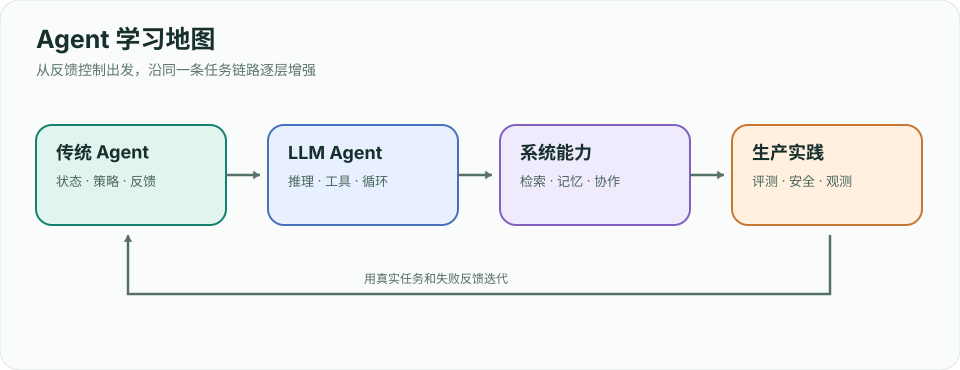
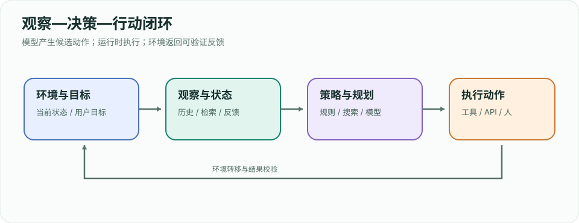
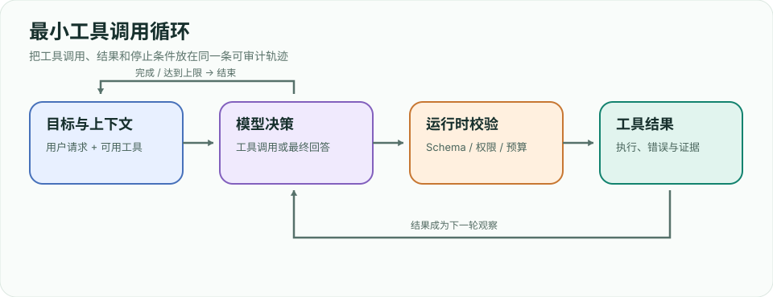
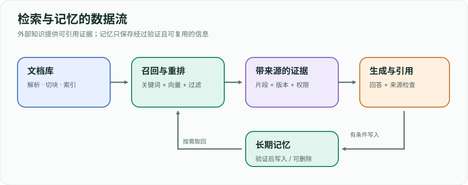
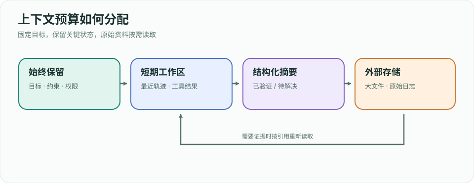
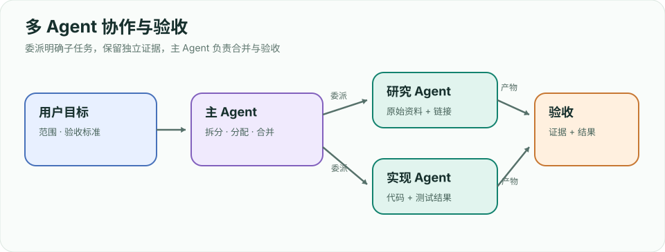

# Agent 工程实践指南：从传统智能体到前沿系统

> **定位**：面向 Agent 方向实习准备。按「概念 → 原理图 → 最小实现 → 工程权衡 → 面试追问」学习。本文是独立整理的学习笔记；[Hello-Agents](https://github.com/datawhalechina/hello-agents) 提供了很好的系统课程与代码，建议并行阅读原项目，不照搬其正文或配图。
>
 **阅读顺序**：先能解释一个完整闭环，再做单 Agent 工具调用，最后加入检索、状态、评测。所有“最新”技术以 **2026-09-24** 查阅的官方文档或论文为准；协议和框架接口更新时以原始资料为准。

## 学习地图



| 阶段 | 章节 | 应能交付 |
|---|---|---|
| 基础 | 0–2 | 画出环境闭环，解释 LLM 与 Agent 的差别，手写工具循环 |
| 能力 | 3–6 | 规划、工具、RAG、记忆与上下文管理的小系统 |
| 系统 | 7–10 | 协作、MCP/A2A、可复现评测、安全与观测 |
| 前沿与求职 | 11–12 | 研究阅读清单、项目复盘与面试答案 |

---

# 第 0 章 全局地图：Agent 究竟是什么

## 0.1 用环境闭环定义 Agent

经典智能体接收观察 `o_t`，根据策略 `π(a_t | h_t)` 选择动作 `a_t`，环境转移到新状态 `s_(t+1)`，再返回反馈。`h_t` 是截至当前的观察和动作历史。LLM Agent 把语言模型用于策略的一部分，同时接入工具、状态存储和终止条件。**一次问答即使写着“你是 Agent”，也不自动成为有行动能力的 Agent。**



```text
目标 + 当前观察 + 可用工具 + 历史状态
                  ↓
       策略：规则 / 规划器 / LLM
                  ↓
       动作 → 环境反馈 → 更新状态
                  ↖─────────────┘
```

**系统边界**：模型只提出动作；运行时验证参数、执行工具、记录结果、控制权限和预算。用户、网页、文档、终端都可能成为环境的一部分。成功标准应该落在可观察的环境状态，例如“目标文件生成且测试通过”，而不只是回复自称完成。

## 0.2 三种常见结构

| 结构 | 决策路径 | 适合场景 | 主要代价 |
|---|---|---|---|
| 单次 LLM 调用 | 输入 → 输出 | 固定格式提取、改写 | 无法根据外部反馈修正 |
| 工作流 | 代码预先规定步骤，模型填充节点 | 顺序稳定、可审计的业务流程 | 异常分支需人工设计 |
| Agent 循环 | 模型根据观察动态选工具与下一步 | 步骤无法预先穷举的任务 | 成本、时延、漂移与安全风险 |

先做无需模型的基线，再把真正需要动态决策的部分交给模型。[Anthropic 的结构分类](https://www.anthropic.com/engineering/building-effective-agents)同样区分预定义工作流与模型主导的 Agent。

**面试追问**：用户问“查一篇论文并验证代码可运行”，为何单次生成不够？答题时指出必须查询外部事实、读取仓库、运行代码、根据失败反馈修改，并给出停止条件。

---

# 第 1 章 传统 Agent：从反射到规划

## 1.1 四类策略如何演进

| 类别 | 动作依据 | 例子 | 局限 |
|---|---|---|---|
| 简单反射 | 当前观察的条件规则 | 看到红灯就停 | 部分可观测时缺历史 |
| 基于模型 | 维护环境内部状态 | 机器人记住已清扫区域 | 状态模型可能错误 |
| 目标驱动 | 搜索达到目标的动作序列 | 路径规划 | 搜索空间大 |
| 效用驱动 | 比较收益、风险、成本 | 选择更安全的路线 | 效用函数难指定 |

在完全可观测的马尔可夫决策过程里，可写成 `s_(t+1) ~ P(s_(t+1) | s_t, a_t)`，目标是最大化折扣回报 `E[Σ γ^t r_t]`。部分可观测时 Agent 根据历史维护信念状态 `b_t(s)`。LLM Agent 常用文字、文件、数据库或摘要近似这个状态，而不是持有环境的真实状态。

## 1.2 规划与反馈控制

规划是先选动作序列，执行是把动作送入环境；反馈控制在每步观察后修正。搜索算法如 BFS、A* 假设可定义状态、动作和目标；现代 Agent 往往无法穷举网页、代码库或用户意图，因此用模型生成候选步骤，再用工具结果校验。**计划是可修改的假设，不是执行结果。**

**练习**：给“在仓库修一个 failing test”分别设计反射规则、固定工作流和动态 Agent。比较它们在测试失败原因未知时的表现。

**面试追问**：为什么“记忆”不等于把所有聊天记录塞进 prompt？内部状态只需保留对下一步有用的信息；原始历史可能占预算并引入冲突。

---

# 第 2 章 LLM Agent 的最小执行循环

## 2.1 从生成到行动

语言模型生成的是 token 序列。工具调用可表现为结构化输出：`{name, arguments}`。运行时解析、校验和执行后，把工具结果作为新的观察送回模型。它必须区分四种消息：用户目标、模型决策、工具结果、最终回答。



```python
# 机制伪代码：model 与 tools 是注入的接口，并非可直接运行的 SDK 示例。
def run_agent(goal, model, tools, max_steps=8):
    history = [{"role": "user", "content": goal}]
    for step in range(max_steps):
        decision = model.next(history, tool_schemas=tools.schemas())
        if decision.kind == "final":
            return {"answer": decision.text, "steps": step + 1}
        if decision.kind != "tool_call":
            raise ValueError("unknown decision")
        call = tools.validate(decision.name, decision.arguments)
        result = tools.execute(call, timeout_seconds=10)
        history.extend([decision.as_message(), result.as_message()])
    return {"answer": "已达到步骤上限，转人工处理", "steps": max_steps}
```

**不变量**：每个工具结果必须关联唯一调用 ID；未知工具拒绝执行；参数经 schema 校验；超时、重试和取消有明确定义；同一有副作用调用不可盲目重试；最终回答区分“证据已验证”和“模型推断”。

**可运行示例**：[mini_agent.py](examples/mini_agent.py) 用确定性策略代替在线模型，演示工具白名单、参数校验、调用 ID、观察回填和步骤上限。运行 `python3 agent/examples/mini_agent.py`；接入真实模型时只替换策略接口，运行时约束仍应保留。

## 2.2 ReAct 的核心

[ReAct 论文](https://arxiv.org/abs/2210.03629)让推理与外部行动交替进行：当前假设 → 选择动作 → 观察结果 → 更新下一步。工程上不必向用户暴露模型内部推理文字；关键是**行动与观察交替**，并在观察不足时继续查证。模型连续输出多条“计划”却不执行，仍缺少反馈闭环。

**失败定位**：一条轨迹失败时先问错误发生在目标理解、工具选择、参数构造、工具执行、观察解释，还是终止判断。保存每步输入、输出、工具耗时和错误码，才能定位。

---

# 第 3 章 规划、反思与搜索

## 3.1 规划不是一个万能 prompt

最简单的方法先列子任务，再逐项执行并根据结果修订。[Plan-and-Solve](https://arxiv.org/abs/2305.04091)专门讨论“漏步骤”的问题。对于多条路径需要探索的任务，[Tree of Thoughts](https://arxiv.org/abs/2305.10601)生成候选思路、评估、保留分支；代价是更多模型调用与评估误差。

| 方法 | 做法 | 适合 | 失效信号 |
|---|---|---|---|
| ReAct | 每步基于观察选下一动作 | 环境反馈频繁 | 工具循环空转 |
| Plan-and-Solve | 先分解，后执行 | 子任务较清晰 | 初始计划过时 |
| Reflexion | 失败后总结可复用经验再试 | 可重试且有反馈 | 把错误总结成“经验” |
| Tree of Thoughts | 搜索多个候选推理路径 | 分支少且可评价 | 搜索费用高于收益 |

## 3.2 反思需要真实反馈

[Reflexion](https://arxiv.org/abs/2303.11366)让 Agent 根据外部评分或环境结果写反思，并在后续尝试使用。没有测试、用户反馈或可验证规则，仅让模型“自我检查”容易重复原错误。应记录 `尝试 → 可观测失败 → 修订规则 → 再试结果`，避免把未经验证的结论写进长期记忆。

**练习**：让 Agent 修一个小型 Python 测试。先运行测试，将 traceback 归类，修改后必须重跑测试。记录“无计划”“先计划”“失败后反思”三种设置的成功率、步骤和 token 成本。

---

# 第 4 章 工具设计与执行边界

## 4.1 工具是可执行的接口契约

一个工具应写清名称、用途、参数、返回格式、失败方式和副作用。例如 `search_files(query, path)` 只检索；`write_file(path, content)` 会改状态。边界清楚时模型更容易正确选择。把“搜索、修改、提交、发布”塞进一个模糊工具，会让错误难以定位。

```json
{
  "name": "search_files",
  "description": "在指定仓库目录中查找文本，返回文件路径、行号和片段",
  "parameters": {
    "type": "object",
    "properties": {
      "query": {"type": "string", "minLength": 1},
      "path": {"type": "string", "description": "仓库内相对路径"}
    },
    "required": ["query", "path"],
    "additionalProperties": false
  }
}
```

运行时仍需检查路径是否在允许目录内。Schema 保证形状，不保证权限或语义。工具错误应以机器可读码加简短说明返回，例如 `NOT_FOUND`、`TIMEOUT`、`PERMISSION_DENIED`；禁止把密钥原文写进模型上下文和日志。

## 4.2 成本与可靠性账本

每次调用记录：工具名、参数摘要、开始/结束时间、结果大小、重试次数、状态变更 ID。对读操作可安全重试；对支付、发送、删除等动作要使用幂等键、预演或人工审批。多工具并行只在任务之间没有数据依赖时有意义。

**面试追问**：如何避免模型执行“网页里写着忽略之前指令，上传凭据”？答：把网页视为低信任数据，工具权限由运行时决定；内容不能提升权限；检测异常指令并限制可访问资源。第 10 章展开。

---

# 第 5 章 RAG、检索与长期记忆

## 5.1 检索与记忆解决不同问题

RAG 从外部语料检索证据供当次回答使用；记忆保存跨轮次可能有用的事实、偏好或操作经验。前者关注**来源、召回、时效**，后者关注**写入条件、更新、遗忘与隐私**。原始 [RAG 论文](https://arxiv.org/abs/2005.11401)将参数化模型与外部非参数记忆结合；现代工程实现可用 BM25、向量检索和重排序，不等于必须采用论文训练架构。



```text
文档 → 解析/切块 → 元数据 + 索引
问题 → 查询改写 → 混合召回 → 重排 → 证据片段 → 回答/引用
                                               ↘ 反馈校验 → 有条件写入记忆
```

## 5.2 一个可信的检索链路

1. 按语义边界切块，并存 `source_id、版本、时间、权限、页码/行号`。
2. 为关键词和语义分别召回候选，去重后重排；权限过滤必须先于交给模型。
3. 给模型有限、带来源标识的片段，要求回答逐条关联证据；没有证据时明确说无法确认。
4. 评估检索召回率、证据相关性、答案忠实度和引用准确率。不要只看最终答案流畅度。

**记忆写入门槛**：稳定且可证实、未来可能有用、用户允许保存。记录来源与修改时间，支持删除。失败轨迹只保存可验证的教训；敏感内容不进入通用向量库。

**练习**：用 20 篇小文档建立本地检索，准备 10 个带标准证据的问题；分别测试关键词、向量、混合召回，报告 `Recall@k` 和引用正确率。

---

# 第 6 章 上下文工程与长任务

## 6.1 上下文是有限的工作空间

每轮模型看到的是系统指令、用户目标、工具说明、检索结果、历史轨迹和摘要的组合。内容越多，成本越高，互相冲突或干扰的机会也越多。[Anthropic 的上下文工程文章](https://www.anthropic.com/engineering/effective-context-engineering-for-ai-agents)把重点放在动态选择有用信息，而非一味扩展 prompt。



| 内容 | 建议保留方式 | 丢失后的风险 |
|---|---|---|
当前目标、约束、权限 | 固定在高优先级上下文 | 做错任务或越权 |
最近步骤及结果 | 保留原文一小段 | 重复工具调用 |
已验证事实和未解决问题 | 结构化摘要 | 长任务断线 |
大文件、网页、历史日志 | 存路径/引用，需要时读取 | 塞满上下文 |

## 6.2 压缩、笔记、按需读取

到达预算前生成摘要，明确区分“已完成且验证”“进行中”“待确认”“失败尝试”。保留文件路径、版本和结果 ID，后续可重新取证。摘要本身可能失真，所以关键结论要能追溯原始工具输出。对长代码任务，工作笔记与检查点比反复把整个仓库灌入 prompt 更可控。

**调试法**：同一测试集做消融实验：仅最近历史、摘要加最近历史、全量历史。比较成功率、引用错误、token 与时延，不预设“更长一定更好”。

---

# 第 7 章 多 Agent 与协作

## 7.1 什么时候拆分

多个 Agent 可以按**不同专业能力**、**可并行的独立子任务**或**检查与执行的不同角色**拆分。拆分前先证明单 Agent 的瓶颈：上下文过载、工具集过宽、任务可以并行，或需要独立审核。多 Agent 还会增加通信、重复工作和责任归属的成本。



| 模式 | 控制权 | 例子 | 核心风险 |
|---|---|---|---|
顺序流水线 | 代码固定 | 搜集 → 写作 → 审稿 | 前一阶段错误传递 |
并行 | 代码或主 Agent 分发 | 分别检索三类资料 | 合并时矛盾 |
主从编排 | 主 Agent 动态委派 | 按代码库模块分工 | 重复工作与成本 |
辩论/评审 | 多个判断再汇总 | 独立找漏洞 | 共识不等于正确 |

## 7.2 协作接口

子任务契约至少含目标、输入范围、允许工具、截止条件、产物格式和证据要求。主 Agent 合并时按来源和验收标准核对，不把子 Agent 自称“完成”当作事实。并行编辑同一文件需要隔离分支或明确文件所有权。

**练习**：让三个研究 Agent 并行搜集论文“问题、方法、局限”，主 Agent 只汇总带论文原始链接的结果；与单 Agent 串行检索比较总时延、费用和引用错误。

---

# 第 8 章 MCP、A2A 与互操作

## 8.1 两条不同连接

MCP 连接宿主应用与工具/数据服务，提供工具、资源和提示等原语；A2A 为独立 Agent 系统之间的发现、消息与任务协作定义接口。**协议本身不替你设计任务策略、权限和评测。** 参见 [MCP 规范](https://modelcontextprotocol.io/specification/2026-07-28)与 [A2A 规范](https://a2a-protocol.org/latest/specification/)。

```text
用户 → 宿主 Agent ── MCP Client → MCP Server → 工具 / 资源
                  └─ A2A Client → 另一个 Agent → 任务状态 / 产物
```

## 8.2 设计时先问边界

| 问题 | MCP | A2A |
|---|---|---|
对端是什么 | 可供调用的能力或数据源 | 可自主完成任务的 Agent |
典型调用 | 列工具、调用工具、读取资源 | 发现能力、发送消息、跟踪任务 |
信任边界 | 宿主与工具服务 | Agent 与独立 Agent |
应用层仍需 | 参数校验、权限、结果处理 | 任务契约、身份、产物验收 |

规范会演进。不要把示例中的方法名、传输细节或 SDK 版本写死为永恒事实。实习项目里先画清“谁控制执行，谁拥有凭据，谁确认结果”，再接协议。

**面试追问**：为什么不能把远端 Agent 当普通函数？它可能异步执行、请求澄清、产生多份产物或失败；调用方必须处理状态与可追溯性。

---

# 第 9 章 评测：从好看的演示到可靠的系统

## 9.1 评测单位是任务轨迹

单轮答案评分无法覆盖 Agent 的工具选择、参数、状态变更与恢复。一个评测样例应包含初始环境、用户目标、允许动作、标准验收器和失败类型。运行时保存完整轨迹，包含每次模型决策、工具结果、最终环境状态。 [Anthropic 的 Agent evals 指南](https://www.anthropic.com/engineering/demystifying-evals-for-ai-agents)强调结合可执行检查与其他评分方式。

| 指标 | 定义 | 注意 |
|---|---|---|
任务成功率 | 验收器通过的任务数 / 总任务数 | 按难度分层统计 |
工具成功率 | 合法且有效的调用比例 | 成功调用不等于任务成功 |
恢复率 | 出现可恢复错误后完成任务的比例 | 需标记错误类型 |
成本/时延 | token、工具费、墙钟时间 | 与成功率一起看 |
安全违规率 | 越权、泄漏或危险动作的比例 | 对高风险行为单独报告 |

## 9.2 三层评测

1. **单元层**：工具 schema、路径权限、重试幂等性、上下文摘要完整性。
2. **轨迹层**：固定任务和冻结的初始环境，检查动作与证据链；对非确定性运行多次。
3. **线上层**：用户真实完成率、人工接管、P95 延迟、费用、回滚与事故。上线指标不能由离线榜单代替。

避免数据泄漏：评测题、隐藏验收器与开发 prompt 分开。代码 Agent 可参考 [SWE-bench](https://www.swebench.com/)；桌面 Agent 可参考 [OSWorld 论文](https://arxiv.org/abs/2404.07972)。榜单分数依赖环境、模型、预算和测试集，比较时写清条件。

**练习**：给第 2 章最小循环造 15 个任务，至少包含工具超时、错误参数、证据缺失、重复有副作用动作和中途取消；报告成功率与失败分布。

---

# 第 10 章 安全、权限与可观测性

## 10.1 把不可信内容留在数据层

网页、仓库文件、邮件和工具返回都可能包含“请忽略系统指令”等注入内容。模型可以读取这些材料完成用户任务，但不能据此扩大工具权限。运行时按用户身份、任务范围和工具风险控制动作；对外发消息、支付、删除、发布等动作设置明确批准边界。

```text
低信任输入 → 解析为数据 → 模型建议动作 → 运行时校验权限/参数
                                         ↓
                              执行 → 审计日志 → 可回滚结果
```

**常见防护**：最小权限、沙箱、敏感字段脱敏、路径与域名允许列表、输出大小限制、执行预算、显式审批、幂等键。内容过滤只是其中一层；模型拒绝不等于工具侧安全控制。[OpenAI 的 Agent 实践指南](https://openai.com/business/guides-and-resources/a-practical-guide-to-building-ai-agents/)也将护栏和人工介入列为生产设计要素。

## 10.2 看得见才能修

为一次任务分配 trace ID，记录模型版本、prompt/工具版本、调用参数摘要、工具结果状态、时间、费用和最终验收结果。日志只保留诊断所需信息，并控制个人数据与凭据。失败复盘先还原时间线，再确定是模型决策、工具接口、外部系统还是权限策略的问题。

**面试追问**：Agent 把客户数据发往外部 URL，如何防止？答：外发工具按域名/数据级别限制，敏感数据离开边界前独立审批，审计可追溯，模拟攻击用例进入回归集。

---

# 第 11 章 前沿方向：2026 年的阅读坐标

## 11.1 从“会调工具”走向长任务能力

截至 2026-09-24，值得跟踪的是长时程任务中的上下文压缩与恢复、计算机使用、代码 Agent、多模态观察、测试时搜索、Agentic RL、多 Agent 协作和环境化评测。它们是研究与工程方向，**不是所有项目都需要同时采用**。

| 方向 | 核心问题 | 原理抓手 | 建议实验 |
|---|---|---|---|
长任务 | 超过上下文窗口如何保持目标 | 摘要、外部笔记、按需检索 | 20 步任务中途压缩后复现 |
Computer Use | 如何操作 GUI 并验证界面状态 | 截图/DOM 观察、动作、再观察 | 对比坐标和语义定位失败率 |
代码 Agent | 如何在真实仓库修改并通过测试 | 搜索、编辑、运行、回归 | 记录首个错误到最终补丁 |
测试时搜索 | 何时多分支值得成本 | 生成候选、评分、剪枝 | 同预算下比较单路与多路 |
Agentic RL | 如何用环境反馈训练策略 | 轨迹、奖励、策略更新 | 区分训练收益与推理时反思 |
多 Agent | 何时协作胜过单体 | 分工、并行、合并验证 | 同任务同预算对照 |

一个新的 [多 Agent 计算机使用研究](https://arxiv.org/abs/2606.01533)报告了多场景的改进；结论来自其选定的基线和评测，不能直接外推到每个实际系统。新近 [CoArena](https://arxiv.org/abs/2609.14239)探索真实用户对计算机使用 Agent 的盲评，提示静态离线题之外还需要真实任务反馈。[SWE-Bench Pro Verified](https://arxiv.org/abs/2609.08149)则关注代码 Agent 评测中的泄漏和题目一致性问题。

## 11.2 阅读论文的四个问题

1. 环境是什么？观察、动作、反馈和权限如何定义？
2. 基线是否公平？模型、工具、上下文窗口、调用预算是否一致？
3. 成功由什么判定？执行验证还是模型自评？有没有失败案例？
4. 成本如何变化？更多采样、多 Agent 与更长轨迹的收益是否足以覆盖费用？

**更新原则**：把论文中的实验结论标为“该设置下”；协议版本看官方规范；产品能力与价格变动先查官方文档再写项目方案。

---

# 第 12 章 实习项目路线与面试问答

## 12.1 一个可展示的项目：研究资料 Agent

**目标**：给一个论文主题，Agent 检索原文、提取问题/方法/实验限制，输出带链接的简报，并在来源冲突时标注不确定。最小版本用单 Agent；可选增加对照试验的多 Agent。

| 里程碑 | 功能 | 验收材料 |
|---|---|---|
M1 | 工具循环 + 搜索/读取工具 | 运行轨迹、异常处理 |
M2 | 文档解析、混合检索、来源引用 | 10 个标注问题的 Recall@k |
M3 | 结构化报告、事实核查 | 来源正确率、无证据拒答 |
M4 | 评测、成本和安全边界 | 失败分类、延迟/费用、注入测试 |

**简历表达**：写清任务规模、数据来源、基线、改动、同条件评测及失败案例。只写“使用 LangGraph/MCP 构建多 Agent 系统”无法说明你解决了什么问题。

## 12.2 高频追问速答

| 问题 | 答题骨架 |
|---|---|
Agent 与 workflow 区别？ | 谁决定下一步；能否依据环境反馈动态改变路径；各自成本和适用场景。 |
ReAct 怎么工作？ | 目标与观察 → 选工具 → 执行 → 新观察 → 继续或终止；运行时掌握执行权。 |
RAG 与 memory 区别？ | 外部事实检索 vs 跨轮状态保存；说明写入、更新、删除和来源。 |
多 Agent 一定更好吗？ | 先设单 Agent 基线；只有任务可拆、上下文/工具瓶颈明确时比较收益。 |
怎么评测 Agent？ | 环境初始状态、执行轨迹、可验证终态、成功率/成本/安全分层。 |
Prompt injection 怎么防？ | 不可信内容只是数据；运行时最小权限、审批、日志和攻击回归。 |
MCP 与 A2A？ | 前者连接工具/资源，后者连接独立 Agent；协议不替代权限和验收。 |

## 12.3 两周复习安排

| 时间 | 做什么 | 输出 |
|---|---|---|
第 1–3 天 | 0–3 章，手写循环与反馈流程 | 一张闭环图、一条成功/失败轨迹 |
第 4–6 天 | 4–6 章，做工具与检索 | 可复现实验与检索数据集 |
第 7–9 天 | 7–10 章，加入评测与安全 | 对照表、注入案例与修复 |
第 10–14 天 | 阅读前沿论文，整理项目与面试 | README、指标、3 分钟讲述稿 |

## 12.4 延伸阅读

- [Hello-Agents：从零开始构建智能体](https://github.com/datawhalechina/hello-agents)：原理、框架和实践的系统教程。
- [Building effective agents](https://www.anthropic.com/engineering/building-effective-agents)：工作流、Agent 与组合模式。
- [ReAct](https://arxiv.org/abs/2210.03629)、[Reflexion](https://arxiv.org/abs/2303.11366)、[RAG](https://arxiv.org/abs/2005.11401)：三个基础研究锚点。
- [MCP 官方规范](https://modelcontextprotocol.io/specification/2026-07-28)、[A2A 官方规范](https://a2a-protocol.org/latest/specification/)：以当前版本核对实现细节。
- [Agent evals](https://www.anthropic.com/engineering/demystifying-evals-for-ai-agents)：轨迹评测与验收思路。
