# LLM 推理加速知识手册 · 实习面试版

> **定位**：面试速查 + 深度理解。每个知识点都遵循「**速查**（一句话立骨架）→ **原理**（讲清为什么）→ **追问**（面试官接下来会问什么）」的递进结构。
>
> **阅读路径建议**：
> - 面试前一天 → 只看每节的 **速查** 行 + 第 9 章「面试速查区」
> - 面试前一周 → 按第 0 章地图过一遍，把不熟的分层重点看
> - 系统学习 → 从第 1 章顺序读，每章末尾的「追问预案」当自测题
>
> **符号约定**：`速查` = 临场先说这段；`原理` = 被追问再展开；`追问` = 高频问题 + 回答要点。
>
> **术语约定**：每个术语**首次出现**时都会给出「**中文名（English Full Name，缩写）**」并附一句话解释；后续出现直接用缩写。附录 A 有完整术语表可供快速回查。
>
> **配图**：全文共 21 张图，位于 `figures/` 目录。若在纯文本环境阅读，可跳过图片，正文文字自成体系。
>
> **代码约定**：全文共 **17 段示意代码**，全部是为了讲清机制而写的**最小可读实现（illustrative code）**，不是任何具体仓库的源码，也不追求性能与边界完备（省略了 mask、边界检查、并行划分、错误处理等细节）。其中可独立验证的部分已用 NumPy 等价改写做过数值校验（校验脚本 `.workbuddy-ai/tmp/verify_snippets.py`），文中出现的误差、冲突路数、比值均为实跑结果。**阅读时关注「数据怎么流、索引怎么算」，不要照抄进生产代码。**

---

## 目录

- [第 0 章 全局地图：为什么推理加速要分四层](#第-0-章-全局地图为什么推理加速要分四层)
- [第 1 章 基础：一次 LLM 推理到底发生了什么](#第-1-章-基础一次-llm-推理到底发生了什么)
- [第 2 章 模型层加速](#第-2-章-模型层加速)
- [第 3 章 算子层加速](#第-3-章-算子层加速)
- [第 4 章 执行层加速](#第-4-章-执行层加速)
- [第 5 章 系统层加速](#第-5-章-系统层加速)
- [第 6 章 专题：KV Cache 全解](#第-6-章-专题kv-cache-全解)
- [第 7 章 专题：MoE 推理](#第-7-章-专题moe-推理)
- [第 8 章 专题：投机解码](#第-8-章-专题投机解码)
- [第 9 章 面试速查区](#第-9-章-面试速查区)
- [附录](#附录)

### 配图索引

| 图号 | 标题 | 所在小节 |
|---|---|---|
| 图 0-1 | LLM 推理加速的四层结构 | 0.1 |
| 图 0-2 | 三个瓶颈：算力 / 带宽 / 容量 | 0.3 |
| 图 0-3 | Prefill vs Decode：两种完全不同的负载 | 0.5 |
| 图 1-1 | 一次 LLM 推理的端到端流程 | 1.1 |
| 图 1-2 | KV Cache 随并发线性增长 | 1.4 |
| 图 2-1 | 量化的基本流程 | 2.1 |
| 图 2-2 | MHA / GQA / MQA / MLA 演进 | 2.5 |
| 图 3-1 | FlashAttention 分块与 online softmax | 3.1 |
| 图 3-2 | PagedAttention 的 Block Table 机制 | 3.2 |
| 图 3-3 | GPU 存储层次 | 3.6 |
| 图 3-4 | Shared Memory Bank Conflict | 3.7 |
| 图 4-1 | CUDA Graph 的执行方式对比 | 4.1 |
| 图 4-2 | torch.compile 编译流水线 | 4.2 |
| 图 5-1 | 静态 Batching vs Continuous Batching | 5.1 |
| 图 5-2 | Chunked Prefill | 5.2 |
| 图 5-3 | Prefix Cache | 5.3 |
| 图 5-4 | 并行策略 DP / TP / PP / EP | 5.5 |
| 图 5-5 | PD 分离架构 | 5.6 |
| 图 6-1 | 减少 KV Cache 的六类手段 | 6.2 |
| 图 7-1 | MoE 的 Router 与 Top-K 选择 | 7.1 |
| 图 8-1 | 投机解码流程 | 8.1 |

### 代码索引

| 编号 | 内容 | 语言 | 所在小节 |
|---|---|---|---|
| 码 1-1 | Prefill 的 LM Head 只算每序列最后一个 Token | Python | 1.2 |
| 码 1-2 | Decode 单步的 KV 追加与注意力计算 | Python | 1.3 |
| 码 2-1 | 对称线性量化 / 反量化（per-tensor 与 per-token） | Python | 2.1 |
| 码 2-2 | GQA 的 K/V 广播（`repeat_kv`） | Python | 2.5 |
| 码 3-1 | online softmax 参考实现（不物化 N×N 矩阵） | Python | 3.1 |
| 码 3-2 | 逻辑块 → 物理 KV 槽位映射（`slot_mapping`） | Python | 3.2 |
| 码 3-3 | 算子融合前后对比（RMSNorm + Residual） | Python | 3.3 |
| 码 3-4 | 最小 Triton softmax kernel | Triton | 3.4 |
| 码 3-5 | Bank Conflict 的地址算术验证 | Python | 3.7 |
| 码 4-1 | CUDA Graph 的捕获与重放 | Python | 4.1 |
| 码 4-2 | torch.compile 用法与 Graph Break 诱因 | Python | 4.2 |
| 码 5-1 | Continuous Batching 的调度主循环 | Python | 5.1 |
| 码 5-2 | Chunked Prefill 的切块与「中间块不采样」 | Python | 5.2 |
| 码 5-3 | Prefix Cache 的链式哈希与碰撞兜底 | Python | 5.3 |
| 码 6-1 | KV Cache INT8 量化的 store kernel 片段 | Triton | 6.3 |
| 码 6-2 | 反量化的两条路径：融合 vs 物化 | Python / Triton | 6.4 |
| 码 8-1 | 投机解码的验证与接受 / 拒绝 | Python | 8.1 |

---

# 第 0 章 全局地图：为什么推理加速要分四层

## 0.1 一张图看懂四层

面试里最容易被问的开场题：**「LLM 推理加速你了解哪些方法？」** 不要一上来就报菜名，先给框架。

> **术语先立住**：**LLM（Large Language Model，大语言模型）** 指参数量在十亿级以上的 Transformer 类自回归语言模型；本手册讨论的「推理（Inference）」特指**训练完成后的前向计算与在线服务**，不含训练与微调。

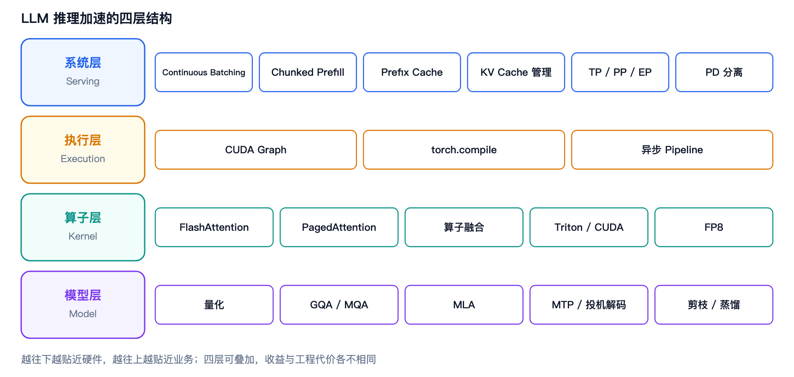
*图 0-1 · LLM 推理加速的四层结构：越往下越贴近硬件，越往上越贴近业务*

**为什么这样分层？** 因为四层的**优化对象不同**：模型层改「要算什么」，算子层改「单个算子怎么算」，执行层改「怎么把算子交给 GPU」，系统层改「多个请求怎么排队共享资源」。四层互不冲突、可以叠加，但收益与工程代价差异巨大。

## 0.2 四层总览表（可直接背）

| 层次 | 技术 | 核心作用 | 简单例子 |
|---|---|---|---|
| **模型层** | 量化 | 用更低精度表示权重/激活，减少显存和计算量 | FP16→FP8/INT8/INT4；AWQ、GPTQ |
| | GQA / MQA | 减少 K/V Head 数，降低 KV Cache 和 Attention 访存 | Llama-2 70B 用 GQA；MQA 多 Q Head 共用一组 KV |
| | MLA | 把 KV 压缩到低维 latent，进一步压缩 KV Cache | DeepSeek-V2/V3 的 Multi-head Latent Attention |
| | MTP / 投机解码 | 一次预测多个 Token，减少逐 Token Decode 次数 | DeepSeek MTP；Draft + Target Speculative Decoding |
| **算子层** | FlashAttention | 分块计算 Attention，减少 HBM 读写，不物化完整 Attention 矩阵 | FlashAttention-2/3 |
| | PagedAttention | 像 OS 分页一样管理 KV Cache，避免连续显存和碎片 | vLLM PagedAttention |
| | 融合 RMSNorm/RoPE/SiLU | 多个小算子合并，减少 Kernel Launch 和显存读写 | RMSNorm+Residual、SiLU+Mul、RoPE Fusion |
| | Triton / CUDA Kernel | 手写高性能 GPU 算子，提高访存/并行/Tensor Core 利用率 | Triton Attention、CUDA SGEMM |
| | FP8 | 8-bit 浮点计算，提高 Tensor Core 吞吐、降低带宽 | H100 FP8 GEMM、Transformer Engine |
| **执行层** | CUDA Graph | 把一系列 Kernel 预先捕获后整体执行，降低 CPU Launch 开销 | vLLM Decode CUDA Graph |
| | torch.compile | 编译 PyTorch Graph，做算子融合、图优化、Kernel 生成 | TorchInductor + Triton |
| | 异步 Pipeline | CPU 调度 / GPU 计算 / 数据传输并行，隐藏等待 | CPU 准备下一 Batch 时 GPU 正在 Decode |
| **系统层** | Continuous Batching | 请求动态加入/退出 Batch，提高 GPU 利用率 | vLLM、SGLang |
| | Chunked Prefill | 长 Prompt 不一次 Prefill，而是分块执行 | 8192 Token Prompt 拆成 512/1024 Token Chunk |
| | Prefix Cache | 相同 Prompt 前缀直接复用已有 KV Cache | System Prompt、多人共享长 Context |
| | KV Cache 管理 | 动态分配/释放/复用/换出 KV Cache | Block Manager、KV Cache Offload |
| | TP / PP / EP | 把大模型拆到多 GPU 上 | Tensor / Pipeline / Expert Parallel |
| | PD 分离 | Prefill 和 Decode 放到不同 GPU/机器，分别优化 | Prefill GPU 高算力、Decode GPU 高带宽 |
| | 高效 Serving | 调度+缓存+流式+负载均衡形成完整在线服务 | vLLM、SGLang、TensorRT-LLM |

> 上表中出现的缩写，正文对应章节都会给出全称与解释；此处先建立整体印象即可。

## 0.3 加速的本质：三个瓶颈

所有推理加速技术，最终都在解决下面三个瓶颈之一。**面试时先把问题定位到瓶颈，再谈技术，会显得非常有条理。**

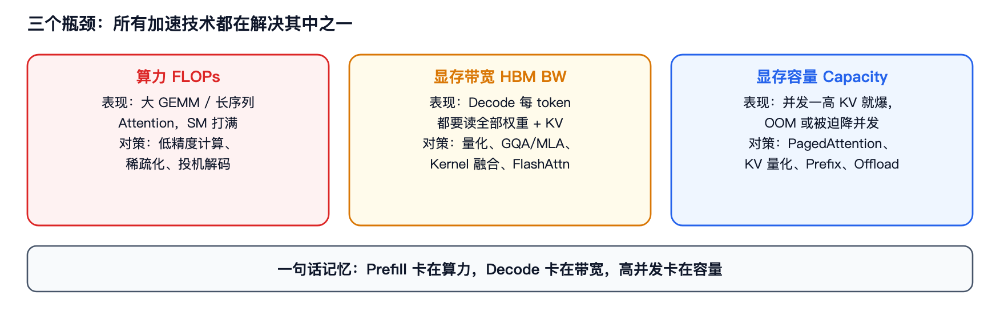
*图 0-2 · 三个瓶颈与各自的典型对策*

| 瓶颈 | 表现 | 典型对策 |
|---|---|---|
| **算力（FLOPs）** | 大 GEMM、长序列 Attention，SM 打满 | 低精度计算（FP8/INT8）、稀疏化、投机解码 |
| **显存带宽（HBM BW）** | Decode 阶段每 token 都要读全部权重 + KV | 量化、GQA/MLA、Kernel 融合、FlashAttention |
| **显存容量** | 并发一高 KV Cache 就爆，OOM 或降并发 | PagedAttention、KV 量化、Prefix Cache、Offload、PD 分离 |

**术语解释**：
- **FLOPs（Floating-point Operations，浮点运算次数）**：衡量计算量的单位，注意与 **FLOP/s**（每秒浮点运算次数，衡量算力）区分。
- **GEMM（General Matrix Multiply，通用矩阵乘法）**：`C = A × B` 形式的稠密矩阵乘，是 Transformer 里 Linear 层的主体，也是 GPU 上最擅长、最成熟的算子形态。
- **SM（Streaming Multiprocessor，流多处理器）**：GPU 的基本计算单元，一块 GPU 由几十到上百个 SM 组成；「SM 打满」指所有计算单元都在忙。
- **OOM（Out Of Memory，显存不足）**：显存分配失败导致进程报错退出。
- **Offload（卸载）**：把暂时不用的数据从显存搬到 CPU 内存或 NVMe，需要时再搬回。

> **一句话记忆**：Prefill 卡在**算力**，Decode 卡在**带宽**，高并发卡在**容量**。

## 0.4 核心指标词典

面试官经常会用这些缩写，听不懂会直接扣分。

| 指标 | 全称 | 含义 | 关注方 |
|---|---|---|---|
| **TTFT** | Time To First Token（首 Token 延迟） | 从发出请求到收到第一个 Token 的耗时，主要由 Prefill 决定 | 用户体感（首字延迟） |
| **TPOT** | Time Per Output Token（每输出 Token 耗时） | 平均每个输出 Token 的耗时，主要由 Decode 决定 | 流式体验流畅度 |
| **TBT** | Time Between Tokens（Token 间隔） | 相邻 Token 之间的时间间隔及其抖动，Chunked Prefill 主要优化它 | 流式体验稳定性 |
| **Latency** | End-to-End Latency（端到端延迟） | TTFT + TPOT × 输出长度 | 单请求 |
| **Throughput** | 吞吐量 | 单位时间处理的 Token 数 / 请求数 | 服务成本 |
| **Goodput** | 有效吞吐量 | 只统计满足 SLO 的请求吞吐，比 Throughput 更真实 | 线上服务 |
| **MFU** | Model FLOPs Utilization（模型算力利用率） | 实际算力 / 峰值算力，衡量计算效率 | 训练 / 长 Prefill |
| **MBU** | Memory Bandwidth Utilization（显存带宽利用率） | 实际带宽 / 峰值带宽，衡量访存效率 | Decode |

**术语解释**：
- **Token（词元）**：模型处理的最小文本单位。文本先经 **Tokenizer（分词器）** 切成 Token，映射为整数 ID 后送入模型。
- **SLO（Service Level Objective，服务等级目标）**：对服务质量的可量化承诺，如「P99 TTFT < 200 ms」。

**关键认知**：**延迟与吞吐天然矛盾**。Batch 越大吞吐越高，但单请求 TPOT 变差。所以线上服务做的是「在满足 SLO 的前提下最大化吞吐」，这也是 PD 分离、调度策略存在的根本原因。

## 0.5 最重要的一个区分：Prefill 计算密集 vs Decode 访存密集

这是整本手册里**最值钱的一条认知**，几乎所有系统层设计都由它推导出来。

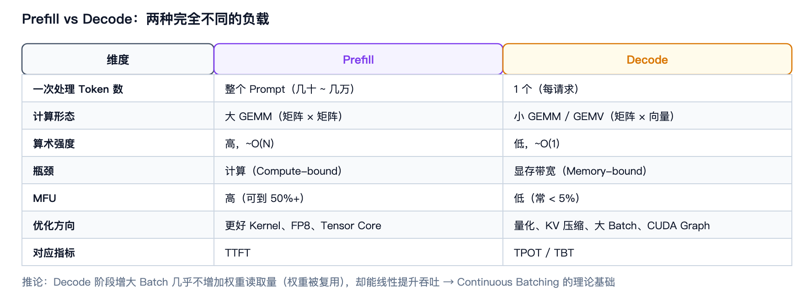
*图 0-3 · Prefill 与 Decode 在计算形态、瓶颈、优化方向上的全面对比*

| 维度 | Prefill | Decode |
|---|---|---|
| 一次处理多少 Token | 整个 Prompt（几十 ~ 几万） | 1 个（每请求） |
| 计算形态 | 大 GEMM，矩阵乘矩阵 | 小 GEMM / GEMV，矩阵乘向量 |
| 算术强度 | 高（~O(N)） | 低（~O(1)） |
| 瓶颈 | **计算（Compute-bound）** | **显存带宽（Memory-bound）** |
| MFU | 高（可到 50%+） | 低（常 < 5%） |
| 优化方向 | 更好的 Kernel、FP8、Tensor Core | 量化、KV 压缩、Batch 增大、CUDA Graph |
| 延迟指标 | TTFT | TPOT / TBT |

**术语解释**：
- **Prefill（预填充阶段）**：把用户输入的全部 Prompt Token 一次性并行前向，建立 KV Cache 的阶段。
- **Decode（解码阶段）**：自回归逐 Token 生成的阶段，每步只处理一个新 Token 并复用历史 KV Cache。
- **GEMV（General Matrix-Vector multiply，通用矩阵向量乘）**：`y = A × x`，其中 `x` 是向量，是 Decode 阶段的主要算子形态，访存受限。
- **算术强度（Arithmetic Intensity）**：每读写 1 字节数据所对应的浮点运算次数（FLOPs / Bytes），是判断「计算受限」还是「访存受限」的核心指标。
- **Compute-bound / Memory-bound（计算受限 / 访存受限）**：前者受限于算力峰值，加带宽没用；后者受限于带宽，加算力没用。
- **Tensor Core（张量核心）**：GPU 内专做矩阵乘累加的硬件单元，支持 FP16/BF16/TF32/FP8/INT8 混合精度，吞吐远高于普通 CUDA Core。

> **追问：为什么 Decode 是访存密集？**
> 生成一个 Token 需要把**全部模型权重**从 HBM 读一遍（MoE 只读激活专家），而计算量只有 2×参数量 FLOPs。以 70B 模型 FP16 为例：读 140 GB 权重，算 140 GFLOPs，算术强度 ≈ 1 FLOP/Byte，远低于 GPU 的机器平衡点（H100 约 300+）。所以**带宽是天花板，加算力没用**。
>
> **推论**：Decode 阶段增大 Batch 几乎不增加权重读取量（权重被复用），却能线性提升吞吐 → 这就是 Continuous Batching 的理论基础。

## 0.6 收益与代价的权衡原则

面试官喜欢问「XX 技术的代价是什么」。记住这张表，回答时永远先说收益、再说代价、最后说适用边界。

| 技术 | 收益 | 代价 / 边界 |
|---|---|---|
| 量化 | 省显存、省带宽 | 精度损失、需校准、算子支持有限 |
| CUDA Graph | 省 CPU Launch 开销 | 静态形状/地址、额外显存、需预捕获多套 |
| 投机解码 | 减少串行 Decode 次数 | Draft 成本、接受率不确定、显存换收益 |
| Chunked Prefill | 降低 TBT 抖动、防 OOM | 有 Token 被浪费、调度更复杂 |
| PD 分离 | 各自最优、互不干扰 | KV 传输开销、需要额外网络/机器 |
| MoE | 参数大而激活少 | 通信/负载均衡/工程复杂度陡增 |

---

# 第 1 章 基础：一次 LLM 推理到底发生了什么

## 1.1 端到端流程

**速查**：Tokenizer → Scheduler 分配资源 → Prefill 建立 KV Cache → Decode 逐 Token 生成 → Detokenize 返回。

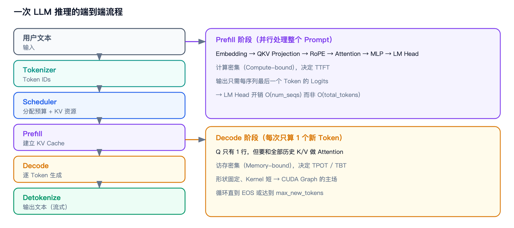
*图 1-1 · 端到端流程，以及 Prefill / Decode 两个阶段的内部构成*

```text
用户输入文本
    │
    ▼
Tokenizer ──► Token IDs
    │
    ▼
Scheduler ──► 分配计算预算 + KV Cache 资源
    │
    ▼
┌──────────────────────── Prefill ────────────────────────┐
│ Embedding → QKV Projection → RoPE → Attention → MLP →   │
│ LM Head → Logits                                        │
│ （并行处理整个 Prompt，建立 KV Cache）                    │
└─────────────────────────────────────────────────────────┘
    │
    ▼
┌──────────────────────── Decode ─────────────────────────┐
│ 每次只算 1 个新 Token，复用历史 KV Cache，循环直到         │
│ EOS 或达到 max_new_tokens                               │
└─────────────────────────────────────────────────────────┘
    │
    ▼
Detokenize ──► 返回文本（通常流式）
```

**术语解释**：
- **Scheduler（调度器）**：决定每一轮把哪些请求放进 Batch、分配多少 Token 预算和 KV Cache 空间的组件，是推理框架的核心大脑。
- **Embedding（嵌入层）**：把 Token ID 映射成稠密向量的查表层。
- **QKV Projection（QKV 投影）**：用三个（或融合为一个）线性层，把隐藏状态投影成 Attention 需要的 Query / Key / Value 三个矩阵。
- **RoPE（Rotary Position Embedding，旋转位置编码）**：通过旋转复数向量把位置信息注入 Q/K 的编码方式，是当前主流 LLM 的位置编码方案。
- **Attention（注意力机制）**：`softmax(QKᵀ/√d)V` 的计算，让每个 Token 按相关性聚合其他 Token 的信息。
- **MLP（Multi-Layer Perceptron，多层感知机）/ FFN（Feed-Forward Network，前馈网络）**：Transformer 块里 Attention 之后的两层全连接网络，通常含 SiLU 激活与门控，是参数量的主要来源。
- **LM Head（语言模型输出头）**：把最后一层隐藏状态投影到词表维度的线性层，输出 **Logits**。
- **Logits（未归一化分数）**：模型对词表中每个 Token 的原始打分，经 softmax 后成为概率分布，供 **Sampling（采样）** 使用。
- **EOS（End Of Sequence，序列结束符）**：模型输出该 Token 表示生成结束。
- **Detokenize（反分词）**：把生成的 Token ID 序列还原为可读文本。

## 1.2 Prefill 阶段

**速查**：一次性并行处理整个 Prompt，计算密集，决定 TTFT，同时把 K/V 写进 KV Cache。

**原理**：
- 输入是 `[num_tokens, hidden]`，所有 Token 位置已知，Attention 可以用 **Causal Mask（因果掩码，保证每个位置只能看到自己及之前的 Token）** 并行算。
- 输出只需要**每个序列最后一个 Token 的 Logits**（用于采样第一个新 Token），所以 LM Head 的开销是 `O(num_seqs)` 而非 `O(total_tokens)`——这是很常见的优化点。
- 长 Prompt 的 Prefill 会瞬间占用大量显存（Activation + KV Cache），所以需要 Chunked Prefill 兜底。

**术语解释**：
**码 1-1 · Prefill 的 LM Head 只算每序列最后一个 Token**

```python
# packed varlen 批：hidden 是 [total_tokens, hidden]，cu_seqlens 是各段边界
last_idx = cu_seqlens[1:] - 1          # 每条序列最后一个 token 在 packed 张量里的下标
logits = lm_head(hidden[last_idx])     # [num_seqs, vocab]，开销 O(num_seqs)

# 反例：写成 lm_head(hidden) 会得到 [total_tokens, vocab]
# 长 prompt 下 99% 以上的 logits 永远不会被采样到，纯属白算
```

> **为什么值得看代码**：`vocab` 通常 10 万级，这一行把 LM Head 的 FLOPs 从 `O(total_tokens × vocab)` 降到 `O(num_seqs × vocab)`——长 Prompt 下是数量级的差别，而工程代价几乎为零。面试里这是很好用的「小改动大收益」例子。

- **Activation（激活值）**：前向传播过程中产生的中间张量，需要临时占用显存。
- **Batch（批）**：一次前向同时处理的请求集合；**num_seqs** 指批内序列数。

**追问：Prefill 能怎么加速？**
> 三条路径：① 算子层——用 packed varlen（**variable length，变长序列打包**）Kernel 一次 launch 覆盖整个 batch，减少 Python 循环和 Kernel Launch；② 消除 GPU→CPU 的 scalar 同步（`.item()` 是同步点）；③ 减少实际要算的 Token——Prefix Cache 命中后只 Prefill 增量。

## 1.3 Decode 阶段

**速查**：每步只处理 1 个新 Token（每请求），复用历史 KV Cache，访存密集，决定 TPOT。

**原理**：
- 新 Token 的 Q 只有 1 行，但需要和**全部历史 K/V** 做 Attention，所以必须维护 KV Cache。
- 每步计算量小、Kernel 短、形状固定 → **Kernel Launch（核函数启动）开销占比高**，这正是 CUDA Graph 的用武之地。
- 每步都要把全部权重读一遍 → **量化收益最大的阶段**。

**术语解释**：
**码 1-2 · Decode 单步到底在算什么**

```python
# x 是当前 token 的 hidden state；cache 里是这条序列的全部历史 K/V
q = proj_q(x)                                   # [1, H_q, D]  ← 只有 1 行
k_new, v_new = proj_kv(x)                       # [1, H_kv, D]

k_cache = torch.cat([k_cache, k_new], dim=0)    # [S+1, H_kv, D]  ← 用显存换计算
v_cache = torch.cat([v_cache, v_new], dim=0)

scores = (q @ k_cache.transpose(-1, -2)) / math.sqrt(D)   # [1, H_q, S+1]
out = torch.softmax(scores, dim=-1) @ v_cache             # [1, H_q, D]
```

这三行代码解释了 KV Cache 的全部必要性：

1. `q` 只有 1 行 → **计算量是 O(S)**，很小，GPU 算得飞快；
2. 但 `k_cache` / `v_cache` 每一步都要**全量读一遍** → **访存是 O(S)**，且 S 随生成长度增长；
3. 计算小、访存大，正好落在「访存受限」区间 → 所以 Decode 的瓶颈是带宽不是算力。

> 注意 `cat` 只是示意：真实实现不会每步分配新张量，而是用 PagedAttention 按槽位**原地写入**（见码 3-2）。`cat` 写法在长序列下会因为反复分配/拷贝显存而直接崩掉。

- **Kernel（核函数）**：在 GPU 上并行执行的函数，一次启动称为 **Kernel Launch**；每次启动都有固定的 CPU→驱动→GPU 提交开销。
- **自回归（Autoregressive，AR）**：每一步的输出作为下一步的输入，天然串行。

**追问：Decode 为什么不能像 Prefill 一样并行？**
> 因为自回归依赖：第 t 个 Token 的输入是第 t−1 个 Token 的输出，天然串行。投机解码就是用来打破这个串行链的（一次验证多个）。

## 1.4 KV Cache：推理显存大户

**速查**：KV Cache 缓存历史 Token 的 Key/Value，避免 Decode 每步重算，但显存占用随「层数 × KV Head 数 × 序列长度 × 并发数」线性增长，高并发时往往超过模型权重。

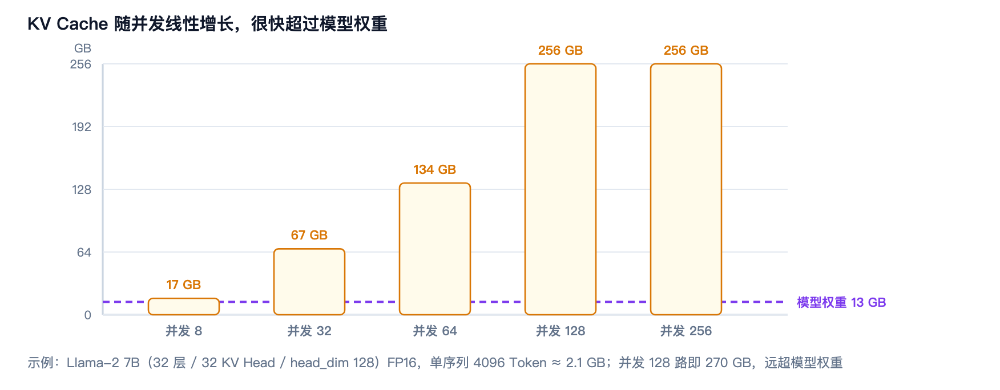
*图 1-2 · KV Cache 随并发线性增长，很快超过模型权重（示意数据）*

**术语解释**：
- **KV Cache（Key-Value Cache，键值缓存）**：把每层历史 Token 的 Key 和 Value 张量存下来，Decode 时直接复用，避免重复计算。它是用「显存换计算」的典型手段。
- **Head（注意力头）**：Attention 被切分成多个并行的子空间，每个子空间一个 Head；**num_kv_heads** 指 K/V 的 Head 数量。
- **head_dim（头维度）**：单个 Head 的向量维度。

**KV Cache 大小公式**：

```text
KV_bytes = 2 × num_layers × num_kv_heads × head_dim × seq_len × batch × dtype_bytes
           ↑
       K 和 V 各一份
```

**举个具体例子**：Llama-2 7B（32 层、32 KV Head、head_dim 128）FP16，单序列 4096 Token：

```text
2 × 32 × 32 × 128 × 4096 × 2 bytes ≈ 2.1 GB
```

看起来不大，但如果并发 128 路，就是 **270 GB**——远超模型权重本身（13 GB）。**这就是为什么 KV Cache 优化是推理系统的核心命题。**

**追问：KV Cache 为什么不能省？**
> 省了就得每步重算全部历史 K/V，计算量从 O(1) 变成 O(N)，完全不可接受。所以只能「压缩」不能「消除」——见第 6 章。

## 1.5 显存构成拆解

**速查**：显存 = 模型权重 + KV Cache + Activation + CUDA Graph Buffer + Workspace（+ 框架开销）。

| 组成 | 说明 | 随什么增长 |
|---|---|---|
| **Model Weight（模型权重）** | 模型参数，固定 | 模型大小、精度 |
| **KV Cache（键值缓存）** | 历史 K/V，最大变量 | 并发数 × 序列长度 |
| **Activation（激活值）** | 前向中间结果 | Batch × 序列长度（Prefill 峰值高） |
| **CUDA Graph Buffer（图缓冲）** | Graph 需要的静态输入/输出缓冲 | Graph 数量 × Batch 桶 |
| **Workspace（工作空间）** | Kernel 临时空间、通信缓冲 | 算子与并行策略 |

**在线 Serving 的关键结论**：随着并发增加，**KV Cache 很容易超过模型权重**，成为显存瓶颈。所以推理框架通常按「剩余显存」动态给 KV Cache 定容（如 vLLM 的 `gpu_memory_utilization` 参数）。

**术语解释**：
- **Serving（在线服务）**：把模型部署成可并发接收请求、流式返回结果的服务系统。

## 1.6 关键公式速查

```text
# KV Cache 显存
KV_bytes = 2 × L × H_kv × D × S × B × dtype_bytes

# Decode 理论下界（访存受限）
TPOT_min ≈ (模型权重字节数 + KV Cache 字节数) / 峰值带宽

# 单 Token 计算量（Decode）
FLOPs ≈ 2 × N_active_params        # 仅激活参数（MoE 只算激活专家）

# 算术强度
Intensity = FLOPs / Bytes
# Intensity < 机器平衡点 → 访存受限（Decode）
# Intensity > 机器平衡点 → 计算受限（Prefill、大 Batch）

# 投机解码期望输出 Token 数（含修正或额外 Token；接受率 α、Draft 长度 γ）
E[tokens] ≈ (1 - α^(γ+1)) / (1 - α)
```

---

# 第 2 章 模型层加速

> **本章主线**：改「要算什么」。核心是两条腿——**降低数值精度（量化）** 和 **改变模型结构（GQA/MQA/MLA/稀疏）**。

## 2.1 量化总论

**速查**：量化是用更低精度（FP8/INT8/INT4）表示权重/激活，换取更小显存和更高吞吐，代价是精度损失。分两大类：**权重量化（Weight-only）** 和 **权重+激活量化（W8A8）**。

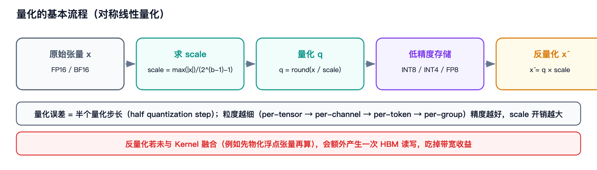
*图 2-1 · 对称线性量化的完整流程，以及融合反量化的重要性*

**术语解释**：
- **量化（Quantization）**：把高精度浮点数映射到低精度表示的过程；**反量化（Dequantization）** 是其逆运算，把低精度值还原成浮点参与计算。
- **PTQ（Post-Training Quantization，训练后量化）**：模型训练完成后直接做量化，无需重训，工业界推理的主流。
- **QAT（Quantization-Aware Training，量化感知训练）**：在训练时模拟量化误差，精度更好但成本高。
- **Weight-only（仅权重量化）**：只量化权重、激活仍为浮点，主要省显存，但用不上 INT8 Tensor Core。
- **W8A8（Weight 8-bit / Activation 8-bit，权重与激活均为 8 位）**：权重和激活都量化到 8 位，才能用上整数 Tensor Core 获得算力收益。
- **Scale（缩放因子）**：量化时用来把浮点范围映射到整数范围的系数，反量化时需要它还原。
- **粒度（Granularity）**：scale 的统计范围——**per-tensor**（整个张量一个 scale）/ **per-channel**（每个通道一个）/ **per-token**（每个 Token 一个）/ **per-group**（每小组一个）。粒度越细精度越好，scale 开销越大。
- **对称量化 / 非对称量化**：对称指量化范围关于 0 对称（如 ±127），实现简单；非对称引入 **zero-point（零点）** 偏移，对非零中心分布更友好。

| 分类维度 | 选项 | 说明 |
|---|---|---|
| 时机 | PTQ / QAT | 工业界推理以 PTQ 为主，QAT 精度更好但成本高 |
| 对象 | Weight-only / W8A8 / KV Cache 量化 | Weight-only 只省显存；W8A8 才能用上 INT8 Tensor Core |
| 粒度 | per-tensor / per-channel / per-token / per-group | 粒度越细精度越好，scale 开销越大 |
| 对称性 | 对称（±127） / 非对称（zero-point） | 对称实现简单，非对称对非零中心分布更好 |
| 映射 | 线性量化 / 非线性（如 NF4） | 低比特（≤4bit）常用非线性 |

**量化基本公式**（对称线性量化）：

```text
q = round(x / scale)          # 量化
x̂ = q × scale                 # 反量化
scale = max(|x|) / (2^(b-1) - 1)   # 对称，b 为位宽
```

**码 2-1 · 对称线性量化与反量化**

```python
def quantize_sym(x, bits=8, dim=None):
    """对称线性量化。dim=None → per-tensor；dim=-1 → per-token（每行一个 scale）。"""
    qmax = 2 ** (bits - 1) - 1                    # INT8 → 127
    if dim is None:
        scale = x.abs().max()                     # 整个张量共用一个 scale
    else:
        scale = x.abs().amax(dim=dim, keepdim=True)   # 每个 Token / 每个通道一个 scale
    scale = torch.clamp(scale, min=1e-8) / qmax   # 防除零，再归一化到 qmax
    q = torch.round(x / scale).clamp(-qmax, qmax).to(torch.int8)
    return q, scale

def dequantize(q, scale):
    return q.to(torch.float32) * scale            # 反量化：多一次乘法，省一半带宽
```

> **两处细节值得记住**：① `dim` 的选择就是「粒度」——`dim=None` 是 per-tensor，`dim=-1` 是 per-token，粒度越细精度越好、scale 开销越大；② `clamp` 是必需的，因为 `round` 可能把恰好等于 `max` 的元素推到 `qmax + 1` 而溢出 int8。真实高性能 kernel 会用「除以 127 而非 128 + 先 ±0.5 再向零截断」的技巧把 `clamp` 彻底省掉（见码 6-1）。
>
> **数值校验**：per-token 量化在 4×128 的随机张量上，反量化最大误差 0.046，不超过半个量化 step，与「算子层误差 ≤ 半个 step」的结论一致。

**追问：量化会掉精度吗？**
> 会，但程度取决于粒度、方法和模型。关键是把「精度损失」分三层说：① **算子层**——反量化与浮点参考实现（reference）的误差通常 ≤ 半个量化 step；② **Attention 输出层**——**余弦相似度（Cosine Similarity，衡量两个向量方向一致性的指标）** 通常在 0.999+；③ **端到端层**——极小的 Logits 差异在接近 tie（分数接近）时会翻转 argmax（取最大值的下标），自回归会把分歧放大。**诚实的态度是：算子数值接近 ≠ 下游质量无损，生产前必须测 PPL（Perplexity，困惑度，衡量语言模型预测能力的经典指标）/ 任务指标。**

## 2.2 权重量化三剑客：GPTQ / AWQ / SmoothQuant

**速查**：GPTQ 用二阶信息逐层最小化量化误差（经典 PTQ）；AWQ 保护对激活重要的少量权重通道（激活感知）；SmoothQuant 把激活的量化难度「迁移」到权重上，让 W8A8 可行。

| 方法 | 一句话 | 核心机制 | 典型配置 |
|---|---|---|---|
| **GPTQ** | 根据量化误差逐层优化权重 | 逐层用 **Hessian（二阶偏导矩阵，此处用于估计量化误差的敏感度）** 做补偿，量化一列后更新剩余列 | INT4/INT3 weight-only |
| **AWQ** | 找重要权重，少量重点保护，其余压成 INT4 | 按激活幅值识别 **salient channel（显著通道）**（~0.1–1%），per-channel 缩放后再量化 | INT4 weight-only，快、鲁棒 |
| **SmoothQuant** | 解决 Activation Outlier，让 W8A8 更容易实现 | per-channel 缩放：`Y=(X/s)(sW)`，把激活的离群值转移到权重 | W8A8 |
| **FP8** | 用浮点指数位保留更大动态范围 | E4M3/E5M2 + per-tensor/block scale | H100/B200 高吞吐 |

**术语解释**：
- **GPTQ（Generative Pre-trained Transformer Quantization）**：一种基于二阶误差补偿的 PTQ 权重量化算法，名字来源于其针对 GPT 类模型提出。
- **AWQ（Activation-aware Weight Quantization，激活感知权重量化）**：认为「对激活影响大的通道才重要」，只保护极少数显著通道。
- **SmoothQuant**：通过数学等价变换平滑激活分布，是「Smooth（平滑）+ Quant（量化）」的合成词。
- **Activation Outlier（激活离群值）**：激活张量中少数幅值异常大的通道，会把 per-tensor 的 scale 撑大，导致其余通道量化分辨率极差。
- **NF4（4-bit NormalFloat）**：一种针对正态分布设计的非线性 4-bit 量化格式。

**追问：AWQ 和 GPTQ 的区别？**
> GPTQ 是**误差最小化**视角，用二阶信息做逐列补偿，精度好但校准慢；AWQ 是**激活感知**视角，认为只有少数通道重要，保护它们即可，实现更简单、对超参不敏感、在指令微调模型上更稳。工程上常两个都试。

**追问：为什么 SmoothQuant 能帮到 W8A8？**
> LLM 激活里存在**离群值（outlier）**，少数通道幅值极大，per-tensor 量化会被这些离群值把 scale 撑大，导致其余通道分辨率极差。SmoothQuant 用数学等价变换把难度从激活转移到权重（权重分布更平滑，好量化），从而让激活也能安全地量化到 INT8。

## 2.3 FP8

**速查**：FP8 是 8-bit 浮点，比 INT8 多了指数位，动态范围大得多，适合大模型权重/激活，且能被 Hopper/Blackwell 的 Tensor Core 原生加速。

**术语解释**：
- **FP8（8-bit Floating Point，8 位浮点数）**：总位宽 8 bit 的浮点格式。
- **E4M3 / E5M2**：FP8 的两种具体格式，`E` 后面的数字是**指数位**数量，`M` 后面是**尾数位**数量。E4M3 = 1 符号 + 4 指数 + 3 尾数（范围约 ±448，精度较高）；E5M2 = 1 + 5 + 2（范围约 ±57344，精度较低）。
- **Hopper / Blackwell**：NVIDIA 的两代 GPU 架构（H100/H200 属 Hopper，B200 属 Blackwell），原生支持 FP8 Tensor Core。
- **Transformer Engine**：NVIDIA 提供的 FP8 自动转换与缩放管理库。

**原理**：
- 因为动态范围大，通常只需 **per-tensor 或粗粒度 block scale**（如 DeepSeek-V3 用 128×128 的 block-wise 缩放），比 INT8 的 per-token 更省开销。
- 累加仍需 FP32，以保证数值精度。

**追问：FP8 和 INT8 怎么选？**
> INT8 的 scale 与分布强相关，遇到离群值需要细粒度（per-token/per-channel）；FP8 自带指数位，动态范围宽，scale 粒度可以更粗，且 Hopper 之后有原生 FP8 Tensor Core。所以新卡上 FP8 通常更省心、吞吐更高；老卡（如 Ampere 架构）只能用 INT8。

## 2.4 量化编码格式对比表（必背）

**术语解释**：下表的格式记法为「1 符号位 + E 指数位 + M 尾数位」。**指数位决定动态范围（能表示多大/多小）**，**尾数位决定精度（能表示多细）**。

| 类型 | 位宽构成 | 特点 | 用途 |
|---|---|---|---|
| **FP32** | 1+8+23 | 精度最高（单精度浮点） | 普通计算、参考实现 |
| **TF32** | 1+8+10（19 bit 存储） | 与 FP32 同范围，尾数精度降低 | Ampere Tensor Core 默认 |
| **FP16** | 1+5+10 | 精度高于 FP8，但范围小（易溢出） | 推理/训练 |
| **BF16** | 1+8+7 | 与 FP32 相同指数位，范围大 | LLM 训练/推理主流 |
| **FP8** | 1+4+3 / 1+5+2 | 更低存储、更高 Tensor Core 吞吐 | H100/B200 推理 |
| **INT8** | 1 符号 + 7 数值 | 定点表示，需 scale | W8A8、KV Cache 量化 |
| **INT4** | 1 符号 + 3 数值 | 极致压缩，精度风险高 | Weight-only（AWQ/GPTQ） |

> **速记**：**BF16 换范围，FP16 换精度，FP8 换吞吐，INT 换密度。** LLM 领域 BF16 是默认基线。
>
> 补充：**FP16（半精度）** 与 **BF16（BFloat16，Brain Floating Point 16）** 都是 16 bit，区别在指数/尾数分配——FP16 精度高但范围小，BF16 范围大但精度低。LLM 因数值范围大，通常选 BF16。

## 2.5 GQA / MQA

**速查**：GQA 让多个 Query Head 共享一组 K/V Head（`num_kv_heads < num_q_heads`），MQA 是极端情况（只有 1 组 K/V）。直接减少 KV Cache 大小和 Attention 的 K/V 访存量，且几乎不损失质量。

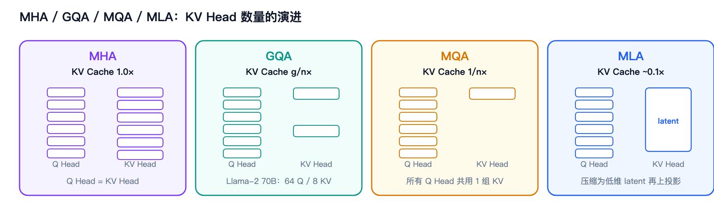
*图 2-2 · 四种注意力变体的 Q Head / KV Head 配比与 KV Cache 压缩比*

**术语解释**：
- **MHA（Multi-Head Attention，多头注意力）**：标准注意力，Q/K/V 的 Head 数相同。
- **MQA（Multi-Query Attention，多查询注意力）**：所有 Query Head 共享唯一一组 K/V。
- **GQA（Grouped-Query Attention，分组查询注意力）**：Query Head 分组，每组共享一组 K/V，是 MHA 与 MQA 的折中。

```text
MHA (标准)      Q: n 组   K/V: n 组        KV Cache: 1.0×
GQA (分组)      Q: n 组   K/V: g 组 (g<n)  KV Cache: g/n×
MQA (极端)      Q: n 组   K/V: 1 组        KV Cache: 1/n×
```

**码 2-2 · GQA 的 K/V 广播**

```python
def repeat_kv(k, num_q_heads):
    """GQA：把 g 组 K/V 广播成 n 组。只在计算时复制，KV Cache 里始终只存 g 组。"""
    if k.shape[1] == num_q_heads:                 # 已经是 MHA，无需广播
        return k
    repeat = num_q_heads // k.shape[1]
    return (k[:, :, None, :, :]
            .expand(-1, -1, repeat, -1, -1)       # expand 是零拷贝视图
            .reshape(k.shape[0], num_q_heads, k.shape[2], k.shape[3]))  # reshape 才真正复制
```

> `expand` 不占显存、`reshape` 才物化——所以 GQA 省下的是 **KV Cache 容量**和 **K/V 的访存带宽**，省不掉 Q 侧那一份注意力计算量。面试被追问「GQA 到底省了什么」时，这个区分是加分点。

- Llama-2 70B：64 个 Q Head，8 个 KV Head → KV Cache 直接降到 1/8。
- Llama-3、Qwen 等新一代模型普遍采用 GQA。
- 代价：K/V 表达能力下降，但实验表明在合理分组下质量损失很小。

**追问：GQA 相比 MQA 好在哪？**
> MQA 压得太狠（1 组 K/V），质量下降明显且训练不稳定；GQA 在 MQA 的压缩比和 MHA 的质量之间取折中，可以按需调节 KV Head 数（如 8 组），是当前的工业标准。

## 2.6 MLA（Multi-head Latent Attention）

**速查**：MLA 把 K/V 联合压缩成一个低维 **latent（潜在向量，此处指压缩后的低维表示）** 向量（如 512 维）缓存，用时再上投影还原，把 KV Cache 压到 MHA 的 ~1/10 级别，同时质量不降反升。

**术语解释**：
- **MLA（Multi-head Latent Attention，多头潜在注意力）**：DeepSeek-V2 提出的注意力结构，通过低秩压缩 KV 表示。
- **latent vector（潜在向量）**：压缩后的低维表示，不是直接可用的 K/V，需要经上投影矩阵还原。
- **上投影 / 下投影（Up / Down Projection）**：下投影把高维压到低维，上投影把低维还原到高维。
- **decoupled RoPE（解耦旋转位置编码）**：把位置信息单独放在一小段带 RoPE 的维度上，避免位置编码破坏压缩结构。

**原理**：
- 传统做法缓存 `K` 和 `V` 两个 `[head_dim × num_heads]` 张量；MLA 改为缓存一个低维 `c_KV`（latent），推理时通过上投影矩阵还原出 K/V。
- 相比 MHA，KV Cache 可减少 **90%+**。

**追问：MLA 和 GQA 谁更好？**
> 目标不同：GQA 是「共享 K/V Head」，实现简单、通用性好、算子成熟；MLA 是「压缩表示」，压缩率更高但计算时要多一次上投影（增加计算量），且需要模型从头训练才能用（不是后训练可改的）。DeepSeek 选择 MLA 是因为从训练阶段就设计了结构。

## 2.7 其他模型层手段

| 技术 | 速查 | 备注 |
|---|---|---|
| **剪枝（Pruning）** | 移除冗余权重/结构 | **非结构化剪枝**省显存但需稀疏算子支持；**结构化剪枝**直接变小模型 |
| **蒸馏（Distillation）** | 小模型学大模型分布 | 常与量化/剪枝组合，产出更小的可部署模型 |
| **稀疏 Attention（Sparse Attention）** | 只算部分 Attention 位置（滑窗/块稀疏） | Longformer、StreamingLLM、滑动窗口 |
| **MTP** | 训练时预测多个未来 Token | 见第 8 章投机解码 |

**术语解释**：
- **知识蒸馏（Knowledge Distillation）**：让一个小模型（学生）去拟合大模型（教师）的输出分布，从而以更小体量获得接近的能力。
- **滑动窗口注意力（Sliding Window Attention）**：每个 Token 只与最近 N 个 Token 做 Attention，把 KV Cache 长度限制在常数。

---

# 第 3 章 算子层加速

> **本章主线**：改「单个算子怎么算」。核心矛盾是 **GPU 的算力和显存带宽不匹配**——大部分 Attention 算子不是算不动，而是**搬不动**。所有技术的共同思路是：**减少 HBM 读写、提高数据复用、把计算塞进 Tensor Core**。

## 3.1 FlashAttention（1/2/3 演进）

**速查**：FlashAttention 是 **IO-aware（访存感知）** 的 Attention 实现，把 Q/K/V 分块搬进 SRAM，用 online softmax 增量计算，**不物化完整的 N×N Attention 矩阵**，把显存从 O(N²) 降到 O(N)，速度提升数倍。

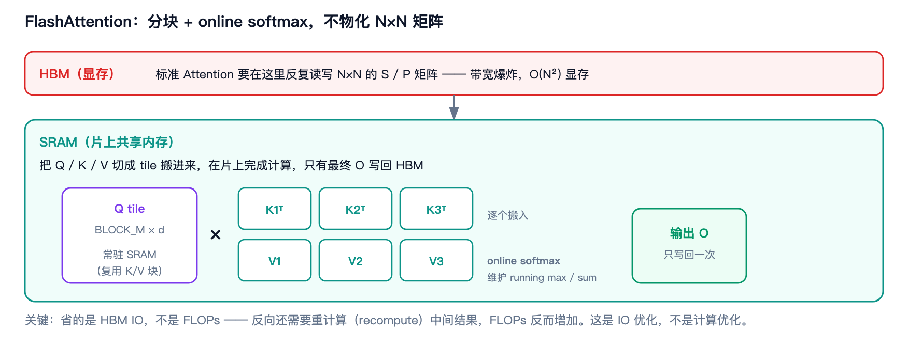
*图 3-1 · 把 Q/K/V 分块搬进片上 SRAM 计算，只有最终输出写回 HBM*

**术语解释**：
- **IO（Input/Output）**：此处特指 GPU 与显存之间的数据读写；**IO-aware** 指算法设计时把访存开销作为第一约束。
- **HBM（High Bandwidth Memory，高带宽显存）**：GPU 的主显存，容量大（GB 级）但相对片上存储慢很多。
- **SRAM（Static Random Access Memory，静态随机存储器）**：此处指 GPU 的**片上共享内存 / L1**，容量小（约 100 KB / SM）但带宽极高。
- **Tile / Tiling（分块）**：把大矩阵切成小块逐个处理，让数据在片上复用。
- **Online Softmax（在线 Softmax）**：分块计算 softmax 的技术，通过维护 running max 和 running sum，逐块增量更新结果，与一次性 softmax 数学等价。
- **重计算（Recomputation）**：反向传播时不保存中间结果，而是重新算一遍，用计算换显存。
- **物化（Materialize）**：把中间结果实际写进显存（与之相对的是「留在寄存器/片上」）。

```text
标准 Attention:
  S = QKᵀ        → 写入 HBM（N×N，巨大）
  P = softmax(S) → 读 HBM 再写 HBM
  O = PV         → 读 HBM
  问题：N×N 矩阵反复读写 HBM，带宽爆炸

FlashAttention:
  把 Q/K/V 切成 tile，逐个搬进 SRAM
  在 SRAM 内做 QKᵀ → online softmax → PV
  只有最终 O 写回 HBM
  代价：反向时需要重算（recompute）而不是存中间结果
```

**码 3-1 · online softmax 的参考实现（FlashAttention 的核心）**

```python
def flash_attention_ref(q, k, v, block_n=128):
    """不物化 N×N 矩阵的最小参考实现：显存 O(N) 而非 O(N²)。"""
    out = torch.zeros_like(q)
    m = torch.full((q.shape[0],), -float("inf"))   # running max
    l = torch.zeros(q.shape[0])                    # running sum（softmax 的分母）
    for j in range(0, k.shape[0], block_n):
        k_blk, v_blk = k[j:j + block_n], v[j:j + block_n]
        s = q @ k_blk.T / math.sqrt(q.shape[-1])   # 只算当前块的分数，不写 HBM
        m_new = torch.maximum(m, s.max(dim=-1).values)
        p = torch.exp(s - m_new[:, None])          # 用新 max 重标定本块
        alpha = torch.exp(m - m_new)               # 旧累加项的修正因子
        l = l * alpha + p.sum(dim=-1)
        out = out * alpha[:, None] + p @ v_blk     # 旧结果先缩放，再并入新块
        m = m_new
    return out / l[:, None]
```

整段代码的精髓就是四行：`m_new`（新的 running max）、`alpha`（旧结果的修正因子）、`out = out * alpha + p @ v_blk`（缩放后合并）、`m = m_new`。

- **为什么必须有 `alpha`**：分块后当前块的最大值可能大于此前所有块的最大值，一旦 `m` 变大，之前用旧 `m` 算出的 `exp(s - m)` 全部偏大，必须整体乘 `exp(m_old - m_new)` 修正。`alpha` 把「重标定」从「重算整块」降成「一次缩放」——这就是 online 的含义。
- **数学等价性已验证**：该实现与一次性 softmax 的朴素 Attention 在 `S=9/64/100`、`block_n=4/16/7` 三组配置下最大绝对误差 **≤ 5e-16**（即浮点精度内完全一致）。

**三代演进**：

| 版本 | 关键改进 | 收益 |
|---|---|---|
| **FA1**（2022） | Tiling + online softmax + 重计算，不物化 S/P | 显存 O(N²)→O(N)，速度 2–4× |
| **FA2**（2023） | 更好的工作划分（按序列维并行）、减少非矩阵乘 FLOPs | 比 FA1 约 2×，并行度更高 |
| **FA3**（2024） | Hopper 专属：**TMA（Tensor Memory Accelerator，张量内存加速器）**、**WGMMA（Warpgroup Matrix Multiply-Accumulate，线程组级矩阵乘指令）**、FP8、ping-pong 调度 | H100 上比 FA2 再快 1.5–2× |

**追问：FlashAttention 会减少 FLOPs 吗？**
> 不会，甚至因为重计算在**反向**时增加 FLOPs。它省的是**显存 IO**，把 Attention 从「访存受限」推向「计算受限」。所以它是 IO 优化，不是计算优化——这个区分面试官很爱考。

**追问：为什么 online softmax 是关键？**
> 因为要分块算 softmax，就必须解决「当前块的最大值可能不是全局最大值」的问题。online softmax 维护 running max 和 running sum，每处理一个新块就按新 max 重标定之前累加的结果，从而保证与一次性 softmax 数学等价。

## 3.2 PagedAttention

**速查**：PagedAttention 借鉴操作系统虚拟内存分页，把 KV Cache 切成固定大小的 **Block（块）**，用 **Block Table（块表）** 做逻辑到物理的映射，消除显存碎片，支持前缀共享，显存浪费从 60–80% 降到 <4%。

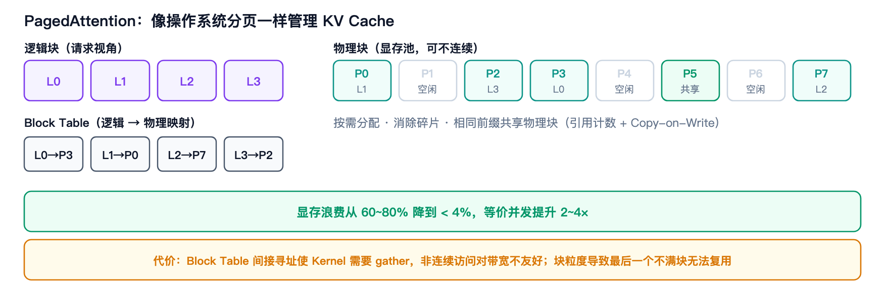
*图 3-2 · 逻辑块经 Block Table 映射到不连续的物理块，支持共享与按需分配*

**术语解释**：
- **PagedAttention（分页注意力）**：vLLM 提出的 KV Cache 管理方案，用分页思想解决显存碎片。
- **Block（块）/ Block Table（块表）**：Block 是固定 Token 数的 KV 存储单元（如 16 个 Token）；Block Table 记录「逻辑块号 → 物理块号」的映射，物理块可以不连续。
- **显存碎片（Memory Fragmentation）**：**内部碎片**指分配了但没用满的部分；**外部碎片**指空闲空间分散、无法满足大块连续分配。
- **Copy-on-Write（写时复制）**：多个请求共享同一物理块，只有当某一方要修改时才复制出私有副本，用于 Beam Search、并行采样等场景。
- **引用计数（Reference Count）**：记录一个物理块被多少请求共享，归零才回收。

```text
传统 KV Cache：每个请求预留 max_seq_len 连续显存
  → 内部碎片（实际长度 < 预留长度）
  → 外部碎片（不同长度请求难拼合）

PagedAttention：
  Block = 固定 token 数（如 16）的 KV 存储单元
  Block Table：逻辑块号 → 物理块号（可以不连续！）
  → 按需分配，用多少占多少
  → 相同前缀可共享物理块（引用计数 + Copy-on-Write）
```

**收益**：
**码 3-2 · 逻辑块 → 物理槽位的映射**

```python
def slot_mapping(block_table, seq_len, block_size):
    """把逻辑位置翻译成物理 KV 槽位。block_table[k] 是第 k 个逻辑块的物理块号。"""
    slots = []
    for pos in range(seq_len):
        phys_block = block_table[pos // block_size]        # 间接寻址：逻辑 → 物理
        slots.append(phys_block * block_size + pos % block_size)
    return slots

# 例：block_size=4，block_table=[7, 2, 9]
# seq_len=10 → slots = [28,29,30,31, 8,9,10,11, 36,37]
#              └─ 逻辑连续 ─┘  └─ 物理跳号 ─┘
```

> `block_table` 里的物理块号**不连续**（上例从 7 跳到 2 再跳到 9），所以 kernel 只能拿着 `slots` 做 **gather**。这就是 PagedAttention 的性能代价：用非连续访存换掉了显存碎片和按最大长度预留的浪费。

- 显存浪费 <4%（论文数据），等价于并发提升 2–4×。
- 支持 **Prefix Sharing（前缀共享）**：多个请求共享同一前缀的物理块（如 system prompt、few-shot 示例）。

**追问：PagedAttention 的代价是什么？**
> ① Block Table 的间接寻址让 Kernel 复杂化（需要 **gather（按索引收集数据）**），非连续访问对带宽不友好；② 块粒度导致「最后一个不满块」无法复用（prefix cache 的固有代价）；③ 需要专门的 Paged Attention Kernel 来高效读取。

## 3.3 算子融合（RMSNorm / RoPE / SiLU）

**速查**：把多个连续的小算子合并成一个 Kernel，减少 Kernel Launch 次数和中间张量的 HBM 读写。

**术语解释**：
- **算子融合（Operator Fusion）**：把多个逐元素/归约算子合并进同一个 Kernel。
- **RMSNorm（Root Mean Square Layer Normalization，均方根层归一化）**：LLM 常用的归一化层，比 LayerNorm 更省计算。
- **SiLU（Sigmoid Linear Unit，也称 Swish 激活函数）**：`x · sigmoid(x)`，常用于 SwiGLU 门控结构。
- **SwiGLU**：用 SiLU 做门控的前馈网络结构，形式为 `SiLU(xW₁) ⊙ (xW₃)`。

| 融合模式 | 融合前 | 融合后收益 |
|---|---|---|
| **RMSNorm + Residual** | `add` 写 HBM → `rmsnorm` 读 HBM | 省一次读写 |
| **SiLU + Mul**（SwiGLU） | `silu` 写 HBM → `mul` 读 HBM | 省一次读写 |
| **RoPE** | 多次 reshape/mul/add | 合并为单 Kernel |
| **QKV Projection** | 三个 Linear | 合并为一个 GEMM |
| **整个 MLP** | Linear → SiLU → Mul → Linear | 减少中间激活 |

**码 3-3 · 融合前 vs 融合后**

```python
# 融合前：3 次 Kernel Launch，中间结果 3 次往返 HBM
h = x + residual                                              # add     → 写 HBM
h = h * torch.rsqrt(h.pow(2).mean(-1, keepdim=True) + eps)     # rmsnorm → 读 + 写 HBM
y = h * weight                                                # mul     → 读 + 写 HBM

# 融合后：1 次 Kernel Launch，h 只存在于寄存器 / SRAM
y = fused_add_rmsnorm(x, residual, weight, eps)
```

> `fused_add_rmsnorm` 是伪函数名，代表把三步塞进同一个 kernel。收益可以算得很清楚：**省 2 次 Launch 开销 + 省掉 `h` 的 3 次写、3 次读**。中间张量越大、算子越碎，这个收益越高——这正是 torch.compile 在 Decode 阶段（大量小算子、访存受限）特别有效的原因。

**追问：为什么融合能加速？**
> 因为 GPU 上「启动一个 Kernel」有固定开销，且每个 Kernel 都要把输入从 HBM 读到寄存器、把输出写回 HBM。融合后中间结果留在寄存器/SRAM 里，**既省 Launch 开销又省带宽**——对访存受限的 Decode 尤其有效。

## 3.4 Triton / CUDA Kernel

**速查**：当框架自带算子不够快时，用 Triton（Python DSL，上手快）或 CUDA C++（极致控制）手写算子，针对性优化访存模式、并行划分和 Tensor Core 使用。

**术语解释**：
- **Kernel（核函数）**：在 GPU 上并行执行的函数，是 GPU 编程的基本单位。
- **Triton**：OpenAI 开源的 GPU 编程语言，用 Python DSL 编写，编译器自动管理共享内存与寄存器，是 torch.compile 的默认后端。
- **DSL（Domain-Specific Language，领域特定语言）**：为特定领域设计的简化语言。

| 维度 | Triton | CUDA C++ |
|---|---|---|
| 语言 | Python DSL | C++ |
| 上手难度 | 低，自动管理 shared memory / 寄存器 | 高，手动管理 |
| 可移植性 | 跨 NVIDIA/AMD | 主要 NVIDIA |
| 控制力 | 中（block 级抽象） | 高（线程级） |
| 典型用途 | Attention Kernel、融合算子 | 极致优化、特殊硬件特性 |

**码 3-4 · 最小 Triton softmax kernel**

```python
@triton.jit
def softmax_kernel(out_ptr, in_ptr, n_cols, BLOCK: tl.constexpr):
    row = tl.program_id(0)                              # 一个 program 负责一行
    offs = tl.arange(0, BLOCK)
    x = tl.load(in_ptr + row * n_cols + offs,
                mask=offs < n_cols, other=-float("inf"))   # other 用 -inf，不污染 max
    x = x - tl.max(x, axis=0)                           # 数值稳定：先减 max
    num = tl.exp(x)
    tl.store(out_ptr + row * n_cols + offs,
             num / tl.sum(num, axis=0), mask=offs < n_cols)
```

> 对比一段等价的 CUDA C++，差异一眼可见：这里**没有线程索引 `threadIdx`、没有 `__shared__` 声明、没有 `__syncthreads()`、没有手写归约树**。`tl.arange` 返回的是 block 级的向量，共享内存分配、线程划分、跨线程归约与同步全部由编译器决定——这就是 Triton「block 级抽象」的含义。上手快是它最大的优点，代价是你拿不到线程级控制（想手写 swizzle 或 warp 特化时就得回到 CUDA）。

**追问：Triton 写 Attention 要注意什么？**
> ① **Block 划分**：`BLOCK_M`（Query 维）、`BLOCK_N`（Key 维）的取舍；② **是否用 `tl.dot`**——不用 Tensor Core 会慢很多；③ **Causal Mask**：可以用循环上界省掉 mask 矩阵，但分块后必须退回 tile 内掩码；④ **num_warps 调参**——寄存器压力大的 Kernel 需要更多 warp。

## 3.5 FP8 计算

**速查**：FP8 让 Hopper/Blackwell 的 Tensor Core 吞吐翻倍、带宽减半，是新一代推理的默认低精度路径。

**原理**：Tensor Core 的 FP8 峰值吞吐通常是 FP16 的 2×；同时权重/激活占用减半，缓解访存瓶颈。关键是 **scaling（缩放）策略**（per-tensor / per-block），以及累加仍需 FP32 保证精度。

## 3.6 GPU 基础补课：Tensor Core / GEMM / 显存层次

面试推理岗，**必须**能说清 GPU 的存储层次和 GEMM 优化思路。

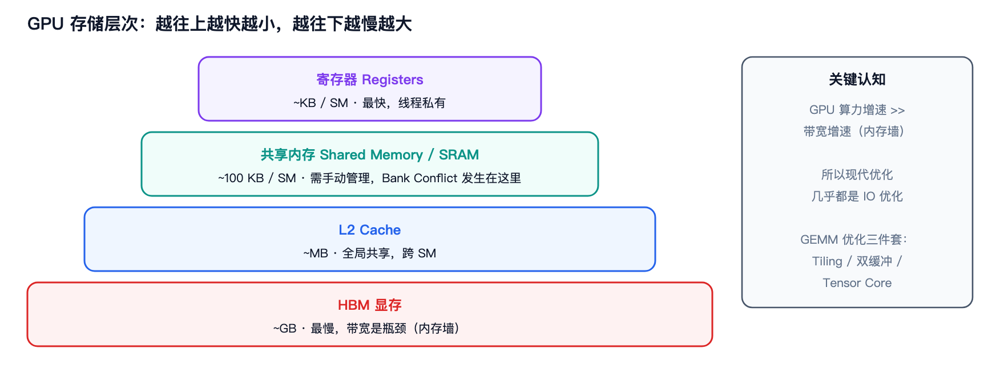
*图 3-3 · GPU 存储层次：越往上越快越小，越往下越慢越大*

**术语解释**：
- **Register（寄存器）**：GPU 最快的存储，线程私有，容量极小（KB 级）。
- **Shared Memory（共享内存）**：SM 内所有线程共享的片上存储，需手动管理，**Bank Conflict** 就发生在这里。
- **L2 Cache（二级缓存）**：跨 SM 共享的片上缓存，容量 MB 级。
- **HBM（High Bandwidth Memory，高带宽显存）**：GPU 主显存，GB 级，带宽是大多数推理负载的瓶颈。
- **内存墙（Memory Wall）**：算力增速长期快于带宽增速，导致系统越来越受带宽限制的现象。
- **双缓冲（Double Buffering）**：在处理当前数据块的同时预取下一块，用计算掩盖访存延迟。

```text
寄存器 (Registers)    ~KB     最快
    ↓
共享内存 / SRAM        ~100KB/ SM   需手动管理，Bank Conflict 就发生在这里
    ↓
L2 Cache              ~MB     全局共享
    ↓
HBM（显存）            ~GB     最慢，带宽是瓶颈
```

**GEMM 优化三件套**：**Tiling（分块提高数据复用）**、**双缓冲（Prefetch 隐藏延迟）**、**Tensor Core（矩阵乘专用单元）**。用不用 Tensor Core 通常有数倍差距。

## 3.7 Shared Memory Bank Conflict

**速查**：一个 **Warp（线程束，GPU 调度的最小线程组，通常 32 个线程）** 内多个线程同时访问 Shared Memory，如果地址落在**同一个 Bank 的不同地址**，访问会被串行化，降低访存效率。

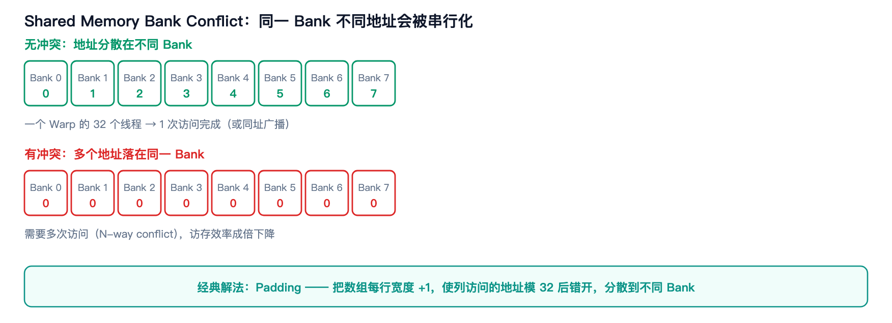
*图 3-4 · 地址分散在不同 Bank 时无冲突；多个地址撞同一 Bank 则被串行化*

**术语解释**：
- **Bank（存储体）**：Shared Memory 被划分为 32 个 Bank（通常每个 4 字节宽），可并行访问。
- **Bank Conflict（存储体冲突）**：同一 Warp 内多个线程访问同一 Bank 的不同地址，硬件无法并行，只能串行化。
- **Broadcast（广播）**：若多个线程访问同一 Bank 的**同一地址**，硬件可一次广播，不算冲突。
- **Padding（填充）**：在数组每行末尾补几个元素，改变地址步长以避开冲突。
- **Swizzle（混淆/重排）**：通过地址位重排打散访问模式，是比 Padding 更现代的解法。

| 场景 | 冲突原因 | 解法 |
|---|---|---|
| 列访问 `[row][col]` 行主序 | 步长等于 Bank 数 | **Padding**：数组宽度 +1 |
| 转置 | 读列写行 | Padding 或 Swizzle |
| 大 stride 访问 | 多个线程撞同一 Bank | 改变数据布局 |

**码 3-5 · Bank Conflict 的地址算术（可实跑验证）**

```python
# 行主序 [row][col] 的地址 = row * width + col；Shared Memory 有 32 个 Bank
for width in (32, 33):
    # 一个 warp 的 32 个线程同时访问第 3 列（row = 0..31）
    banks = [(row * width + 3) % 32 for row in range(32)]
    print(width, "冲突路数 =", max(banks.count(b) for b in banks))

# 输出：
# 32 冲突路数 = 32    ← 步长 32，32 个线程全撞同一个 Bank，硬件串行化 32 次
# 33 冲突路数 = 1     ← padding 1 后步长 33，33 mod 32 = 1，依次错开，无冲突
```

> 输出是实跑结果。这就是「Padding +1」的全部原理：**让访问步长 `stride mod 32 ≠ 0`**。注意冲突是「同一 Bank 的**不同地址**」——若 32 个线程访问的是同一 Bank 的**同一地址**，硬件会广播，不算冲突。

**追问：为什么 Padding 能解决冲突？**
> 假设 32×32 的矩阵按行主序存，列访问时同一列的元素地址间隔 32，恰好都落在同一 Bank。把每行宽度改成 33（padding 1），列元素地址间隔变成 33，模 32 后依次错开，就分散到不同 Bank 了。

---

# 第 4 章 执行层加速

> **本章主线**：改「怎么把算子交给 GPU」。这一层不改变计算结果，只消除**调度与提交**的浪费。

## 4.1 CUDA Graph

**速查**：CUDA Graph 把一系列 Kernel 预先 **Capture（捕获）** 成一张执行图，之后通过 **Replay（重放）** 一次性提交，降低 CPU 调度、Driver 调用和 Kernel Launch 开销。**它优化的是执行调度开销，不是 Attention 的数学计算本身。**

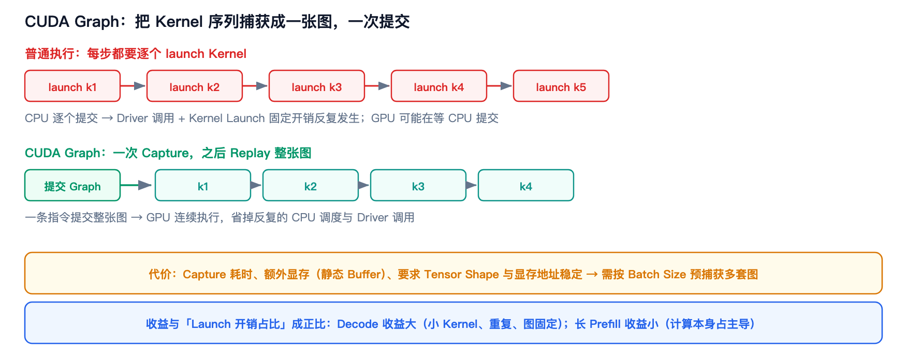
*图 4-1 · 普通执行逐个 launch Kernel；CUDA Graph 一次提交整张图*

**术语解释**：
**码 4-1 · CUDA Graph 的捕获与重放**

```python
g = torch.cuda.CUDAGraph()

# ① 预热：捕获前相关算子必须已在真实 stream 上跑过，否则会把初始化逻辑录进图里
static_in = torch.randn(batch, hidden, device="cuda")
for _ in range(3):
    model(static_in)

# ② 捕获：把整条 kernel 序列及其依赖关系录成一张图
with torch.cuda.graph(g):
    static_out = model(static_in)

# ③ 重放：数据必须写进同一块 static_in —— 不能换张量、不能换地址
static_in.copy_(next_batch)      # 正确：原地写入
g.replay()
out = static_out.clone()

# static_in = next_batch         # 错误：静默失效——图里绑定的仍是旧地址
```

> 两块固定地址的 `static_in` / `static_out` 就是「静态形状 + 静态地址」约束的来源，也是 Graph 额外占显存的原因。**第 ③ 步是实践中最容易踩的坑**：`copy_` 是原地写，`=` 是重新绑定变量名，后者不会报错但结果全错。

- **CUDA Graph（CUDA 执行图）**：把一串 Kernel 及其依赖关系记录成有向图，之后可整体重放。
- **Capture / Replay（捕获 / 重放）**：Capture 是把 Kernel 序列录制成图的过程；Replay 是按图一次性提交执行。
- **Kernel Launch Overhead（核函数启动开销）**：每次启动 Kernel 时 CPU 构造参数、调用驱动、提交到 GPU 的固定成本，Kernel 越短这个开销占比越高。
- **Driver（驱动）**：操作系统与 GPU 之间的中间层，CUDA 调用最终都要经过它。
- **静态 Buffer（静态缓冲区）**：预先分配、地址固定的输入/输出显存，Graph 重放要求地址稳定。

```text
普通 CUDA 执行（每步都要）：
  CPU: launch k1 → launch k2 → ... → launch kn
       ↑ 每次 launch 都有 CPU→Driver→GPU 的固定开销
  GPU: 执行 k1 → 执行 k2 → ... （CPU 可能还没提交完，GPU 在等）

CUDA Graph：
  一次性 Capture 整条 Kernel 序列 → 生成 Graph
  Replay 时一条指令提交整张图 → GPU 连续执行
```

**收益**：
- 主要省 **CPU Kernel Launch Overhead**，对「大量小 Kernel、重复执行、计算图固定」的场景收益最大。
- 最适合 **LLM Decode**：每步计算图重复、Batch 较小、单 Kernel 短，容易受 Launch 开销影响，能显著降低 TPOT。

**代价**：
- 初始化 Capture 耗时；
- Graph 占用额外显存（静态输入/输出 Buffer）；
- **要求 Tensor Shape 和显存地址尽量稳定** → 框架需预分配静态 Buffer，并按不同 Batch Size 提前 Capture 多套 Graph。

**追问：为什么长 Prompt Prefill 用 CUDA Graph 收益不明显？**
> 因为 Prefill 计算量大，计算本身占主要时间，Kernel Launch 占比很低，属于「计算受限」；CUDA Graph 省的那点 Launch 开销被淹没在计算时间里。**收益与「Launch 开销占比」成正比。**

**追问：CUDA Graph 和动态 Kernel 选择为什么不兼容？**
> Graph 在 Capture 时就固定了 Kernel 序列，Replay 时无法更换。如果框架想根据 **Context（上下文，此处指历史序列长度）** 长度动态选 Kernel（如两种 Paged Attention 实现），Graph 里就只能捕获其中一种。解决思路是做 `(batch, context_bucket)` 的图池，但显存和捕获成本会上升。

## 4.2 torch.compile

**速查**：torch.compile 是 PyTorch 2.0 的编译器，通过 `TorchDynamo → FX Graph → AOTAutograd → TorchInductor` 把模型编译成融合的 Triton/CUDA Kernel，实现算子融合、图优化和减少 Python 开销。

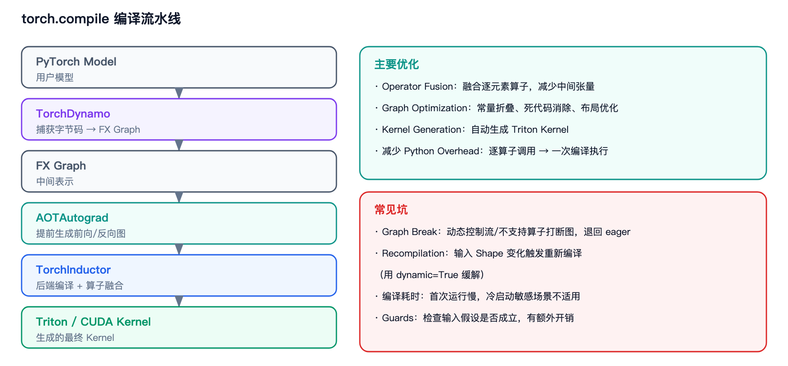
*图 4-2 · 编译流水线的四个阶段，以及主要优化与常见坑*

**术语解释**：
- **torch.compile**：PyTorch 2.0 引入的即时编译器（JIT Compiler）接口，一行代码即可编译模型。
- **TorchDynamo**：捕获 Python 字节码并生成计算图的组件；遇到不支持的算子会 **Graph Break（图中断）**，退回逐算子 eager 执行。
- **FX Graph（Functional eXchange Graph）**：PyTorch 的图中间表示（IR），由节点和边组成的计算图。
- **AOTAutograd（Ahead-Of-Time Autograd，提前自动微分）**：提前生成前向/反向计算图并做图级优化。
- **TorchInductor**：后端编译器，负责算子融合与代码生成（默认生成 Triton Kernel）。
- **Recompilation（重编译）**：输入 Shape 变化导致需要重新编译，带来额外开销。
- **Guard（守卫）**：运行时检查输入假设（如 Shape、dtype）是否仍然成立，不成立则重编译。

```text
PyTorch Model
    ↓
TorchDynamo        # 捕获 Python 字节码，生成 FX Graph
    ↓
FX Graph
    ↓
AOTAutograd        # 提前生成前向/反向图，做图级优化
    ↓
TorchInductor      # 后端编译器，做算子融合 + 生成代码
    ↓
Triton / CUDA Kernel
```

**主要优化**：
- **Operator Fusion**：融合逐元素算子、减少中间张量；
- **Graph Optimization**：常量折叠、死代码消除、布局优化；
- **Kernel Generation**：自动生成 Triton Kernel；
- **减少 Python Overhead**：把 Python 逐算子调用变成一次编译后的执行。

**码 4-2 · torch.compile 的用法与 Graph Break 诱因**

```python
# mode: "default" | "reduce-overhead"（含 CUDA Graph） | "max-autotune"（自动调 Triton 参数）
model = torch.compile(model, mode="max-autotune", dynamic=False)

# 反例：会触发 Graph Break —— Python 控制流依赖张量值
if x.sum() > 0:                      # 张量参与 Python 分支 → 图被切断
    x = x * 2

# 正例：改成张量运算，可以留在图内
x = torch.where(x.sum() > 0, x * 2, x)
```

> `dynamic=False` 意味着输入 shape 一变就重编译。推理服务里 batch 大小和序列长度天然波动，所以只有两条路：开 `dynamic=True`（编译期变长、运行期略慢），或按 shape 桶预编译——后者与 CUDA Graph 按 batch size 桶捕获是同一个思路。

**追问：torch.compile 的坑？**
> ① **Graph Break**——动态控制流、不支持的算子会打断图；② **Recompilation**——输入 Shape 变化会触发重新编译（动态 Shape 用 `dynamic=True` 缓解）；③ **编译耗时**——首次运行慢，不适合冷启动敏感场景；④ **Guards**——需要检查输入假设是否成立，有额外开销。

## 4.3 异步 Pipeline / Overlap

**速查**：让 CPU 调度、GPU 计算、数据传输并行执行，用「重叠（**Overlap**）」隐藏等待时间。

**术语解释**：
- **Pipeline（流水线）**：把任务拆成多个阶段，让不同阶段并行处理不同数据。
- **Overlap（重叠）**：让计算与通信/传输同时进行，从而隐藏其中一方的时间。
- **Pinned Memory（锁页内存）**：被锁定在物理内存中的主机内存，支持直接 DMA 与异步拷贝。
- **DMA（Direct Memory Access，直接内存访问）**：不经过 CPU 的数据搬运方式。
- **H2D（Host to Device，主机到设备）**：从 CPU 内存到 GPU 显存的拷贝。
- **CUDA Stream（流）**：GPU 上的任务队列，不同 Stream 之间的操作可以并发。

| 重叠对 | 做法 | 收益 |
|---|---|---|
| CPU 调度 ↔ GPU 计算 | CPU 提前准备下一个 Batch 的元数据，GPU 同时 Decode 当前 Batch | 隐藏 CPU 开销 |
| 计算 ↔ H2D 拷贝 | 用 pinned memory + 异步拷贝 | 隐藏传输延迟 |
| 计算 ↔ 通信（多卡） | 计算与 All-Reduce / All-to-All 重叠 | 隐藏通信开销 |
| Prefill ↔ Decode | 同一 Batch 混合调度 | 提升利用率、平滑 TBT |

**追问：为什么要用 pinned memory？**
> 普通内存（pageable）的 DMA 拷贝需要驱动先锁页，是同步的；pinned（page-locked）内存可以直接 DMA，支持异步拷贝，配合 CUDA Stream 就能和计算重叠。

---

# 第 5 章 系统层加速

> **本章主线**：改「多个请求怎么排队、怎么共享资源」。这是推理框架（vLLM/SGLang）的主战场，也是面试最常深挖的一层。

## 5.1 Continuous Batching

**速查**：Continuous Batching（连续批处理，也叫 **Iteration-level Batching，迭代级批处理**）让请求在**每次迭代**动态加入/退出 Batch，而不是等整批请求都结束。核心是提升 GPU 利用率——Decode 阶段权重读取被更多请求分摊。

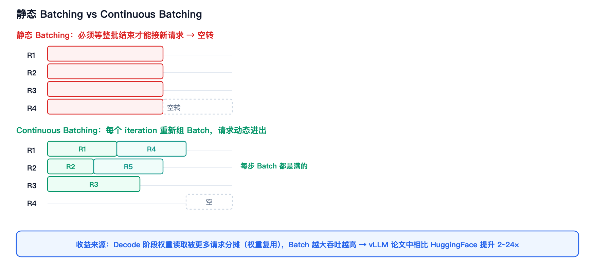
*图 5-1 · 静态 Batching 会空转；Continuous Batching 每步都重新组批，Batch 始终是满的*

**术语解释**：
- **Continuous Batching（连续批处理）**：由 Orca 系统提出，在每次迭代（每生成一个 Token）结束时重新组 Batch。
- **Static Batching（静态批处理）**：传统做法，整批请求必须一起开始、一起结束。
- **Iteration（迭代）**：一次前向计算，Decode 阶段每迭代生成一个 Token。
- **GPU 利用率（GPU Utilization）**：GPU 实际忙碌时间占比；Batch 不满时大量算力被浪费。

```text
静态 Batching（传统）:
  Batch = [R1, R2, R3]，必须等全部生成完才能接新请求
  → R1 早结束，它占的位置就浪费了（GPU 空转）

Continuous Batching（Orca / vLLM）:
  每个 iteration 结束都重新组 Batch
  R1 结束 → 立刻用 R4 补位
  → 每步 Batch 都是满的
```

**码 5-1 · Continuous Batching 的调度主循环**

```python
while waiting or running:
    budget = max_num_batched_tokens
    decode_seqs, budget = schedule_decode(running, budget)      # 先排 decode：每请求 1 token
    prefill_seqs, budget = schedule_prefill(waiting, budget)    # 剩余预算再排 prefill

    logits = model_runner.run(decode_seqs + prefill_seqs)       # 一轮前向，两批共享预算

    for seq in decode_seqs:                                     # 谁结束，谁立刻退出
        if seq.is_finished():
            running.remove(seq)
    for seq in prefill_seqs:                                    # prefill 完，立刻转 running
        running.append(seq)
```

> 关键就在最后两个循环：**退出与加入都发生在「每一轮迭代之后」**，而不是等整批跑完——这就是 Continuous Batching 与 Static Batching 的全部差别。另外注意 `decode` 与 `prefill` 共用同一个 `budget`（`max_num_batched_tokens`）和序列槽位，不是各拿一份，所以长 Prompt 的 Prefill 只能吃掉 Decode 剩下的预算，不会阻塞已在跑的请求。

**追问：Continuous Batching 的调度怎么做？**
> 一次 `schedule()` 通常返回两批——**Decode 批**和 **Prefill 批**，共享同一个 **Token Budget（Token 预算，一轮允许处理的最大 Token 数）**。先排 Decode（每个 running 请求 1 Token），剩余预算再排 Prefill，这样长 Prompt 不会阻塞已在跑的请求。running 队列用 **round-robin（轮询）** 防止饥饿；显存不够时**抢占（Preemption）** 部分请求（释放 KV），靠 Prefix Cache 或重算恢复。

## 5.2 Chunked Prefill

**速查**：把长 Prompt 的 Prefill 拆成多个 **Chunk（块）** 分批执行，避免一次性占满显存（OOM），同时可以和 Decode 混在同一 Batch 里，降低 TBT 抖动。

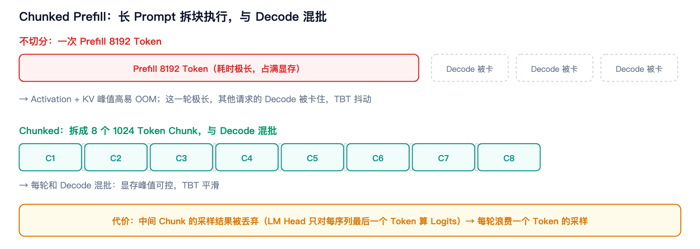
*图 5-2 · 长 Prompt 拆块后与 Decode 混批，显存峰值可控、TBT 平滑*

**术语解释**：
- **Chunked Prefill（分块预填充）**：把一次大 Prefill 切成多个小 Chunk 分轮执行。
- **Head-of-Line Blocking（队首阻塞）**：队列头部的大请求阻塞了后面小请求的处理。

```text
不切分：8192 Token Prompt → 一次 Prefill
  → Activation + KV 峰值高，容易 OOM
  → 这一轮耗时极长，其他请求的 Decode 被卡住（TBT 抖动）

Chunked：8192 拆成 16 个 512 Token Chunk
  → 每个 Chunk 和 Decode 混批执行
  → 显存峰值可控，TBT 平滑
```

**代价**：
- 中间 Chunk 的采样结果会被丢弃（因为 LM Head 只对每序列最后一个 Token 算 Logits，而中间 Chunk 的「最后一个 Token」不是真正的末 Token）→ **每轮浪费一个 Token 的采样**。
- 调度更复杂，需要处理「未完成的 Prefill 请求」在队列中的位置。

**码 5-2 · Chunked Prefill 的切块与「中间块不采样」**

```python
CHUNK = 512
for start in range(0, len(prompt), CHUNK):
    chunk = prompt[start:start + CHUNK]
    logits = model(prefill_chunk(chunk, kv_cache))    # 增量写入 KV Cache
    if start + CHUNK < len(prompt):
        continue        # ← 中间块不采样：这一步的「最后一个 token」并不是真正的末 token
    next_token = sample(logits)
```

> `continue` 那两行就是「每轮浪费一个 Token 采样」的由来：LM Head 只对每序列的最后一个位置算 Logits，而中间 Chunk 的最后一个位置并没有完整上下文，采出来的东西必然是错的，只能丢弃。这是为支持流式 Chunk 付出的代价，不是实现缺陷。

**追问：Chunked Prefill 和 Continuous Batching 什么关系？**
> 是互补的。Continuous Batching 解决「请求动态进出」，Chunked Prefill 解决「单个长请求内部怎么切分以平滑调度」。两者一起用才能既高吞吐又低抖动（代表实现：Sarathi-Serve）。

## 5.3 Prefix Cache / RadixAttention

**速查**：Prefix Cache 把已经算过的 KV Cache 按前缀哈希存起来，相同前缀的后续请求直接复用，避免重复 Prefill。SGLang 的 RadixAttention 用**基数树（Radix Tree，一种按公共前缀压缩存储的树结构）** 组织，支持更灵活的前缀匹配与 LRU 淘汰。

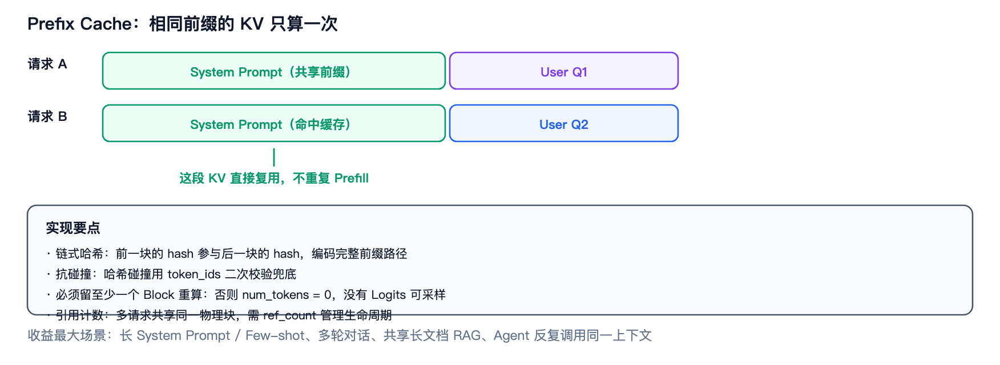
*图 5-3 · 共享前缀的 KV 只算一次，后续请求直接命中复用*

**术语解释**：
- **Prefix Cache（前缀缓存）**：缓存已计算的前缀 KV，供后续同前缀请求复用。
- **RadixAttention（基数树注意力）**：SGLang 提出的方案，用基数树管理前缀 KV，支持任意长度的前缀匹配与淘汰。
- **LRU（Least Recently Used，最近最少使用）**：一种缓存淘汰策略，优先淘汰最久未访问的条目。
- **链式哈希（Chained Hash）**：后一块的哈希值由「前一块哈希 + 本块 Token」共同决定，使哈希编码完整前缀路径。

```text
请求 A: [System Prompt][User Q1]
请求 B: [System Prompt][User Q2]
        └─ 相同前缀，KV 只算一次 ─┘

实现：以 Block 为单位做链式哈希
     hash → physical_block_id 映射表
     命中则复用，未命中则新算
```

**码 5-3 · Prefix Cache 的链式哈希与碰撞兜底**

```python
import hashlib

def compute_hash(token_ids, prefix_hash=0):
    """链式哈希：把「前一块的哈希」当种子，使哈希值编码完整前缀路径。
    示意实现（真实实现用 xxhash64 等非加密哈希，此处用 blake2b 代替）。"""
    payload = str(prefix_hash).encode() + bytes(token_ids)
    return int.from_bytes(hashlib.blake2b(payload, digest_size=8).digest(), "big")

h, hits = 0, 0
for blk in chunked(token_ids, block_size):
    h = compute_hash(blk, h)                     # ← 依赖前一块：顺序敏感
    block = hash_to_block_id.get(h)
    if block is None:
        break                                    # 未命中：从这里开始全部重算
    if block.token_ids != blk:
        break                                    # 哈希碰撞 → 用 token_ids 二次校验兜住
    hits += 1

# 注意：只能复用前 (num_blocks - 1) 个块
# 必须留至少一个块重算，否则 seq 长度为 0，没有 logits 可采样
```

> 三件事在这段代码里都能看到：① **链式哈希保证顺序敏感**——交换两个块会得到完全不同的哈希，所以「前缀」的定义是严格的；② **碰撞必须二次校验**——哈希相等不代表内容相等，`token_ids` 比对是最后一道防线；③ **必须留一个块重算**——这是 block 粒度前缀复用的固有代价，不是 bug。

**关键设计点**：
- **哈希必须编码完整路径**：链式哈希保证前缀顺序敏感。
- **抗碰撞**：哈希碰撞要用 token_ids 二次校验兜底。
- **必须留至少一个 Block 重算**：否则 `num_tokens` 会是 0，就没有 Logits 可采样。
- **引用计数**：多请求共享同一物理块，需要 ref_count 管理生命周期。

**追问：Prefix Cache 什么时候收益最大？**
> ① 长 System Prompt / Few-shot 示例；② 多轮对话（历史上下文复用）；③ 共享长文档的 RAG（**Retrieval-Augmented Generation，检索增强生成**，先检索再生成）场景；④ Agent 场景反复调用同一上下文。**前缀越长、共享度越高，收益越大。**

## 5.4 KV Cache 管理与 Offload

**速查**：KV Cache 管理负责动态分配/释放/复用/换出。Offload 是把暂时不用的 KV 换到 CPU 内存或 NVMe，需要时再换回（用 PCIe 带宽换显存容量）。

**术语解释**：
- **Block Manager（块管理器）**：PagedAttention 的物理块分配器，维护空闲块列表与「哈希 → 块」映射。
- **Preemption（抢占）**：显存不足时强制释放部分请求的 KV，把它们放回等待队列。
- **Swap / Offload（换出 / 卸载）**：把数据从显存搬到 CPU 内存或 SSD。
- **PCIe（Peripheral Component Interconnect Express，外设互联总线）**：CPU 与 GPU 之间的数据传输通道，带宽远低于显存。
- **NVMe（Non-Volatile Memory express，非易失性内存标准）**：高速 SSD 接口协议。

| 机制 | 说明 |
|---|---|
| **Block Manager** | PagedAttention 的物理块分配器，维护 free list 与 hash→block 映射 |
| **抢占（Preemption）** | 显存不足时释放部分请求的 KV（置回 waiting 队列），优先恢复被抢占者 |
| **KV Offload / Swap** | 把 KV 换到 CPU DRAM / NVMe，PCIe 带宽成为新瓶颈 |
| **分层存储（Tiered Storage）** | GPU HBM → CPU DRAM → SSD 的多级 KV 存储 |

**追问：抢占之后怎么恢复？**
> 两条路：① 被释放的 Block 还在哈希表里 → Prefix Cache 直接命中，只需重算未缓存部分；② 已被覆盖 → 从头重算。所以「抢占」的代价取决于 Prefix Cache 的命中情况。

## 5.5 并行策略：DP / TP / PP / EP / SP

**速查**：单卡放不下或要提吞吐时，把模型/数据切到多卡。DP 复制模型切数据；TP 层内切权重（通信量大，需 NVLink）；PP 按层切（有 Bubble，需 Micro-batch）；EP 切专家（MoE 专用）；SP 切序列维度。

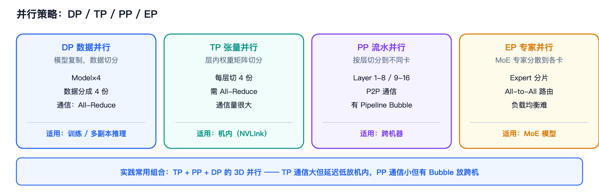
*图 5-4 · 四种主要并行策略的切分方式、通信模式与适用场景*

**术语解释**：
- **DP（Data Parallel，数据并行）**：每张卡放一份完整模型，把数据切分到各卡。
- **TP（Tensor Parallel，张量并行）**：把同一层的权重矩阵按维度切到多卡，层内需要频繁通信。
- **PP（Pipeline Parallel，流水线并行）**：按层切分到不同卡，形成流水线。
- **EP（Expert Parallel，专家并行）**：MoE 场景下把不同 Expert 放到不同卡。
- **SP（Sequence Parallel，序列并行）**：沿序列维度切分，常用于降低激活显存。
- **Micro-batch（微批次）**：PP 中把一个大 Batch 拆成多个小批，填充流水线以减少气泡。
- **Pipeline Bubble（流水线气泡）**：流水线启动/排空阶段部分阶段空闲造成的浪费。
- **All-Reduce（全归约）**：所有卡的数据求和后广播回每张卡。
- **All-to-All（全交换）**：每张卡把自己的一部分数据发给所有其他卡，是 EP 的核心通信模式。
- **All-Gather / Reduce-Scatter（全收集 / 归约散射）**：All-Reduce 的两个半边操作，分别用于聚合与分散。
- **P2P（Point-to-Point，点对点）**：相邻卡之间直接传输，PP 使用。
- **NVLink**：NVIDIA 的 GPU 间高速互联，带宽远高于 PCIe，适合放通信量大的 TP。
- **RDMA（Remote Direct Memory Access，远程直接内存访问）**：跨机器的高性能网络传输技术。

| 策略 | 切什么 | 通信模式 | 通信量 | 适用 |
|---|---|---|---|---|
| **DP** | 数据（模型复制） | All-Reduce（梯度） | 训练时大 | 训练 / 推理多副本 |
| **TP** | 层内权重矩阵 | All-Reduce（每层） | **很大** | 单机内（NVLink） |
| **PP** | 按层切分 | P2P（相邻 stage） | 小 | 跨机 |
| **EP** | MoE 专家 | **All-to-All** | 大 | MoE 模型 |
| **SP** | 序列维度 | All-Gather / Reduce-Scatter | 中 | 长序列 |

**追问：TP 和 PP 怎么选？**
> TP 通信量大但延迟低，适合放在**同一台机器内**（NVLink 带宽高）；PP 通信量小但会产生 Pipeline Bubble（需要 Micro-batch 填充），适合**跨机器**。实践中常用 **TP + PP + DP** 的组合（3D 并行）。

**追问：为什么 MoE 要用 EP？**
> MoE 的专家数量多（DeepSeek-V3 有 256 个），全放一张卡显存不够。EP 把不同专家放到不同卡上，Token 通过 All-to-All 路由到对应专家所在卡。代价是通信成为新瓶颈。

## 5.6 PD 分离（Prefill-Decode Disaggregation）

**速查**：把 Prefill 和 Decode 部署到不同的 GPU/机器上，各自按自己的瓶颈做优化（Prefill 配高算力卡、Decode 配高带宽卡），互不干扰。

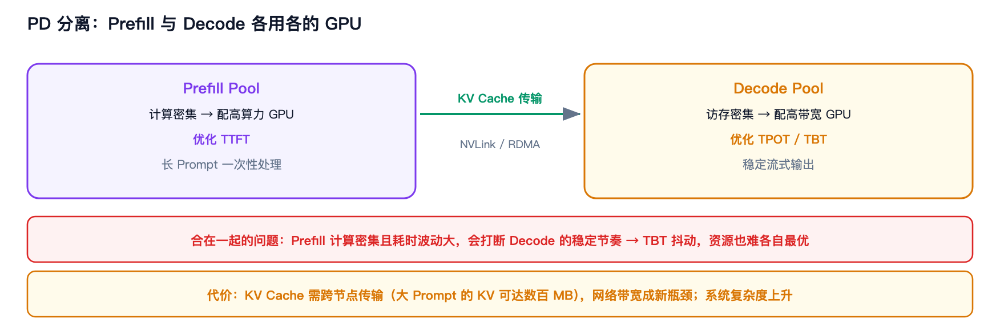
*图 5-5 · Prefill Pool 与 Decode Pool 分离部署，通过 KV Cache 传输衔接*

**术语解释**：
- **PD 分离（Prefill-Decode Disaggregation，预填充-解码分离）**：把两个阶段部署到独立资源池，代表工作有 DistServe、Splitwise。
- **KV Transfer（KV 传输）**：Prefill 算好的 KV Cache 传给 Decode 侧，是 PD 分离的核心开销来源。

```text
合在一起的问题：
  Prefill 是计算密集、耗时波动大
  Decode 是访存密集、要求 TBT 稳定
  两者混跑 → Prefill 会打断 Decode，TBT 抖动；资源也难各自最优

PD 分离：
  ┌─────────────┐        KV Transfer       ┌─────────────┐
  │ Prefill Pool│ ───────────────────────► │ Decode Pool │
  │ 高算力 GPU  │   (NVLink/RDMA/网络)     │ 高带宽 GPU  │
  └─────────────┘                          └─────────────┘
```

**收益**：TTFT 和 TPOT 分别优化、资源配比可按负载比例调整、故障隔离。
**代价**：KV Cache 需要跨节点传输（大 Prompt 的 KV 可能几百 MB），网络带宽成为新瓶颈；系统复杂度上升。

## 5.7 推理框架对比

| 框架 | 定位 | 核心特性 | 适合场景 |
|---|---|---|---|
| **vLLM** | 通用 LLM Serving 标杆 | PagedAttention + Continuous Batching + Scheduler | 通用在线服务、研究基线 |
| **SGLang** | 强调前缀复用与 Agent | RadixAttention、Prefix 复用、结构化输出 | Agent、多轮对话、高前缀复用 |
| **TensorRT-LLM** | NVIDIA 官方极致性能 | TensorRT、CUDA Graph、**In-flight Batching**、低精度 Kernel | 追求极致 GPU 性能、N 卡生产部署 |
| **llama.cpp** | 本地 / 端侧 | **GGUF（GPT-Generated Unified Format，一种含量化权重的单文件模型格式）**、低比特量化、CPU/GPU/Metal 跨平台 | 本地推理、端侧、Mac |

**术语解释**：
- **In-flight Batching（飞行中批处理）**：TensorRT-LLM 对 Continuous Batching 的叫法。
- **Agent（智能体）**：能自主调用工具、多轮规划与执行的 LLM 应用形态，其请求通常有很长且高度重复的上下文。
- **结构化输出（Structured Output）**：用正则或 JSON Schema 约束解码过程，保证输出符合指定格式。

**追问：vLLM 和 SGLang 的区别？**
> 两者都基于 PagedAttention + Continuous Batching。SGLang 的差异点在于 **RadixAttention**（用基数树做更灵活的前缀复用，覆盖多轮/Agent 场景）和**结构化输出**（约束解码），在 Agent 与多轮对话负载下往往更有优势。

## 5.8 调度器设计要点

面试如果让你「设计一个推理调度器」，按这个框架答：

1. **预算（Budget）**：Token Budget 和 Sequence Slot 共享，Decode 优先、Prefill 吃剩余。
2. **公平性（Fairness）**：Round-robin 防饥饿；被抢占请求插队首（比新请求优先恢复）。
3. **内存准入（Admission）**：`can_allocate` 试探 → 逐步缩小 Chunk 直到可行 → 增量分配 KV（避免按最大长度预留）。
4. **抢占（Preemption）**：只在必要时触发；只抢占本轮尚未执行的 victim，避免释放正在使用的 Block Table。
5. **缓存（Cache）**：Prefix Cache 优先，命中即省 Prefill。
6. **流式与 SLO**：Chunked Prefill 平滑 TBT，满足延迟约束。

**术语解释**：
- **Admission（准入）**：判断一个请求当前是否有足够资源可以进入执行。
- **Victim（牺牲者）**：被选中执行抢占、需要释放资源的请求。
- **Sequence Slot（序列槽位）**：一轮调度中允许容纳的最大序列数。

---

# 第 6 章 专题：KV Cache 全解

## 6.1 为什么是瓶颈

**速查**：KV Cache 同时吃掉**容量**和**带宽**——容量上它随并发线性增长，常超过模型权重；带宽上 Decode 每步都要把全部 KV 从 HBM 读一遍。所以它是推理系统第一优化对象。

```text
容量瓶颈：并发 ↑ → KV 总量 ↑ → OOM 或被迫降并发
带宽瓶颈：Decode 每步读 (权重 + KV) → 带宽决定 TPOT 下界
```

## 6.2 减少 KV Cache 的六类手段（面试必背）

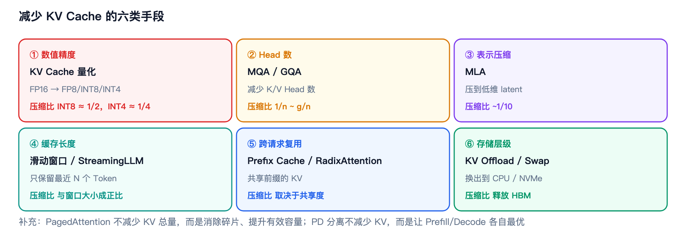
*图 6-1 · 六类手段、机制与压缩比一览*

| 类别 | 手段 | 机制 | 压缩比 | 代价 |
|---|---|---|---|---|
| **① 数值精度** | KV Cache 量化 | FP16/BF16 → FP8 / INT8 / INT4 | INT8 ≈ 1/2，INT4 ≈ 1/4 | 精度损失、需融合反量化 |
| **② Head 数** | MQA / GQA | 减少 K/V Head 数 | 1/n ~ g/n | 轻微质量损失 |
| **③ 表示压缩** | MLA | KV 压到低维 latent | ~1/10 | 需模型原生支持、多一次上投影 |
| **④ 缓存长度** | 滑动窗口 / StreamingLLM | 只保留最近 N 个 Token | 与窗口大小成正比 | 丢失长程信息 |
| **⑤ 跨请求复用** | Prefix Cache / RadixAttention | 共享前缀的 KV | 取决于共享度 | 哈希/索引开销、Block 粒度损失 |
| **⑥ 存储层级** | KV Offload / Swap | 换出到 CPU/NVMe | 释放 HBM | PCIe/SSD 带宽瓶颈、延迟上升 |

**补充**：还有 **PagedAttention**（不减少 KV 总量，而是消除碎片、提升有效容量）和 **PD 分离**（不减少 KV，而是让 Prefill/Decode 各自最优）。

## 6.3 计算示例

**KV Cache 量化到 INT8 的存储收益**（head_dim = 128，per-(token, KV head) 对称量化，scale 存 FP16）：

```text
BF16 : 128 × 2 bytes                = 256 B
INT8 : 128 × 1 byte + 1 FP16 scale  = 130 B
比值 : 130 / 256                     ≈ 50.8%
```

**码 6-1 · KV Cache INT8 量化的 store kernel 片段**

```python
@triton.jit
def store_kvcache_int8(k_ptr, k_cache_ptr, k_scale_ptr, slot_ptr,
                       BLOCK_D: tl.constexpr):
    token, head = tl.program_id(0), tl.program_id(1)   # 一个 program = 一个 head vector
    offs = tl.arange(0, BLOCK_D)
    slot = tl.load(slot_ptr + token)                   # 逻辑位置 → 物理槽位（见码 3-2）

    key = tl.load(k_ptr + token * BLOCK_D + offs)
    # 除以 127 而不是 128：最大元素恰好映射到 ±127，加 0.5 后向零截断仍回 127
    # → 永不溢出，整个 kernel 不需要 clamp
    k_scale = tl.maximum(tl.max(tl.abs(key), axis=0) / 127.0, 1.0e-8)
    qk = key / k_scale
    # round-half-away-from-zero：先 ±0.5 再向零截断，正负号对称
    qk = tl.where(qk >= 0, qk + 0.5, qk - 0.5).to(tl.int8)

    tl.store(k_cache_ptr + slot * BLOCK_D + offs, qk)
    tl.store(k_scale_ptr + slot, k_scale.to(tl.float16))   # scale 单独存，粒度 = per (token, KV head)
```

> **两个设计选择值得记住**：
> ① **`/127` 而不是 `/128`**：最大元素映射到 ±127，`+0.5` 后是 127.5，向零截断回 127，因此**永不溢出、无需 clamp**，省掉整个 kernel 的一遍逐元素判断。
> ② **舍入是 round-half-away-from-zero**，不是 PyTorch `round()` 的 half-to-even。写法 `where(q >= 0, q + 0.5, q - 0.5)` 再向零截断，对正负号处理一致。
>
> **存储账**（head_dim = 128）：BF16 占 `128 × 2 = 256 B`，INT8 占 `128 × 1 + 1 × 2 = 130 B`，比值 **50.78%**——注意 scale 也是要占空间的，算收益时不能漏掉它。

> **一个容易被问倒的表述细节**：KV Cache 通常按「剩余显存」定容，所以量化后**显存占用总量几乎不变**，涨的是**可用块数/上下文容量**（约 1.95×）。要准确表述为「**用吞吐换上下文容量**」，而不是「省了显存」。

## 6.4 面试追问

**「KV Cache 量化后为什么端到端反而变慢？」**
> 因为反量化路径不统一。好的做法是 **Decode 融合反量化**（在 Paged Attention Kernel 里读 INT8 → 转 FP32 → 乘 scale → 直接进 online softmax，不物化浮点 Cache）；但如果 **Prefill 走的是「物化 gather + 反量化」**（按 Block Table 把 KV 还原成浮点张量再交给 **SDPA（Scaled Dot-Product Attention，PyTorch 官方提供的注意力算子封装）**），每层都要重新 gather + 反量化 + 写一遍浮点张量，这个开销会吃掉带宽收益。**结论：KV 量化的收益取决于反量化是否融合。**

**码 6-2 · 反量化的两条路径：融合 vs 物化**

```python
# 路径 A（好）：融合在 Paged Attention kernel 内部，不物化浮点 Cache
key = tl.load(k_cache_ptr + k_offsets, mask=mask, other=0.0
              ).to(tl.float32) * k_scale[:, None]
# → 直接进 online softmax，全程只多了一次乘法和一次类型转换

# 路径 B（有代价）：按 Block Table 把 KV 物化成浮点张量，再交给 SDPA
values = cache[block_ids, block_offsets].to(torch.float32)     # [seqlen, H_kv, D]
token_scales = scales[block_ids, block_offsets].float()
k_fp = (values * token_scales.unsqueeze(-1)).to(dtype)
# → 每一层都要重新 gather + 反量化 + 写一遍浮点张量
```

> 同样是把 INT8 还原成浮点，两条路径的成本差一个量级：路径 A 只在寄存器里过一遍，**带宽收益完整保留**；路径 B 要额外分配、写入、再读出 `[seqlen, H_kv, D]` 的浮点张量，**把省下的带宽又还回去了**。所以「KV 量化端到端到底快不快」，答案取决于 Prefill 侧走的是哪条路——这也是「量化收益取决于反量化是否融合」这句话的代码级解释。

**「为什么带宽减半，Kernel 只快一点？」**
> 反量化把 K/V tile 提到 FP32 精度，寄存器需求上升（往往需要更多 warp），**ALU（Arithmetic Logic Unit，算术逻辑单元）** 与寄存器压力抵消了一部分带宽收益。进一步优化方向是**代数等价改写**：先算 `k_int8 · q` 的点积，再乘 scale 向量，而不是先缩放整个 tile——乘法次数可从 O(block × head_dim) 降到 O(block)。

---

# 第 7 章 专题：MoE 推理

## 7.1 原理

**速查**：MoE 在 Transformer 的 FFN 中引入多个 **Expert（专家，指独立的 FFN 子网络）**，**Router（路由器，负责给 Token 打分并选择专家的模块）** 为每个 Token 稀疏选择 **Top-K（分数最高的 K 个）** Expert，从而用较小的 Activated FLOPs 获得更大的模型容量。

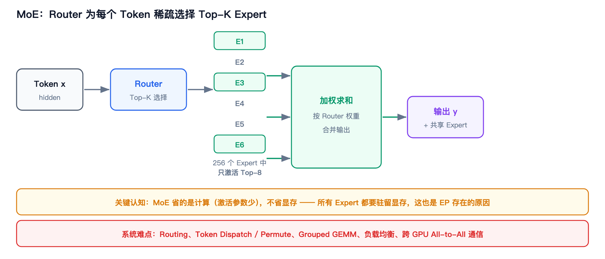
*图 7-1 · Router 为每个 Token 选择 Top-K Expert，加权合并后输出*

**术语解释**：
- **MoE（Mixture of Experts，混合专家）**：用多个专家网络 + 稀疏路由替代单一 FFN 的模型结构。
- **Router / Gate（路由器 / 门控）**：计算每个 Token 对各 Expert 的权重并选出 Top-K 的模块。
- **Top-K**：取分数最高的 K 个；MoE 中 K 通常为 1~8。
- **Activated FLOPs（激活计算量）**：单个 Token 实际触发的计算量，MoE 中只算被选中的 Expert。
- **共享专家（Shared Expert）**：所有 Token 都会经过的专家，用于提升泛化并稳定路由（DeepSeek-V3 采用）。
- **Auxiliary Loss（辅助损失）**：训练时用于约束专家负载均衡的额外损失项。

```text
Dense FFN:  x → FFN → y                    （每个 Token 都过全部参数）
MoE FFN:    x → Router → Top-K Expert → 加权求和 → y
                 ↑
        每个 Token 只激活 K 个 Expert（如 8 选 2、256 选 8）
```

**代表模型**：

| 模型 | 总参数 | 激活参数 | 专家配置 |
|---|---|---|---|
| Mixtral 8×7B | 47B | 13B | 8 Expert，Top-2 |
| DeepSeek-V3 | 671B | 37B | 256 路由 Expert + 1 共享，Top-8 |

## 7.2 MoE 与 Dense 的区别（面试高频对比）

**术语解释**：**Dense（稠密模型）** 指每个 Token 都经过全部参数的常规模型，与 MoE 的稀疏激活相对。

| 维度 | Dense | MoE |
|---|---|---|
| 每 Token 经过的参数 | 全部 | Top-K Expert |
| 总参数 vs 激活参数 | 接近 | 差距巨大 |
| 单 Token 计算量 | 与总参数成正比 | 与激活参数成正比 |
| 显存 | 模型大小决定 | **总参数决定（全部 Expert 都要装）** |
| 系统难点 | 大 GEMM | Routing、Dispatch、Grouped GEMM、负载均衡、All-to-All |
| 推理复杂度 | 相对简单 | 复杂很多 |

> **关键认知**：MoE **省的是计算，不是显存**。所有 Expert 都要加载到显存，所以 MoE 对显存容量要求反而更高（这也是 EP 存在的原因）。

## 7.3 系统难点

| 难点 | 说明 |
|---|---|
| **Routing（路由）** | Router 计算开销小但引入额外依赖，需与 Attention 重叠 |
| **Token Dispatch / Permute（Token 分发 / 重排）** | 把 Token 按 Expert 分组重排，产生大量不规则访存 |
| **Grouped GEMM（分组矩阵乘）** | 每个 Expert 的 Batch 大小不同，需要专门的分组 GEMM Kernel |
| **负载均衡（Load Balancing）** | 某些 Expert 过热会导致个别 GPU 成为瓶颈（需 aux loss / 容量因子） |
| **All-to-All 通信** | EP 下 Token 要跨卡路由到专家，通信量巨大 |

## 7.4 EP 与通信优化

- **EP（Expert Parallel）**：把不同 Expert 放到不同 GPU，Token 通过 All-to-All 送到目标卡。
- **通信优化**：DeepEP（DeepSeek 开源）做了大量 All-to-All 优化；通信与计算重叠（把 Dispatch/Combine 与 Attention/GEMM 并行）。
- **共享专家**：DeepSeek-V3 保留 1 个共享 Expert，所有 Token 都过，提升泛化并稳定路由。

**追问：MoE 推理为什么比 Dense 难做？**
> Dense 的难点是「大 GEMM」，是规整的计算问题；MoE 的难点是「路由 + 不规则访存 + 负载不均 + 跨卡通信」，是系统问题。尤其 EP 下 All-to-All 通信很容易成为瓶颈，且 Expert 负载不均衡会导致部分 GPU 空转。

---

# 第 8 章 专题：投机解码

想逐一看清 Draft Model、MTP、EAGLE、Medusa 与 Prompt Lookup 的结构和取舍，可阅读[投机解码的五条路线](/blog/speculative-decoding-methods/)；文内附有生成路径与树形验证结构图。

## 8.1 核心思想

**速查**：先用成本更低的方法生成多个候选 Token（Draft），再由主模型**一次性并行验证**，从而减少 Decode 阶段的串行 Forward 次数。

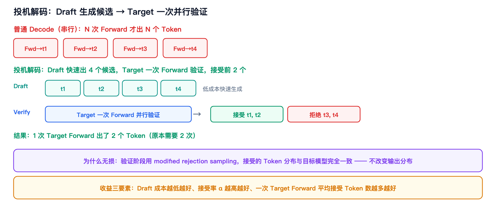
*图 8-1 · Draft 快速生成候选，Target 一次 Forward 并行验证并接受前 k 个*

**术语解释**：
- **投机解码（Speculative Decoding）**：用低成本模型生成候选、由目标模型并行验证的加速范式。
- **Draft Model（草稿模型）**：生成候选 Token 的轻量模型。
- **Target Model（目标模型）**：真正要部署的大模型，负责验证候选。
- **Forward（前向）**：一次完整的前向计算。
- **Accept / Reject（接受 / 拒绝）**：验证阶段判定候选 Token 是否被采纳。
- **Acceptance Rate（接受率，α）**：候选 Token 被接受的比例，是决定加速比的关键。
- **modified rejection sampling（改进拒绝采样）**：一种采样修正方法，保证接受结果的分布与目标模型完全一致。

```text
普通 Decode（串行）:
  Forward → t1 → Forward → t2 → Forward → t3 → ...   （N 次 Forward 出 N 个 Token）

投机解码:
  Draft 快速生成 t1,t2,t3,t4（低成本）
  Target 一次 Forward 并行验证这 4 个候选
  → 接受前 k 个（如接受 t1,t2），拒绝后续
  → 1 次 Target Forward 出了 2 个 Token
```

**码 8-1 · 投机解码的验证与接受 / 拒绝**

```python
# ① Draft 低成本生成 γ 个候选
draft = [draft_model.step(ctx) for _ in range(gamma)]

# ② Target 一次 Forward，并行得到每个位置的概率分布（唯一的「贵」操作）
p_target = target_model(ctx + draft)        # [γ, vocab]

# ③ 逐个验证：modified rejection sampling
accepted = 0
for i, tok in enumerate(draft):
    if torch.rand(()) < min(1.0, p_target[i, tok] / p_draft[i, tok]):
        accepted += 1                       # 接受，继续验证下一个
    else:
        break                               # 拒绝，后面的候选一并作废

# ④ 第一个被拒的位置，从「修正分布」重采样
if accepted < gamma:
    p_corrected = torch.clamp(p_target[accepted] - p_draft[accepted], min=0)
    next_token = sample(p_corrected / p_corrected.sum())
```

> **第 ④ 步才是「无损」的来源。** 只做 ①②③ 的话，输出分布会偏向 Draft（因为 Draft 说「是」的 token 更容易留下），必须补上「从 `max(p_target − p_draft, 0)` 归一化后的修正分布重采样」，接受的 Token 边缘分布才与目标模型完全一致。
>
> **期望输出数**（含首个拒绝后的修正 Token，或全接受后的额外 Token）`E = (1 − α^(γ+1)) / (1 − α)`：α=0.8、γ=4 → **3.36**；α=0.6、γ=4 → 2.31；α=0.5、γ=8 → **2.00**。单算被接受的 Draft Token 数，应从这里减去 1。最后一组说明：接受率只有 0.5 时，把 Draft 长度从 4 加到 8 也几乎不涨收益，反而增加 Draft 成本。

**为什么正确？** 若验证与修正采用目标模型实际生效的采样分布，并执行 **modified rejection sampling**，输出分布与直接从目标模型采样一致；近似验收模式不在此保证之内。

## 8.2 五类 Draft 来源

| 类别 | 代表 | Draft 从哪来 | 特点 |
|---|---|---|---|
| **① Draft Model** | 经典 Speculative Decoding | 一个更小的独立模型自回归生成 | 简单通用，需额外部署小模型 |
| **② MTP** | DeepSeek MTP | 主模型内置的多 Token 预测模块 | 不需额外模型，复用主模型表示 |
| **③ Hidden Feature** | EAGLE 系列 | 用 Target 的 hidden state 训练轻量 Draft 网络 | 接受率通常更高，Draft 递归但很小 |
| **④ 多预测 Head** | Medusa | 主模型后挂多个预测 Head + Tree Attention | 无需 Draft 模型，Head 很轻 |
| **⑤ 文本匹配** | Prompt Lookup / N-gram | 从上下文/历史中匹配重复片段 | 几乎零额外开销，但只对重复内容有效 |

**术语解释**：
- **MTP（Multi-Token Prediction，多 Token 预测）**：训练时让模型同时预测未来多个位置，推理时可当 Draft 模块用。
- **EAGLE**：一类用目标模型隐藏特征训练轻量 Draft 网络的方法，全称为「Extrapolation Algorithm for Greater Language-model Efficiency」。
- **Medusa（美杜莎）**：在主模型后挂多个预测头并行预测不同未来位置的方法。
- **N-gram（N 元组）**：连续 N 个 Token 构成的片段；N-gram 投机即匹配历史中已出现的片段作为候选。
- **Tree Attention（树形注意力）**：用一棵候选树一次性验证多条候选路径，共享前缀计算。
- **hidden state / hidden feature（隐藏状态 / 隐藏特征）**：Transformer 中间层的向量表示。

**补充**：还有 Self-Speculative（跳层）、LayerSkip、Lookahead / Jacobi Decoding 等不依赖独立 Draft Model 的方法。

## 8.3 统一流程

这些方法在抽象上都遵循下面的流程；单路径与候选树的具体验收规则不同：

```text
Draft → Verify → Accept / Reject
```

**逐个拆解**：

1. **Draft Model + Target Model**
   Draft Model 自回归生成 `x_{t+1}, x_{t+2}, x_{t+3}`；Target Model 把整段候选一次性 Forward，并行计算各位置概率，逐个 Accept/Reject。只要 Draft 足够轻且与 Target 分布接近，一次 Target Forward 就能接受多个 Token。

2. **MTP（Multi-Token Prediction）**
   不一定需要独立小模型，而是在主模型训练时增加 MTP 模块，让模型除了预测 t+1 还学习预测更远的未来 Token。推理时作为轻量 Draft 递归产生候选，再由主模型验证。

3. **Medusa Head**
   挂在 LLM 最后一层 hidden state 上的轻量预测头，每个 Head = `MLP/Linear+SiLU`（带残差）+ `hidden→vocab` 的 Linear。不同 Head 分别预测未来第 1、2、3… 个 Token，每位置取 Top-K 构造**候选树**，通过 Tree Attention 让原模型一次并行验证多个候选。

4. **EAGLE**
   不用多个独立 Head 直接预测，而是训练一个轻量**自回归 Draft 模型**：根据目标模型的 hidden feature 和 token embedding 预测下一步 feature，再得到 draft token，递归生成多个候选，最后 Target 一次并行验证。Draft 仍串行但很小，且能利用前一个 Token 的信息，所以接受率通常高于独立多 Token Head。

5. **N-gram / Prompt Lookup**
   直接从 Prompt 或历史生成内容中匹配重复片段作为候选，几乎没有额外模型开销。适合代码补全、摘要、RAG 等有大量重复片段的场景。

## 8.4 收益分析

**决定加速比的三要素**：

```text
① Draft 成本 c         —— 越低越好（Draft 越轻越好）
② 接受率 α             —— 越高越好（Draft 与 Target 分布越接近越好）
③ 一次 Target Forward 平均接受 Token 数
```

**期望输出 Token 数**（含修正或全接受后的额外 Token；假设每个位置的条件接受率均为 α、Draft 长度为 γ）：

```text
E[tokens] ≈ (1 - α^(γ+1)) / (1 - α)
```

**结论**：
- α 越高，收益越大；α 很低时（如 < 0.5）投机解码可能反而变慢。
- γ 不是越大越好——γ 太大时后面的候选接受率会下降，还要付出更多 Draft 成本。
- **加速比上限受限于 Target Forward 与 Draft 成本之比**。

## 8.5 各方法对比表

| 方法 | 额外模型 | 接受率 | Draft 成本 | 实现复杂度 | 典型场景 |
|---|---|---|---|---|---|
| Draft Model | 需要（独立小模型） | 中 | 中 | 低 | 通用 |
| MTP | 不需要（内置） | 中高 | 低 | 中（需模型支持） | DeepSeek 系列 |
| Medusa | 不需要（多个 Head） | 中 | 低 | 中（需训练 Head） | 通用，易集成 |
| EAGLE | 需要（轻量 Draft 网络） | **高** | 低 | 高（需训练） | 追求高接受率 |
| N-gram / Lookup | 不需要 | 场景相关 | **极低** | **最低** | 代码补全、RAG |

**追问：投机解码是「无损」的吗？**
> 在采样时使用 modified rejection sampling，并以实际生效的目标分布（含温度、top-k/top-p 等处理）验收与修正，才保证输出分布一致；贪心解码可逐位置核对 Target 的最优 Token。部分方法另有近似验收模式，例如 Medusa 的 typical acceptance，不能统称严格无损。

---

# 第 9 章 面试速查区

## 9.1 高频问题 30 秒速答

| 问题 | 30 秒回答骨架 |
|---|---|
| **推理加速有哪些方法？** | 分四层：模型层（量化、GQA/MQA、MLA、投机解码）、算子层（FlashAttention、PagedAttention、算子融合、FP8）、执行层（CUDA Graph、torch.compile、异步 Pipeline）、系统层（Continuous Batching、Chunked Prefill、Prefix Cache、KV 管理、TP/PP/EP、PD 分离） |
| **Prefill 和 Decode 的区别？** | Prefill 并行处理整个 Prompt，计算密集，决定 TTFT；Decode 每步 1 Token，访存密集，决定 TPOT。前者优化算力，后者优化带宽。 |
| **KV Cache 为什么是瓶颈？** | 容量上随并发线性增长常超权重；带宽上 Decode 每步都要全量读。对策见第 6 章六类手段。 |
| **FlashAttention 省的是什么？** | 省 HBM IO，不是省 FLOPs（反向还会增加）。把 Attention 从访存受限推向计算受限。 |
| **PagedAttention 解决什么？** | 显存碎片（浪费从 60–80% 降到 <4%），并支持前缀共享和 Copy-on-Write。 |
| **CUDA Graph 的好处？** | 减少 Decode 每步的 CPU 调度和 Kernel Launch 开销；不减少 GPU 计算。适合小 Kernel、重复执行、图固定的场景。 |
| **Continuous Batching 原理？** | 每个 iteration 重新组 Batch，请求动态进出，把 Decode 的权重读取分摊到更多请求。 |
| **Chunked Prefill 的代价？** | 中间 Chunk 的采样结果被丢弃（浪费一个 Token），调度更复杂；换来的是 TBT 平滑和防 OOM。 |
| **Prefix Cache 怎么保证正确？** | 链式哈希编码完整前缀路径 + token_ids 二次校验抗碰撞 + 必须留至少一个 Block 重算以产生 Logits。 |
| **量化会掉精度吗？** | 分三层说：算子层（≤半个 step）、Attention 输出层（cosine 0.999+）、端到端层（接近 tie 会翻转 argmax 并被自回归放大）。必须测 PPL。 |
| **MoE 省什么？** | 省计算（激活参数少），**不省显存**（所有 Expert 都要装）。难点是路由、负载均衡和 All-to-All 通信。 |
| **投机解码何时无损？** | 用目标模型的实际采样分布做精确验收与修正时，输出分布与直接采样一致。 |
| **PD 分离的动机？** | Prefill 计算密集、Decode 访存密集，混跑互相干扰；分离后各自最优，代价是 KV 跨节点传输。 |
| **TP 和 PP 怎么选？** | TP 通信量大、延迟低，放机内（NVLink）；PP 通信量小、有 Bubble，跨机。常用 3D 并行组合。 |

## 9.2 必背对比表

**① 四种 Attention 变体**

| 变体 | KV Head 数 | KV Cache | 质量 | 代表 |
|---|---|---|---|---|
| MHA | = Q Head | 1.0× | 最好 | 早期模型 |
| GQA | < Q Head（分组） | g/n× | 接近 MHA | Llama-2 70B / Llama-3 |
| MQA | 1 | 1/n× | 有损失 | PaLM、Falcon |
| MLA | latent 压缩 | ~0.1× | 好 | DeepSeek-V2/V3 |

**② 量化方法**

| 方法 | 类型 | 粒度 | 特点 |
|---|---|---|---|
| GPTQ | PTQ weight-only | per-group | 二阶误差补偿，经典 |
| AWQ | PTQ weight-only | per-channel | 激活感知，保护 salient 通道 |
| SmoothQuant | W8A8 | per-channel | 迁移激活离群值到权重 |
| FP8 | W8A8 | per-tensor/block | 动态范围大，新卡首选 |

**③ 四层加速技术一览**（见 0.2 总览表）

## 9.3 数字速记

| 数字 | 含义 |
|---|---|
| **2 × L × H_kv × D × S × B × dtype** | KV Cache 大小公式 |
| **< 4%** | PagedAttention 显存浪费 |
| **2–24×** | vLLM 相比 HF 的吞吐提升（论文） |
| **~90%** | MLA 相比 MHA 的 KV Cache 减少量 |
| **1/2、1/4** | INT8、INT4 KV 量化的理论压缩比 |
| **2×** | FP8 相比 FP16 的 Tensor Core 峰值吞吐 |
| **1.5–2×** | FA3 相比 FA2 在 H100 上的提升 |
| **~0.999+** | 量化后 Attention 输出的 cosine similarity 量级 |

## 9.4 常见易错点 / 陷阱

| 易错点 | 正确认知 |
|---|---|
| ❌ FlashAttention 减少 FLOPs | ✅ 减少 HBM IO；反向反而增加 FLOPs |
| ❌ CUDA Graph 提升 GPU 计算速度 | ✅ 只减少 CPU Launch/调度开销 |
| ❌ KV 量化省显存 | ✅ 显存按剩余定容，涨的是**可用块数/上下文容量** |
| ❌ MoE 省显存 | ✅ 省计算；所有 Expert 都要驻留显存 |
| ❌ 投机解码必然有损 | ✅ 精确验收可保持目标分布；近似验收另当别论 |
| ❌ Prefix Cache 可以复用最后一个满块 | ✅ 必须留至少一个 Block 重算，否则没有 Logits |
| ❌ 量化后 attention 数值接近就代表质量无损 | ✅ 需测 PPL / 任务指标，exact token agreement 不是语言质量指标 |
| ❌ 静态 Batching 就够了 | ✅ 静态 Batching 会因请求长度不一浪费大量算力 |
| ❌ Chunked Prefill 没有代价 | ✅ 每轮浪费一个 Token 的采样 |
| ❌ 带宽减半 Kernel 就快一倍 | ✅ 受寄存器压力、ALU、非连续访存等影响，实际收益打折 |

## 9.5 反问面试官的问题（加分项）

- 团队目前推理服务的主要瓶颈是 TTFT 还是 TPOT？有没有用 PD 分离？
- 线上主要用哪套框架（vLLM / SGLang / TensorRT-LLM）？自研 Kernel 的比重有多大？
- 模型侧有没有考虑 MLA / MoE 这类结构优化，还是以量化为主？
- 有没有多卡 / 多机部署，通信是不是瓶颈？
- 对精度（PPL / 任务指标）有没有明确的验收标准？

---

# 附录

## 附录 A · 术语表

按首次出现顺序排列，标注「缩写 · 英文全称 · 中文名」。

### A.1 推理与指标

| 缩写 | 英文全称 | 中文名 |
|---|---|---|
| LLM | Large Language Model | 大语言模型 |
| Token | — | 词元（最小文本单位） |
| TTFT | Time To First Token | 首 Token 延迟 |
| TPOT | Time Per Output Token | 每输出 Token 耗时 |
| TBT | Time Between Tokens | Token 间隔 |
| E2E | End-to-End | 端到端 |
| MFU | Model FLOPs Utilization | 模型算力利用率 |
| MBU | Memory Bandwidth Utilization | 显存带宽利用率 |
| Goodput | — | 有效吞吐量 |
| SLO | Service Level Objective | 服务等级目标 |
| FLOPs | Floating-point Operations | 浮点运算次数 |
| PPL | Perplexity | 困惑度 |
| EOS | End Of Sequence | 序列结束符 |

### A.2 模型结构与训练

| 缩写 | 英文全称 | 中文名 |
|---|---|---|
| Prefill | — | 预填充阶段 |
| Decode | — | 解码阶段 |
| KV Cache | Key-Value Cache | 键值缓存 |
| Attention | — | 注意力机制 |
| MHA | Multi-Head Attention | 多头注意力 |
| MQA | Multi-Query Attention | 多查询注意力 |
| GQA | Grouped-Query Attention | 分组查询注意力 |
| MLA | Multi-head Latent Attention | 多头潜在注意力 |
| RoPE | Rotary Position Embedding | 旋转位置编码 |
| FFN | Feed-Forward Network | 前馈网络 |
| MLP | Multi-Layer Perceptron | 多层感知机 |
| RMSNorm | Root Mean Square Layer Normalization | 均方根层归一化 |
| SiLU | Sigmoid Linear Unit | SiLU（Swish）激活函数 |
| LM Head | Language Model Head | 语言模型输出头 |
| MoE | Mixture of Experts | 混合专家 |
| MTP | Multi-Token Prediction | 多 Token 预测 |
| AR | Autoregressive | 自回归 |
| Causal Mask | — | 因果掩码 |
| latent | — | 潜在向量 |
| hidden state | — | 隐藏状态 |

### A.3 量化

| 缩写 | 英文全称 | 中文名 |
|---|---|---|
| FP32 / FP16 / BF16 | 32 / 16-bit Floating Point (BFloat16) | 单精度 / 半精度 / 脑浮点 16 |
| FP8 | 8-bit Floating Point | 8 位浮点数 |
| TF32 | TensorFloat-32 | 张量浮点 32 |
| INT8 / INT4 | 8 / 4-bit Integer | 8 位 / 4 位整型 |
| PTQ | Post-Training Quantization | 训练后量化 |
| QAT | Quantization-Aware Training | 量化感知训练 |
| W8A8 | Weight 8-bit / Activation 8-bit | 权重与激活均 8 位 |
| AWQ | Activation-aware Weight Quantization | 激活感知权重量化 |
| GPTQ | Generative Pre-trained Transformer Quantization | GPT 类模型量化算法 |
| NF4 | 4-bit NormalFloat | 4 位正态浮点 |

### A.4 算子与硬件

| 缩写 | 英文全称 | 中文名 |
|---|---|---|
| HBM | High Bandwidth Memory | 高带宽显存 |
| SRAM | Static Random Access Memory | 静态随机存储器（片上共享内存） |
| SM | Streaming Multiprocessor | 流多处理器 |
| GEMM | General Matrix Multiply | 通用矩阵乘法 |
| GEMV | General Matrix-Vector multiply | 通用矩阵向量乘 |
| IO | Input/Output | 输入/输出（此处指显存读写） |
| TMA | Tensor Memory Accelerator | 张量内存加速器 |
| WGMMA | Warpgroup Matrix Multiply-Accumulate | 线程组级矩阵乘累加指令 |
| ALU | Arithmetic Logic Unit | 算术逻辑单元 |
| Warp | — | 线程束（32 线程） |
| Bank | — | 存储体 |
| Bank Conflict | — | 存储体冲突 |
| Padding | — | 填充 |
| Swizzle | — | 地址重排 |
| Tensor Core | — | 张量核心 |
| SDPA | Scaled Dot-Product Attention | 缩放点积注意力算子 |
| Tiling | — | 分块 |
| Online Softmax | — | 在线 Softmax |
| Recomputation | — | 重计算 |

### A.5 执行与系统

| 缩写 | 英文全称 | 中文名 |
|---|---|---|
| CUDA Graph | — | CUDA 执行图 |
| Capture / Replay | — | 捕获 / 重放 |
| Kernel Launch | — | 核函数启动 |
| Graph Break | — | 图中断 |
| FX Graph | Functional eXchange Graph | PyTorch 图中间表示 |
| AOTAutograd | Ahead-Of-Time Autograd | 提前自动微分 |
| DMA | Direct Memory Access | 直接内存访问 |
| H2D | Host to Device | 主机到设备 |
| Pinned Memory | — | 锁页内存 |
| Continuous Batching | — | 连续批处理 |
| Chunked Prefill | — | 分块预填充 |
| Prefix Cache | — | 前缀缓存 |
| RadixAttention | Radix Attention | 基数树注意力 |
| Radix Tree | — | 基数树 |
| LRU | Least Recently Used | 最近最少使用 |
| Block / Block Table | — | 块 / 块表 |
| Copy-on-Write | — | 写时复制 |
| Preemption | — | 抢占 |
| Admission | — | 准入 |
| Victim | — | 牺牲者 |
| Offload / Swap | — | 卸载 / 换出 |
| Head-of-Line Blocking | — | 队首阻塞 |
| PD 分离 | Prefill-Decode Disaggregation | 预填充-解码分离 |

### A.6 并行与通信

| 缩写 | 英文全称 | 中文名 |
|---|---|---|
| DP | Data Parallel | 数据并行 |
| TP | Tensor Parallel | 张量并行 |
| PP | Pipeline Parallel | 流水线并行 |
| EP | Expert Parallel | 专家并行 |
| SP | Sequence Parallel | 序列并行 |
| All-Reduce | — | 全归约 |
| All-to-All | — | 全交换 |
| All-Gather | — | 全收集 |
| Reduce-Scatter | — | 归约散射 |
| P2P | Point-to-Point | 点对点 |
| Pipeline Bubble | — | 流水线气泡 |
| Micro-batch | — | 微批次 |
| NVLink | — | NVIDIA GPU 间高速互联 |
| PCIe | Peripheral Component Interconnect Express | 外设互联总线 |
| RDMA | Remote Direct Memory Access | 远程直接内存访问 |
| NVMe | Non-Volatile Memory express | 非易失性内存标准 |

### A.7 投机解码与框架

| 缩写 | 英文全称 | 中文名 |
|---|---|---|
| Speculative Decoding | — | 投机解码 |
| Draft Model | — | 草稿模型 |
| Target Model | — | 目标模型 |
| Acceptance Rate | — | 接受率 |
| modified rejection sampling | — | 改进拒绝采样 |
| Medusa | — | 美杜莎（多头预测） |
| EAGLE | Extrapolation Algorithm for Greater Language-model Efficiency | EAGLE 投机解码 |
| N-gram | — | N 元组 |
| Tree Attention | — | 树形注意力 |
| GGUF | GPT-Generated Unified Format | 单文件量化模型格式 |
| RAG | Retrieval-Augmented Generation | 检索增强生成 |
| In-flight Batching | — | 飞行中批处理 |

## 附录 B · 论文与资料清单

**Attention 与 Kernel**
- FlashAttention (2022) / FlashAttention-2 (2023) / FlashAttention-3 (2024)
- PagedAttention · vLLM (SOSP 2023)
- Triton: An Intermediate Language and Compiler (2019)

**调度与 Serving**
- Orca: Continuous Batching (OSDI 2022)
- Sarathi-Serve: Chunked Prefill (OSDI 2024)
- SGLang / RadixAttention (2024)
- DistServe / Splitwise: PD 分离 (2024)

**量化**
- GPTQ (2023) / AWQ (MLSys 2024) / SmoothQuant (ICML 2023)
- FP8 Formats for Deep Learning (NVIDIA, 2022)

**模型结构**
- GQA (EMNLP 2023)
- DeepSeek-V2 (MLA) / DeepSeek-V3 (MTP + MoE)
- Mixtral of Experts (2024)

**投机解码**
- Fast Speculative Decoding (Leviathan et al., 2023)
- Medusa (2023) / EAGLE (2024)

**并行**
- Megatron-LM: TP (2019) / GPipe、PipeDream: PP

## 附录 C · 面试前自查清单

- [ ] 能用一句话说清四层框架，并各举 2–3 个技术
- [ ] 能画图解释 Prefill / Decode 的区别与各自瓶颈
- [ ] 能默写 KV Cache 大小公式并举例
- [ ] 能说清 FlashAttention 省的是 IO 不是 FLOPs
- [ ] 能说清 PagedAttention 解决的碎片问题与 Block Table 机制
- [ ] 能解释 CUDA Graph 的收益与代价（静态形状、额外显存）
- [ ] 能说出 Continuous Batching / Chunked Prefill / Prefix Cache 各自解决什么、代价是什么
- [ ] 能对比 GPTQ / AWQ / SmoothQuant / FP8
- [ ] 能对比 MHA / GQA / MQA / MLA 的 KV Cache 与质量
- [ ] 能说清 MoE 省计算不省显存，以及 All-to-All 通信难点
- [ ] 能说出投机解码五类 Draft 来源与统一流程
- [ ] 能解释 PD 分离的动机与代价
- [ ] 能说出 TP / PP / EP 的通信模式与适用场景
- [ ] 对每个技术都能主动说出「收益 + 代价 + 适用边界」

---

> **最后一句**：面试时最好的状态不是「我知道很多技术」，而是「**我能把问题定位到瓶颈，再选技术，并说清代价与边界**」。这份文档的所有表格与配图，本质都是在训练这套判断力。
